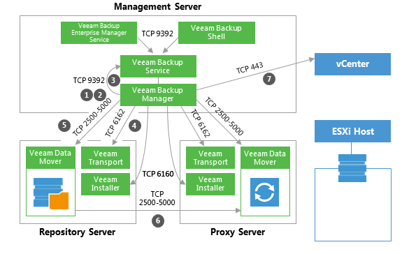
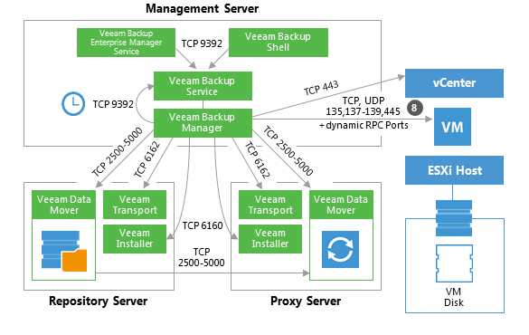
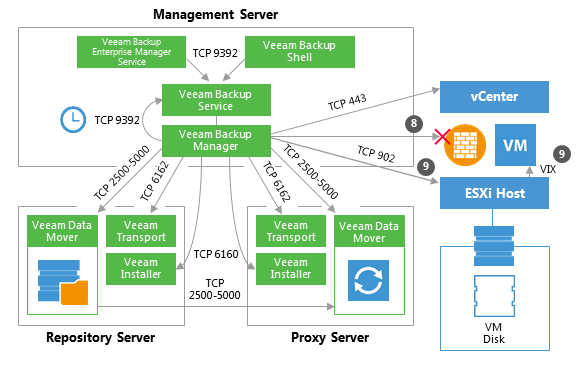
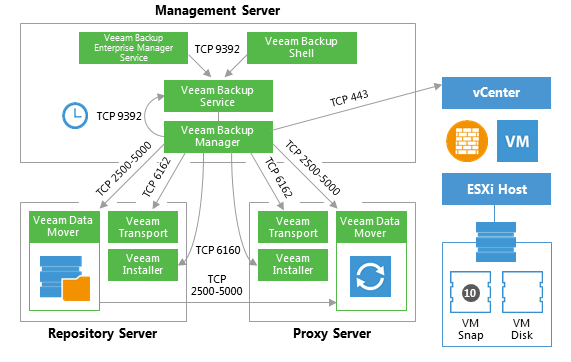
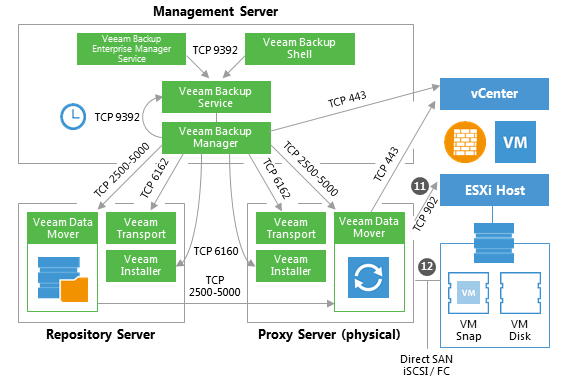
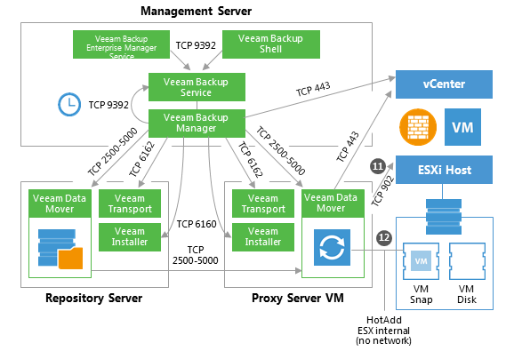
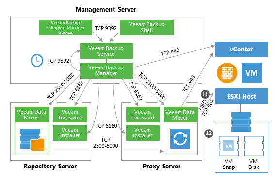
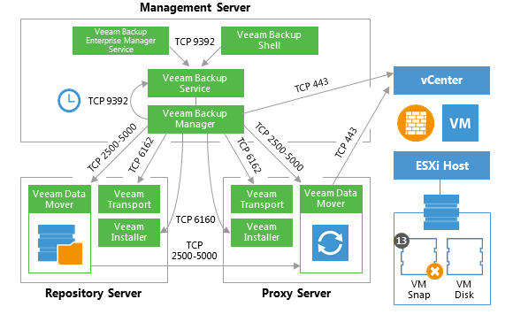

# Backup

This section provides a step-by-step description of a VMware virtual
machine backup process implemented in Veeam Backup & Replication.

### 1. Initialization Phase

A backup job can be started automatically or manually in the Veeam
Backup & Replication console, Veeam Backup Enterprise Manager web
console, by means of PowerShell, RESTful API and other.

In the initialization phase, Veeam Backup & Replication prepares
resources necessary for a backup job. To help you better understand
firewall settings and connection initiation flow, the process is
illustrated by the diagram (see below):

1.  When a backup job is initialized, the Veeam Backup Manager process
    is started on the Veeam backup server.

2.  Veeam Backup Manager reads job settings from the Veeam Backup
    configuration database and creates a list of VM tasks to process
    (one task stands for one VM disk).

3.  Veeam Backup Manager connects to the Veeam Backup Service. The Veeam
    Backup Service includes a resource scheduling component for managing
    all tasks and resources in the backup infrastructure. The resource
    scheduler checks what resources are available, and assigns backup
    proxies and repositories to process that job tasks using Veeam's
    load balancing.

4.  After the necessary backup infrastructure resources have been
    assigned, Veeam Backup Manager connects to the Transport Services on
    the target repository and on the backup proxy. The Transport
    Services, in their turn, start the Veeam Data Movers. On the backup
    proxy, a new Veeam Data Mover is started for each task that the
    proxy is processing.

5.  Veeam Backup Manager establishes a connection with Veeam Data Movers
    on the backup repository and backup proxy, and sets a number of
    rules for data transfer (such as network traffic throttling rules,
    and so on).

6.  Veeam Data Movers on the backup proxy and repository establish a
    connection with each other for data transfer.

7.  Veeam Backup Manager connects to the vCenter Server or ESXi host and
    gathers metadata about VMs and hosts engaged in the backup process.
    At this step, no connection between the Veeam backup server and VM
    guest networks is established.

### 2a. Guest Processing for Windows-Based VMs

For VMs with Microsoft Windows guest OS, Veeam Backup & Replication
obtains information about the guest’s IP addresses from VMware Tools.
Veeam uses these IP addresses to connect to the guest OS and perform
in-guest processing tasks (if application-aware image processing is
enabled).

If it is not possible to connect to the guest OS or the connection is
blocked by a firewall, Veeam Backup & Replication tries to establish a
connection using VIX, as described in section 2b.

### 2b. Guest Processing for Windows-Based VMs (VIX)

If there is no network connectivity to the VM guest OS, Veeam Backup &
Replication uses the communication channel provided by VMware Tools
(VIX) to interact with the guest OS and perform in-guest processing
tasks.

### 2c. Guest Processing for Linux/Unix-Based VMs

If pre-freeze and post-thaw scripts are enabled in the backup job
properties, Veeam Backup & Replication obtains information about the
guest’s IP address from VMware Tools. Veeam uses this IP address to
connect to the guest network over SSH and perform in-guest processing
tasks. Scripts reside on the backup server and are injected in the guest
OS at the time of backup.

If there is no network connectivity with a Linux-based VM, Veeam Backup
& Replication will not fail over to the VIX communication channel. In
such cases, as an alternative method, you can use VMware Tools
quiescence and let VMware Tools run the necessary scripts that will need
to be created inside the guest OS (see location details for Windows /
Linux guest at:
<https://pubs.vmware.com/vsphere-50/topic/com.vmware.datarecovery.admin.doc_20/GUID-6F339449-8A9F-48C0-BE70-91A2654A79D2.html>.

However, it is recommended to use Veeam’s functionality to call
pre-freeze and post-thaw scripts, as this method is more controllable by
the Veeam code: all errors that occur during the backup process are
written to Veeam logs (not VMware Tools).

### 3. Creating a VM Snapshot

Now, Veeam Backup & Replication requests the vCenter Server or ESXi host
to initiate a VM snapshot creation. A VM snapshot is required to use
VMware VADP backup methods and leverage features like VMware Changed
Block Tracking (CBT).

### 4. Releasing the Guest OS Activities

Right after the VM snapshot is taken, all quiesced disk I/O activities
in the guest OS are resumed.

### 5. VM Data Transport 

To read and transfer data from the VM snapshot, Veeam Backup &
Replication can use one of the following transport modes:

-   Direct SAN Access

-   Virtual Appliance (HotAdd)

-   Network (NBD)

For more information about each transport mode, see [Veeam Backup &
Replication User
Guide](http://helpcenter.veeam.com/backup/80/vsphere/index.html?transport_modes.html)
or a corresponding section below.

### 5a. Direct SAN Access Data Transport Mode

In the Direct SAN Access mode, Veeam backup proxy connects to the ESXi
host where the VM resides, and reads the necessary VM configuration
files (such as \*.vmx). Backup proxies use VM configuration details to
read VM data directly from the SAN.

### 5b. Virtual Appliance Data Transport Mode

In the Virtual Appliance transport mode, Veeam backup proxy connects to
the ESXi host where the VM resides, and reads the necessary VM
configuration files (such as \*.vmx). VM disks as of the snapshot state
are hot-added to a virtualized Veeam backup proxy. The proxy reads VM
data and unmaps the VM disks when finished.

### 5c. Network Data Transport Mode

In the Network transport mode, Veeam backup proxy connects to the ESXi
host where the VM resides, and reads the necessary VM configuration
files (such as \*.vmx). In this mode, the same data channel is used to
read VM disk data, too.

### 6. Committing VM Snapshot

After Veeam backup proxy finishes reading VM data, Veeam backup server
requests the vCenter Server or ESXi host to initiate a VM snapshot
commit.

