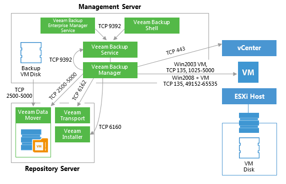
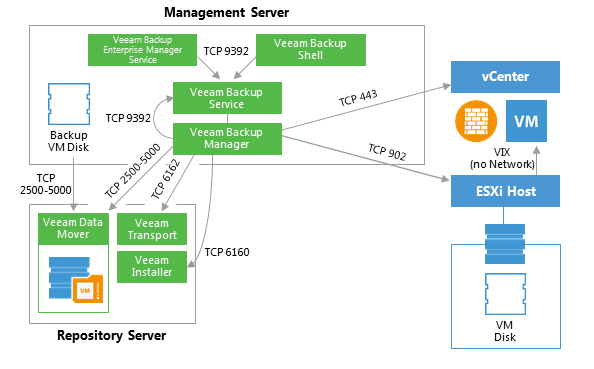

# Windows File-Level Restore

This section provides a step-by-step description of Microsoft Windows
file-level restore process for a VMware virtual machine implemented in
Veeam Backup & Replication.

### 1. Initialization Phase

In the initialization phase, Veeam Backup & Replication prepares
resources necessary for Microsoft Windows file-level restore. It
performs the following steps:

1.  Checks with the Veeam Backup Service whether the necessary backup
    infrastructure resources are available for Microsoft Windows
    file-level restore.

2.  Starts Veeam Data Movers on the Veeam backup server and
    backup repository.

3.  Mounts the content of backup files to the backup server with the
    help of Veeam’s proprietary driver.

The backup files remain on the backup repository. Guest files inside the
backup can be accessed in Veeam Backup browser or Microsoft Windows File
explorer on the backup server, mapped by default in the *C:\\VeeamFLR*
folder (can be changed via registry key).

### 2a. Restoring Windows Guest OS Files (Network-Based)

To restore guest files back to the original VM, Veeam Backup &
Replication establishes a connection with the VM Guest OS. It obtains
information about the guest IP address from VMware Tools. Veeam uses
this IP address to connect to the guest OS and perform in-guest file
recovery.

### 2b. Restoring Windows Guest OS Files (Networkless)

If there is no network connectivity with the VM guest OS, Veeam Backup &
Replication uses the communication channel provided by VMware Tools
(VIX) to interact with the guest OS and perform in-guest file recovery.

### 3. Dismounting Backup Content

After all restore activities are completed and the user closes the Veeam
Backup browser (or the browser is closed by timeout), the content of the
backup files is dismounted from the backup server.