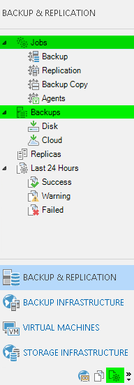

# Powershell

In this section we will discuss the Veeam PS Snapin implementation. The goal is not to document the complete set of cmdlets. Instead, this topic will discuss how the "GUI Objects" link to the "PS Objects". The goal is not to give a primer on Powershell so the topic will assume that you understand the basic concepts as Objects, Pipeline, Loops, etc.

## Getting started

Starting from v9.x the Powershell Snapin is automatically installed when you install the Backup & Replication server or the Console. To start, just head over to the backup server and open a Powershell console or the powershell_ise (convenient Powershell "IDE"). Make sure you are running the 64 bit version. This can be determined by executing the following command.

```
[Environment]::Is64BitProcess
```

Some operation like starting FLR require local administrator rights. You can verify if this is the case by running. If you do not "run as administrator", some operations might fail

```
([Security.Principal.WindowsPrincipal] [Security.Principal.WindowsIdentity]::GetCurrent()).IsInRole([Security.Principal.WindowsBuiltInRole]::Administrator)
```

With the basics checked, you can now load the Veeam powershell Snapin

```
Add-PSSnapin VeeamPSSnapin
```

To discover all standard cmdlets supplied by the snapin, use the Get-Command

```
Get-Command -Module VeeamPSSnapin
```

You will notice that most cmdlets nouns start with VBR (short for Veeam Backup & Replication) or VSB (short for Veeam SureBackup)

To get help with a cmdlet, refer to the [documentation online](https://helpcenter.veeam.com/backup/powershell/cmdlets.html) or via powershell

```
Get-help Set-VBRJobSchedule -full
```

Starting from v9 you can connect to a remote server (when you install the local console). You can use the connect-vbrserver CMDlet to make the initial connection. All subsequent CMDlet will be execute against the connected server. If you run on the backup server itself, and you load the snapin, a connect will be made to the local backup server

Manually connecting to the local server
```
Connect-VBRServer -server 127.0.0.1
```

Disconnecting (so you can connect to another server)
```
Disconnect-VBRServer
```


## Discover undocumented/unsupported properties and methods
Sometimes, you will need info that can not be requested by using the standard CMDlets. There are ways to discover those properties by querying a certain object.

**Using methods and properties in this way are unsupported and might change between version. If there is a CMDlet available that allows you to execute the method or query the information, please use the CMDlet in favor of and object method or property**

Assuming that you have already one job defined, let's first store a VBRJob in $firstjob. Once that is done, we can pipe $firstjob to Get-Member
```
$firstjob = @(get-vbrjob)[0]
$firstjob | Get-Member
```

This will show use two types of members. Properties can be considered dataset. You can call them to get information. Methods are functions that can be executed. For example, when you run the command, you might see the following items
```
DisableScheduler             Method     void DisableScheduler()
...
JobType                      Property   Veeam.Backup.Model.EDbJobType JobType {get;}
```

For example to disable the scheduler, you can execute
```
$firstjob.DisableScheduler()
```

To get the JobType, use
```
$firstjob.JobType
```

JobType is an Enum. Sometimes you will discover Enums that are modifiable, but you don't know what values can be expected. You can easily discover them via the Enum Type. First find out the type by appending GetType().FullName
```
$firstjob.JobType.GetType().FullName
```

In the case of a JobType, the enum is called "Veeam.Backup.Model.EDbJobType". To request all possible values, using the square brackets and pipe it to Get-Member -Static -MemberType Property
```
[Veeam.Backup.Model.EDbJobType] | Get-Member -Static -MemberType Property
```

## Working with Jobs

When you start working with Backups, immediately you will notice there is a difference between a job and a backup itself. The job is in essence a collection of configuration data and scheduling info. The backup is the result of a backup job running. Notice that there are different types of Jobs under the node. For example Backups job, Replica jobs, etc. The meta data describing a job run is called a session. This is reflected in GUI but might not be apparent. When you open the GUI, in the "Backup & Replication" section, you will see in the left panel the "job" node (including other job types) and the "backup" node containing all your backups. For sessions, you have a complete separate section called "History".

**What is quite important that in Powershell often VSS is used instead of Application Aware Image Processing (AAIP). This can be quite confusing, if you are looking for AAIP settings. This stems from earlier versions of B&R where AAIP was focused on VSS only**



In powershell this means that objects also have been split up in separate objects. To execute "Job" manipulations, you will work on the "VBRJob" object. To discover only cmdlets related to "VBRJob" execute:

```
Get-Command -Module VeeamPSSnapin -noun VBRJob
```

For example, to get a specific a Job and start it, you can use the corresponding Job
```
Get-VBRJob -name "Backup Job Name" | Start-VBRJob
```

To query all jobs that are only backups, you can use a where clause on the JobType itself
```
Get-VBRJob | Where { $_.JobType -eq "Backup" }
```

Common Jobtypes are
* Backup : Backup
* Replica : Replica
* Backup Copy Job : BackupSync

The fact that Get-VBRJob returns all kind of type jobs can be confusing. Sometimes, you might try to update a property which makes no sense for the type you are working on. This might lead to error or worse, invalid configurations

### Editing existing job
Let assume $backupjob is holding a backup job. If you used the correct jobname, the following code should say "Variable is set correctly"
```
$backupjob = Get-VBRJob -name "Backup Job Name"
if($backupjob.JobType -eq "Backup") { write-host "Variable is set correctly"}
```

To start a backup, you can use the Start-VBRJob as shown in the beginning of this section. If you want to start a full backup, you can use. Async means the CMDlet does not wait for the job to complete
```
$backupjob | Start-VBRJob -FullBackup -RunAsync
```

To edit the job, you will first need to acquire the JobSettings. There are specific CMDlets for that. By using the match parameter, we relax the where clause so that it only has to contain "VBRJob" but do not limit it to "VBRJob" alone (this is actually a regex match)
```
Get-Command -Module Veeampssnapin | where { $_.noun -match "VBRJob" }
```

JobSettings are categorized in different sections that loosely correspond to
* VBRJobObject : Section Virtual Machines
* VBRJobProxy : Section Storage > Backup Proxy
* VBRJobAdvancedBackupOptions : Section Storage > Button Advanced  > Tab Backup
* VBRJobAdvancedStorageOptions : Section Storage > Button Advanced > Tab Storage
* VBRJobAdvancedNotificationOptions : Section Storage > Button Advanced > Tab Notifications
* VBRJobAdvancedViOptions : Section Storage > Button Advanced > Tab vSphere
* VBRJobAdvancedHvOptions : Section Storage > Button Advanced  > Tab Hyper-V
* VBRJobAdvancedOptions : Section Storage > Button Advanced > Tab Scripts
* VBRJobObjectVssOptions : Section Guest Processing >  Button Applications > Edit of individual VM/Container
* VBRJobVssOptions :  Section Guest Processing
* VBRJobGuestFSIndexing :  Section Guest Processing > Checkbox Indexing
* VBRJobVSSIntegration :  Section Guest Processing > Checkbox AAIP
* VBRJobSchedule : Section Schedule (inline edit with set-)
* VBRJobScheduleOptions : Section Schedule
* VBRJobOptions : Special object since it contains the actual configuration of almost everything

Editing the options depends a bit on the CMDlet you are using. There are 4 main catagories.

#### Get / Set Method

This is probably the oldest method and allows you the most flexibility. First start by getting the specific options you want to edit. Than modify the settings. Finally apply the new settings. For example, you want to edit the retention. First start by getting the VBRJobOptions

```
$joboptions = Get-VBRJobOptions -Job $backupjob
```

Now lets edit the corresponding joboption. Refer to the discover methods described in previous sections to figure out how to query the possible options with Get-Member. Eg ($joboptions | gm; $joboptions.BackupStorageOptions | gm)
```
$joboptions.BackupStorageOptions.RetainCycles = 30
```

Now lets apply the settings
```
$updatedjob = Set-VBRJobOptions -Job $backupjob -Options $joboptions
```

**Get / Set Pairs are:**
* Get-VBRJobOptions / Set-VBRJobOptions
* Get-VBRJobVSSOptions / Set-VBRJobVssOptions
* Get-VBRJobObjectVssOptions / Set-VBRJobObjectVssOptions
* Get-VBRJobScheduleOptions / Set-VBRJobScheduleOptions


VBRJobOptions has actually most options that you can edit on the job. Some of the edit's can be done more easily by doing the inline edits. Just for a reference, here is a dump of v9.5 options and suboptions

* $options.BackupStorageOptions
  * $options.BackupStorageOptions.BackupIsAttached
  * $options.BackupStorageOptions.CheckRetention
  * $options.BackupStorageOptions.CompressionLevel
  * $options.BackupStorageOptions.EnableDeduplication
  * $options.BackupStorageOptions.EnableDeletedVmDataRetention
  * $options.BackupStorageOptions.EnableFullBackup
  * $options.BackupStorageOptions.EnableIntegrityChecks
  * $options.BackupStorageOptions.KeepFirstFullBackup
  * $options.BackupStorageOptions.RetainCycles
  * $options.BackupStorageOptions.RetainDays
  * $options.BackupStorageOptions.StgBlockSize
  * $options.BackupStorageOptions.StorageEncryptionEnabled
* $options.BackupTargetOptions
  * $options.BackupTargetOptions.Algorithm
  * $options.BackupTargetOptions.FullBackupDays
  * $options.BackupTargetOptions.FullBackupMonthlyScheduleOptions
  * $options.BackupTargetOptions.FullBackupScheduleKind
  * $options.BackupTargetOptions.TransformFullToSyntethic
  * $options.BackupTargetOptions.TransformIncrementsToSyntethic
  * $options.BackupTargetOptions.TransformToSyntethicDays
* $options.CloudReplicaTargetOptions
  * $options.CloudReplicaTargetOptions.CloudConnectHost
  * $options.CloudReplicaTargetOptions.CloudConnectStorage
* $options.FailoverPlanOptions
  * $options.FailoverPlanOptions.PostCommandLine
  * $options.FailoverPlanOptions.PostEnabled
  * $options.FailoverPlanOptions.PreCommandLine
  * $options.FailoverPlanOptions.PreEnabled
* $options.GenerationPolicy
  * $options.GenerationPolicy.ActualRetentionRestorePoints
  * $options.GenerationPolicy.CompactFullBackupDays
  * $options.GenerationPolicy.CompactFullBackupMonthlyScheduleOptions
  * $options.GenerationPolicy.CompactFullBackupScheduleKind
  * $options.GenerationPolicy.DeletedVmsDataRetentionPeriodDays
  * $options.GenerationPolicy.EnableCompactFull
  * $options.GenerationPolicy.EnableCompactFullLastTime
  * $options.GenerationPolicy.EnableDeletedVmDataRetention
  * $options.GenerationPolicy.EnableRechek
  * $options.GenerationPolicy.GFSIsReadEntireRestorePoint
  * $options.GenerationPolicy.GFSMonthlyBackups
  * $options.GenerationPolicy.GFSQuarterlyBackups
  * $options.GenerationPolicy.GFSRecentPoints
  * $options.GenerationPolicy.GFSWeeklyBackups
  * $options.GenerationPolicy.GFSYearlyBackups
  * $options.GenerationPolicy.IsGfsActiveFullEnabled
  * $options.GenerationPolicy.KeepGfsBackup
  * $options.GenerationPolicy.MonthlyBackup
  * $options.GenerationPolicy.QuarterlyBackup
  * $options.GenerationPolicy.RecheckBackupMonthlyScheduleOptions
  * $options.GenerationPolicy.RecheckDays
  * $options.GenerationPolicy.RecheckScheduleKind
  * $options.GenerationPolicy.RecoveryPointObjectiveUnit
  * $options.GenerationPolicy.RecoveryPointObjectiveValue
  * $options.GenerationPolicy.RetentionPolicyType
  * $options.GenerationPolicy.SimpleRetentionRestorePoints
  * $options.GenerationPolicy.SyncIntervalStartTime
  * $options.GenerationPolicy.WeeklyBackupDayOfWeek
  * $options.GenerationPolicy.WeeklyBackupTime
  * $options.GenerationPolicy.YearlyBackup
* $options.HvNetworkMappingOptions
  * $options.HvNetworkMappingOptions.NetworkMapping
* $options.HvReplicaTargetOptions
  * $options.HvReplicaTargetOptions.EnableInitialPass
  * $options.HvReplicaTargetOptions.InitialPassDir
  * $options.HvReplicaTargetOptions.InitialSeeding
  * $options.HvReplicaTargetOptions.ReplicaNameSuffix
  * $options.HvReplicaTargetOptions.TargetFolder
  * $options.HvReplicaTargetOptions.UseNetworkMapping
  * $options.HvReplicaTargetOptions.UseReIP
  * $options.HvReplicaTargetOptions.UseVmMapping
* $options.HvSourceOptions
  * $options.HvSourceOptions.CanDoCrashConsistent
  * $options.HvSourceOptions.DirtyBlocksNullingEnabled
  * $options.HvSourceOptions.EnableHvQuiescence
  * $options.HvSourceOptions.ExcludeSwapFile
  * $options.HvSourceOptions.FailoverToOnHostBackup
  * $options.HvSourceOptions.GroupSnapshotProcessing
  * $options.HvSourceOptions.OffHostBackup
  * $options.HvSourceOptions.UseChangeTracking
* $options.JobOptions
  * $options.JobOptions.BackupCopyJobCanRunAnyTime
  * $options.JobOptions.RunManually
  * $options.JobOptions.SourceProxyAutoDetect
  * $options.JobOptions.TargetProxyAutoDetect
  * $options.JobOptions.UseWan
* $options.JobScriptCommand
  * $options.JobScriptCommand.Days
  * $options.JobScriptCommand.Frequency
  * $options.JobScriptCommand.Periodicity
  * $options.JobScriptCommand.PostCommand
  * $options.JobScriptCommand.PostScriptCommandLine
  * $options.JobScriptCommand.PostScriptEnabled
  * $options.JobScriptCommand.PreCommand
  * $options.JobScriptCommand.PreScriptCommandLine
  * $options.JobScriptCommand.PreScriptEnabled
* $options.NotificationOptions
  * $options.NotificationOptions.EmailNotificationAdditionalAddresses
  * $options.NotificationOptions.EmailNotificationSubject
  * $options.NotificationOptions.EmailNotifyOnError
  * $options.NotificationOptions.EmailNotifyOnLastRetryOnly
  * $options.NotificationOptions.EmailNotifyOnSuccess
  * $options.NotificationOptions.EmailNotifyOnWaitingTape
  * $options.NotificationOptions.EmailNotifyOnWarning
  * $options.NotificationOptions.SendEmailNotification2AdditionalAddresses
  * $options.NotificationOptions.SnmpNotification
  * $options.NotificationOptions.UseCustomEmailNotificationOptions
* $options.Options
  * $options.Options.RootNode
* $options.ReIPRulesOptions
  * $options.ReIPRulesOptions.Rules
* $options.ReplicaSourceOptions
  * $options.ReplicaSourceOptions.Backup2Vi
* $options.SanIntegrationOptions
  * $options.SanIntegrationOptions.Failover2StorageSnapshotBackup
  * $options.SanIntegrationOptions.FailoverFromSan
  * $options.SanIntegrationOptions.MultipleStorageSnapshotEnabled
  * $options.SanIntegrationOptions.MultipleStorageSnapshotVmsCount
  * $options.SanIntegrationOptions.NimbleSnapshotSourceEnabled
  * $options.SanIntegrationOptions.NimbleSnapshotSourceRetention
  * $options.SanIntegrationOptions.NimbleSnapshotTransferAsBackupSource
  * $options.SanIntegrationOptions.NimbleSnapshotTransferEnabled
  * $options.SanIntegrationOptions.NimbleSnapshotTransferRetention
  * $options.SanIntegrationOptions.SanSnapshotBackupBackupSource
  * $options.SanIntegrationOptions.SanSnapshotBackupTransferEnabled
  * $options.SanIntegrationOptions.SanSnapshotBackupTransferRetention
  * $options.SanIntegrationOptions.SanSnapshotReplicaBackupSource
  * $options.SanIntegrationOptions.SanSnapshotReplicaTransferEnabled
  * $options.SanIntegrationOptions.SanSnapshotReplicaTransferRetention
  * $options.SanIntegrationOptions.SanSnapshotSourceEnabled
  * $options.SanIntegrationOptions.SanSnapshotSourceRetention
  * $options.SanIntegrationOptions.UseSanSnapshots
* $options.SqlLogBackupOptions
  * $options.SqlLogBackupOptions.BackupIntervalUnit
  * $options.SqlLogBackupOptions.BackupIntervalValue
  * $options.SqlLogBackupOptions.DailyRetentionDays
  * $options.SqlLogBackupOptions.RetentionType
  * $options.SqlLogBackupOptions.StorageIntervalUnit
  * $options.SqlLogBackupOptions.StorageIntervalValue
* $options.ViCloudReplicaTargetOptions
  * $options.ViCloudReplicaTargetOptions.CloudConnectDatastore
  * $options.ViCloudReplicaTargetOptions.CloudConnectHost
  * $options.ViCloudReplicaTargetOptions.Enabled
* $options.ViNetworkMappingOptions
  * $options.ViNetworkMappingOptions.NetworkMapping
* $options.ViReplicaTargetOptions
  * $options.ViReplicaTargetOptions.ClusterName
  * $options.ViReplicaTargetOptions.ClusterReference
  * $options.ViReplicaTargetOptions.DatastoreHDTargetType
  * $options.ViReplicaTargetOptions.DatastoreName
  * $options.ViReplicaTargetOptions.DatastoreReference
  * $options.ViReplicaTargetOptions.DatastoreRootPath
  * $options.ViReplicaTargetOptions.DiskCreationMode
  * $options.ViReplicaTargetOptions.EnableDigests
  * $options.ViReplicaTargetOptions.EnableInitialPass
  * $options.ViReplicaTargetOptions.HostReference
  * $options.ViReplicaTargetOptions.InitialPassDir
  * $options.ViReplicaTargetOptions.InitialSeeding
  * $options.ViReplicaTargetOptions.PbmProfileId
  * $options.ViReplicaTargetOptions.ReplicaNamePrefix
  * $options.ViReplicaTargetOptions.ReplicaNameSuffix
  * $options.ViReplicaTargetOptions.ReplicaTargetResourcePoolName
  * $options.ViReplicaTargetOptions.ReplicaTargetResourcePoolRef
  * $options.ViReplicaTargetOptions.ReplicaTargetVmFolderName
  * $options.ViReplicaTargetOptions.ReplicaTargetVmFolderRef
  * $options.ViReplicaTargetOptions.UseNetworkMapping
  * $options.ViReplicaTargetOptions.UseReIP
  * $options.ViReplicaTargetOptions.UseVmMapping
* $options.ViSourceOptions
  * $options.ViSourceOptions.BackupTemplates
  * $options.ViSourceOptions.BackupTemplatesOnce
  * $options.ViSourceOptions.DirtyBlocksNullingEnabled
  * $options.ViSourceOptions.EnableChangeTracking
  * $options.ViSourceOptions.EncryptLanTraffic
  * $options.ViSourceOptions.ExcludeSwapFile
  * $options.ViSourceOptions.FailoverToNetworkMode
  * $options.ViSourceOptions.SetResultsToVmNotes
  * $options.ViSourceOptions.UseChangeTracking
  * $options.ViSourceOptions.VCBMode
  * $options.ViSourceOptions.VDDKMode
  * $options.ViSourceOptions.VmAttributeName
  * $options.ViSourceOptions.VmNotesAppend
  * $options.ViSourceOptions.VMToolsQuiesce

This was generated via the following PScode (if you are running on a higher/lower version this could be userful)
```
$options = Get-VBRJobOptions -job @(Get-VBRJob | where { $_.JobType -eq "Backup" })[0]
$members = $options | gm -MemberType Property  | % { $_.Name }
foreach ($member in $members)
{
 Write-host (("* `$options.{0}") -f $member)
 $suboptions = $options."$member"
 $submembers = $suboptions | gm -MemberType Property | % { $_.Name }
 foreach ($submember in $submembers)
 {
  Write-host (("  * `$options.{0}.{1}") -f $member,$submember)
 }
}
```

#### Inline edits

Because the inline methods are sometimes cumbersome to use, inline methods have been added that allow you to edit some settings directly. Let's take for example the schedule options. You can use Set-VBRJobSchedule directly without first querying it's current settings.

For example, let's set a job to run only on a daily basis
```
Set-VBRJobSchedule -Job $backupjob -Monthly -NumberInMonth 2 -Days Monday
```

Or every 4 hours
```
Set-VBRJobSchedule -Job $backupjob -Periodicaly -PeriodicallyKind Hours -FullPeriod 4
```

The problem with inline edits are that they are less discoverable. Consult the help to see the parameters for possible options. Alternatively you can just try any edit. This might result hinting acceptable values or can not convert to an <enum type> which you can then query. Needless to say that this might lead to unexpecting result and thus the documentation method is more acceptable

Inline edits:
* Set-VBRJobAdvancedBackupOptions
* Set-VBRJobAdvancedHvOptions
* Set-VBRJobAdvancedNotificationOptions
* Set-VBRJobAdvancedOptions
* Set-VBRJobAdvancedStorageOptions
* Set-VBRJobAdvancedViOptions
* Set-VBRJobSchedule

#### Enable / Disable

Some edits are just enable or disabling a feature. For example enabling AAIP is really just a checkbox in the GUI. In Powershell, you can use Enable-VBRJobVSSIntegration
```
Enable-VBRJobVSSIntegration -Job $backupjob
```

Enable / Disable Pairs are:
* Enable-VBRJob / Disable-VBRJob
* Enable-VBRJobGuestFSIndexing / Disable-VBRJobGuestFSIndexing
* Enable-VBRJobSchedule / Disable-VBRJobSchedule
* Enable-VBRJobVSSIntegration / Disable-VBRJobVSSIntegration

#### Adding and removing job objects

Add Job Objects (VM, Resource Pools, etc.) are more complicated. They require you to first find the object and then use the specific CMDlet

Important, there are Hypervisor specific calls (Add-VBRViJobObject/Add-VBRHvJobObject) and none Hypervisor specific (Add-VBRJobObject). Please avoid using none specific calls (Add-VBRJobObject) as they are [deprecated](https://helpcenter.veeam.com/backup/powershell/obsolete_cmdlets.html) and might be removed in future versions

Let's start with first adding a VM called "vm1". To do this, use one of the corresponding find CMDlets
```
Get-Command -Module Veeampssnapin | where { $_.noun -match "VBR" -and $_.verb -match "Find" }
```

For VMware maybe the easiest CMDlet is the Find-VBRViEntity and for Hyper-V Find-VBRHvEntity. If you found a matching VM, you should get a message that it is indeed a VM
```
$vm = Find-VBRViEntity -HostsAndClusters -Name "vm1"
if ($vm.type -eq "vm") { write-host "We got ourselves a VM here" }
```

Next step is to add it to a job
```
Add-VBRViJobObject -Job $backupjob -Entities $vm
```

We can remove it by first finding the job object
```
$jobobject = Get-VBRJobObject -Job $backupjob -Name "vm1"
```

Then we can remove it via
```
Remove-VBRJobObject -Objects $jobobject
```

### Creating new jobs
Still need to write stuff here

### Frequently Asked Examples

#### Run code on every job
Although this is basic powershell, here is a basic scelleton for changing a setting on every job
```
$Jobs =  Get-VBRJob | where {$_.JobType -eq "Backup" -or $_.JobType -eq "Replica"}
foreach ($Job in $Jobs)
{
  #Take action on a $Job here
}
```

For example to change the Blocksize on every job after you have loaded the snapin

```
$Jobs =  Get-VBRJob | where {$_.JobType -eq "Backup" -or $_.JobType -eq "Replica"}
foreach ($Job in $Jobs)
{
  $Options = Get-VBRJobOptions -Job $Job
  $Options.BackupStorageOptions.StgBlockSize  = [Veeam.Backup.Common.EKbBlockSize]::KbBlockSize1024
  $null = Set-VBRJobOptions -Job $job -Options $options
}
```

#### Enable bitlooker
Refer to "Run code on every Job" if you want to edit multiple jobs at the same time
```
$Job = get-vbrjob -name "Backup job 1"
$Options = Get-VBRJobOptions -Job $Job
$Options.ViSourceOptions.DirtyBlocksNullingEnabled = $True
$null = Set-VBRJobOptions -Job $job -Options $options
```
#### Changing block settings
Refer to "Run code on every Job" if you want to edit multiple jobs at the same time
```
$Job = get-vbrjob -name "Backup job 1"
$Options = Get-VBRJobOptions -Job $Job
$Options.BackupStorageOptions.StgBlockSize  = [Veeam.Backup.Common.EKbBlockSize]::KbBlockSize1024
$null = Set-VBRJobOptions -Job $job -Options $options
```

#### Changing compression settings
Refer to "Run code on every Job" if you want to edit multiple jobs at the same time
```
$Job = get-vbrjob -name "Backup job 1"
$Options = Get-VBRJobOptions -Job $Job
# 0 = none, 4 = dedup friendly, 5 = optimal, 6 = high, 9 = extreme
$options.BackupStorageOptions.Compressionlevel = 0
$null = Set-VBRJobOptions -Job $job -Options $options
```

## Working with Backups
To get the  backups for that specific job, you can use
```
Get-VBRBackup -name "Backup Job Name"
```

## Working with Sessions
