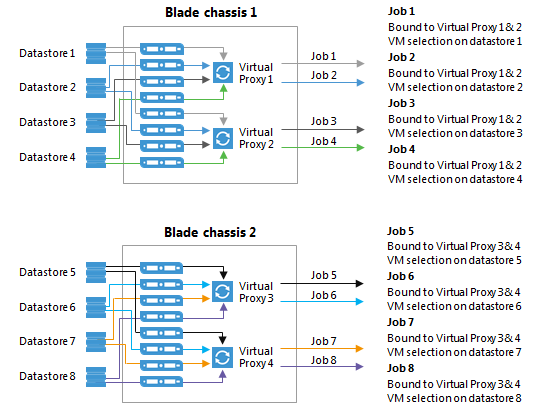

# Backup Job

## Job Layout and Object Selection

Veeam Backup and Replication allows you to flexibly select objects to add to the job. At the **Virtual Machines** step of the job wizard, the **Add Objects** screen offers various “views” into the vCenter architecture that match the views provided by the vSphere client. You can switch between the **Hosts and Clusters**, **VMs and Templates**, **Datastores and VMs** or **Tags** views by pressing the appropriate button on the backup object selection screen.

This screen also provides an advanced object exclusion tool that allows you to select a parent object and then exclude child objects, or even individual disks within a VM.

More guidelines on object selection are listed below.

### Increasing Deduplication Rate

If the target repository is not configured to use per VM backup files, deduplication across all VMs within a single job is available. When using per VM backup files, deduplication is only available within a single VM backup chain, which reduces it's efficiency but still makes it relevant. The following recommendation applies to job level deduplication only.

Grouping VMs running the same operating system or deployed from similar templates into a single job will increase deduplication rate. Job sizing guidelines still apply, and it is recommended to monitor the backup window and the size of the job for manageability.

### Container based jobs

Adding resource pools, folders, datastores, or vSphere Tags (vSphere 5.5 and higher) to backup jobs makes backup management easier. New machines that are member of such constructs or containers are automatically included in the backup job.

When creating jobs based on groups or constructs, ensure that the configured constructs do not overlap. Overlapping constructs may cause undesired results. For instance, when creating jobs based on datastores, VMs with disks residing on multiple datastores included in more than one backup job will cause the VM to be backed up in each job.

#### Tags
Tags are very convenient for a policy driven approach to data protection. However, it is recommended to follow these guidelines:

-   Monitor the number of VMs automatically added to the job to avoid too many VMs being backed up within a single job
-   Only one tag can be used to include a VM in a job
-   Using tags, you can classify VMs by service levels, using different backup jobs for different service levels
-   Veeam ONE Business View (OBV) is a very convenient tool for managing vSphere Tags. OBV allows for creating classification rules and update corresponding tags in vCenter. Classifications can be defined from CPU, RAM, VM naming convention, folder, resource pool, datastore etc. OBV can also import VM/host/datastore descriptions from a CSV file. This feature can be useful when refreshing VMware tags, for example, to update CMDB.

#### Exclusions
It is recommended to limit the number of exclusions in backup jobs. While exclusions can be very useful, the virtual infrastructure is dynamic and changes rapidly. It is quite possible that a VM gets moved to a folder or resource pool that is excluded which makes it unprotected. Monitoring [Protected VMs](https://helpcenter.veeam.com/one/reporter/protected_vms.html) with Veeam ONE is highly recommended.

### Compression and Storage Optimization

Detailed descriptions of compression and storage optimization settings and their influence on the backup infrastructure is provided in the [Deduplication and Compression](./deduplication_and_compression.md) section of this guide. In almost all cases deduplication should be left enabled. Veeam Backup & Replication uses source side deduplication which decreases the amount of data that must be transferred to the target repository.

When using a deduplication appliance for storing backups, please see the [Deduplication Appliances](/resource_planning/repository_type_dedupe.md#job-configuration) section of this guide for a detailed description of compression and storage optimization settings.

### Encryption

A detailed description of encryption settings and its influence on the backup infrastructure is provided in the [Encryption](./encryption.md) section above in this document.

For general guidelines about encryption, refer to the Veeam User Guide: [Encryption keys](https://helpcenter.veeam.com/backup/vsphere/encryption_keys.html).

## Storage maintenance
While data amount is growing and backup window is decreasing, forward incremental forever backups have become increasingly important in any backup solution. Backup jobs with no scheduled synthetic or active full backups are becoming more widely adopted. Forward incremental with weekly synthetic full backups is however still the default setting.

The two main objections towards using a forward incremental forever backup mode are the following:

The first one is **full backup file fragmentation**, leading to undesired VBK file growth over time, and degradation of performance due to fragmentation. Previously it was recommended to perform periodical active full backups in order to create a new VBK file and backup chain. This would mitigate issues of fragmentation and remove whitespace left by deleted data blocks.

The second objection is **silent storage corruption**. If ever a file or block in the chain got corrupted by a storage related issue, all subsequent consolidations or restores from this could be affected.

To address both objections, following features are available under the "Maintenance" tab, in the Advanced settings of a backup job.

### Full backup file maintenance - "Defragment and compacting"
Full backup file maintenance will address two issues: VBK file fragmentation caused by transforms (forward incremental forever, or reverse incremental), and left over whitespace from deleted data blocks. These issues are mitigated by synthesizing a new full backup file on the backup repository i.e. copy blocks from the existing VBK file into a new VBK file, and subsequently deleting the original file. This process may also be referred to as "compacting".

**How does it work?** During VBK compacting, a new VBK file is created. Existing blocks are copied from the previous VBK, requiring free space equivalent to the size of an additional full backup in the repository. In the [Restore Point Simulator](http://vee.am/rps), this space is part of the "Work space" parameter. When using Scale-out Backup Repository in Performance Mode, the compacting process may utilize several extents and significantly speed up the compacting process.

**When to use?** For every backup job with full transforms. Defragmentation will benefit the most jobs that are configured to generate a single chain per job, keeping files smaller and restore speed optimal over time.

**When to avoid?** When using deduplication storage, it is recommended to disable the "Defragment and compact". As deduplication appliances are fragmented by their very nature, and have very poor support for random I/O workloads, the compacting feature will not enhance backup or restore performance.

### Storage-level corruption guard
In addition to using SureBackup for restore validation, storage-level corruption guard was introduced to provide a greater level of confidence for the total dataset.

**How does it work?** When a job has finished, storage-level corruption guard will perform a CRC verification for the entire backup chain. It will validate whether the contents of the backup chain blocks match the contents described within the backup file metadata. If a mismatch is discovered, it will attempt to repair the data block from production storage, assuming the block still exists and has not been overwritten. If it exists, the backup file will be repaired. If not, storage-level corruption guard will fail and make the user aware that a new full backup is required, and that the backup chain must be recovered from a secondary copy of the backup.

**When to use?** It is recommended to use storage-level corruption guard for any backup job with no active full backups scheduled. Synthetic full backups are still "incremental forever" and may suffer from corruption over time.

**When to avoid?** It is highly discouraged to use storage-level corruption guard on any storage that performs native "scrubbing" to detect silent data corruptions. Such storage will automatically heal silent data corruptions from parity disks or using erasure coding. This is the case for most deduplication appliances.

For more information, please see Veeam Helpcenter:
[Health Check for Backup Files](https://helpcenter.veeam.com/backup/vsphere/backup_health_check.html).

## Job Chaining

Chaining backup jobs is convenient in certain circumstances, but should be used with caution. For example, if a job in such chain fails or stops responding, the entire job chain delivers poor backup success rate.

A most common way to handle multiple jobs is to let the built-in Intelligent Load Balancing (ILB) handle the proxy/repository resources by starting multiple jobs in parallel by using all available proxy/repository resources. This will typically allow the shortest the backup window.

## Load Balancing
When planning jobs schedule, you should consider balancing the load on source and target disks. Too many jobs accessing the same disk will load the storage significantly; this makes the job run slower or may have a negative impact on the VMs performance. To mitigate this problem, you can utilize [Storage Latency Control](../resource_planning/interaction_with_vsphere.md#storage-latency-control) (or Backup I/O Control) settings.

Veeam also employs a load balancing method that automatically allocates a proxy, making a choice between all proxies managed by Veeam Backup & Replication that are available at the moment.

For more details on load balancing, refer to the Veeam Backup & Replication User Guide at [Resource scheduling](https://helpcenter.veeam.com/backup/vsphere/resource_scheduling.html).

## Binding Jobs to Specific Proxies

Refer to the User Guide in order to examine the advanced deployment scenario with multiple proxies: [Advanced deployments](https://helpcenter.veeam.com/backup/vsphere/advanced.html).

While configuring a backup job, you can disable the automatic proxy selection. Instead, you can select particular proxies from the list of proxies managed by Veeam backup server, and appoint them to the job. This is a very good way to manage distributed infrastructures; also it helps you to keep performance under control.

For example, you can back up a cluster residing on multiple blade chassis. In this case, if you use virtual proxies, keep the proxies load well-balanced and optimize the network traffic.

Dedicated proxies can be also very helpful if you use a stretched cluster and do not want proxy traffic to go across inter-switch link.

See the illustration below as a good starting point to reach and keep control on high backup throughput. In this example, administrator wants to keep network traffic as much as possible inside the chassis; only the proxy-to-repository traffic goes via an external link.

**Tip:** To optimize load balancing in a distributed environment where backup proxies are rolled out to multiple sites, it is recommended to select all proxies from the same site in the job.
