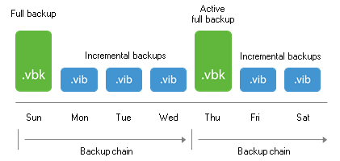
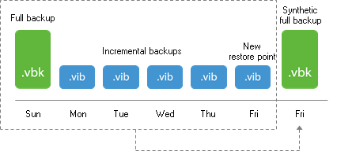
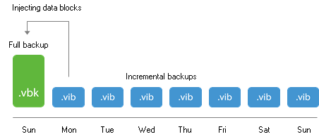
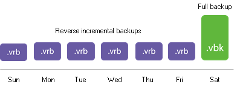

# Backup Methods

Veeam Backup & Replication stores backups on disk using a simple, self-contained file based approach. However, there are several methods available for exactly how those files are created and stored on the file system. This section will provide an overview of these methods, their pros and cons, as well as recommendations on use cases for each one.

For a graphical representation of the mentioned backup modes in this
section, please see [Veeam KB1799](https://www.veeam.com/kb1799).

As a generic overview for I/O impact of the backup modes, please see this table:

| Method                                     | I/O impact on destination storage                      |
|--------------------------------------------|--------------------------------------------------------|
| Forward incremental                        | 1x write I/O for incremental backup size               |
| Forward incremental, active full           | 1x write I/O for total full backup size                |
| Forward incremental, transform             | 2x I/O (1x read, 1x write) for incremental backup size |
| Forward incremental, synthetic full        | 2x I/O (1x read, 1x write) for entire backup chain     |
| Reversed incremental                       | 3x I/O (1x read, 2x write) for incremental backup size |
| Synthetic full with transform to rollbacks | 4x I/O (2x read, 2x write) for entire backup chain     |

## Forward Incremental

The forward incremental backup method is the simplest and easiest to understand; it generally works well with all storage devices although it requires more storage space than other backup methods due to the fact that it requires the creation of periodic full backups (either using active or synthetic backups), typically scheduled weekly. This is necessary because the incremental backups are dependent on the initial full backup; thus, older backups cannot be removed from retention chain until a newer backup chain is created. When a new full backup arrives, a new chain is started, and the old backups can be removed once the new chain meets the retention requirements.

### Active Full Backups

The first time a job is run it always performs an active full backup. During this process the VM is read in full, and VM data is stored (typically compressed and deduped) into a full backup file (.VBK).

Each time an active full is performed (either on schedule or by manually triggering the Active Full command), a new .VBK file is created
by reading all data from the source VM. Incremental backups are stored in
incremental backup files (.VIB).

When performing active full backups, all blocks are re-read from the
source datastore. As opposed to incremental forever modes, this
eliminates the recommendation for periodical health checks and
compacting operations on the full backup file (VBK).

#### I/O Impact of Active Full

When creating an active full, the I/O load on the backup storage is
mainly sequential writes, which generally provides good performance for
most storage types. However, all the data (not just the changes) has to
be copied from the production datastore, and this will increase the
time a VM snapshot remains open (see also the
  "[Impact Snapshot Operation](../resource_planning/interaction_with_vsphere.html#impact-of-snapshot-operations)" section of this guide). The snapshot lifetime can be
reduced by leveraging [Backup from Storage Snapshots](../resource_planning/backup_from_storage_snapshots.md).

#### When to use

Forward incremental backup provides good performance with almost any storage and highest level of backup chain consistency since each new chain is populated by re-reading VM source data. Incremental backups are still processed using Changed Block Tracking (CBT). Active Full can be used in any case where plenty of repository space is available, the backup window allows enough time and network bandwidth is sufficient to support reading the source data in full.

| Use | Don't Use |
|--------|--------|
| Recommended for deduplication appliances that use SMB or NFS protocols. |When backup window does not allow enough time for re-reading all of the source VM data.|
|On storage systems that use software or non-caching RAID hardware such as many low-end NAS devices.|For large or performance sensitive VMs where re-reading the data can have a negative impact on the VMs performance.|

### Synthetic Full

Synthetic full summarize the information stored in the most recent file chain (VBK and VIB files) to create a new full backup.

If a synthetic full is scheduled, when the job runs, it first creates a normal incremental backup to collect the most recent changes.

After the job completes this the incremental backup, the synthetic full generation is stared. It reads the most recent version of each block for every VM in the job from the backup chain and writes those blocks to a new VBK file. This is how a new full backup is created.

#### I/O Impact of Synthetic Full

Synthetic full creation is an I/O intensive process on the repository. Since the process reads individual blocks from the various files in the chain and writes those blocks to the VBK, it creates a roughly 50/50 read/write mix. The processing speed is limited by the IOPS and latency profile of the repository storage, so it can take significant amount of time. However, there is no impact on the source storage or production networks during this time as I/O occurrs only in the repository.

#### Recommendations on Usage

Due to the way this synthetic full process works, having many smaller backups jobs with fewer VMs will perform synthetic full processing faster than having very large backup jobs with many VMs. Keep this in mind when setting up jobs that will use this method.

| Use | Don’t Use |
|--------|--------|
| Recommended for use when repository storage uses fast disk with caching RAID controllers using large stripe sizes. |   Small NAS boxes with limited spindles that depend on software RAID. |
| Deduplication appliances that support offloading synthetic operations (DataDomain, StoreOnce and ExaGrid)  |  Deduplication appliances that use SMB or NFS protocols. |

## Forever Forward Incremental

Forever forward incremental method keeps one full backup file (VBK) on disk, and then only incremental backups (VIBs) afterwards. This method allows backups space to be utilized efficiently, as there is only a single full backup on disk due to a merge process. This process is launched when the retention setting is met. It takes the oldest incremental backup and writes those blocks into the VBK, moving the VBK forward.

### I/O Impact of Merge Process

The merging process is performed at the end of the backup job once the retention for the job has been reached. This process will read the blocks from the oldest incremental backups (VIB file) and write those blocks into the VBK file thus it creates a 50/50 read-write mix on the target storage. The time required to perform the merge will be based on the size of the incremental data and the random I/O performance of the underlying storage.

### Recommendations on Usage

The primary advantages of using forever forward incremental backup method are the space savings and very fast, incremental backups. However, the tradeoff is the time required for the merge process. This process can take from minutes to hours depending on the amount of incremental change that the job has to process. However, this merge process impacts only the target storage thus the impact on production is quite low.

Like with synthetic full, it is recommended to have many smaller jobs with a limited number of VMs, which can significantly increase the performance of synthetic merge process. Very large jobs with more than 100 VMs can experience significant increase in time due to extra metadata processing. This may be remediated by combining forward
incremental forever mode with [per VM backup files](../resource_planning/repository_planning_pervm.md).

| Use | Don’t Use |
|--------|--------|
| Repositories with good performing disk configuration and cache is recommended | Smaller backup repositories or NAS devices with limited spindles|
| Ideal for low change rate VMs | Large change rate jobs may take a long time to merge |

## Reverse Incremental

At its first run, reverse incremental backup creates a full backup file (VBK). All subsequent backups are incremental, that is, only changed data blocks are copied (using CBT if available). During the incremental backup, changed blocks are written directly into the full backup, while replaced blocks are taken out and copied into a rollback file (.VRB).

This method provides space-efficient backup, as there is only one full VBK to store. It also facilitates granular retention, since removing old points is simply a matter of deleting old VRB files. Additionally, restore operations from the most recent point in time are faster, is the most recent point in time is always the full backup (VBK).

The disadvantage is that creation of rollback files occurs during the backup process itself, which results in high I/O load on the target storage and can slow the backup process down. This could be a matter of concern especially for the VMs that experience high change rates.

Over time, this also causes fragmentation of the VBK file. It is
recommended to enable compacting on backup jobs running in reverse
incremental mode.

### I/O Impact of Reverse Incremental

During the backup process as changed blocks are read from the source VM they are written directly to the VBK file. If this block replaces an existing, older block, that old block is read from the VBK and then written to the VRB file. This means that reverse incremental backups create a 33/66 read-write mix on the target storage during the backup process itself. This I/O typically becomes the limiting factor for backup performance of the job.

This can be especially noticeable for VMs with a high random change rate, or when running multiple simultaneous jobs, and is more noticeable on low-end storage or de-duplication appliances.

### Recommendations on Usage

| Use | Don’t Use |
|--------|--------|
|Can be for used when repository storage uses fast disk with caching RAID controllers using large stripe sizes.|Small NAS boxes with limited spindles that depend on software RAID.|
|Excellent for low change rate VMs, especially large VMs with limited daily change.|Deduplication appliances that use SMB or NFS protocols.|
||May not be ideal for VMs that create a large amount of change each day as merge times can be significant although this may still be acceptable if the merge finishes in an acceptable time.|
||As the rollback is created during the backup process itself, backup throughput can be limited by target storage. This slower performance can lead to VM snapshots open for longer time.|
