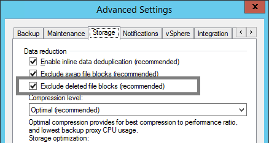

# Deduplication and Compression

## Storage Optimization Overview

Veeam Backup & Replication takes advantage of multiple techniques for optimizing the size of stored backups, primarily compression and deduplication. The main goal of these techniques is to strike the correct balance between the amount of data read and transferred during backup as well as what is stored on the backup target while providing acceptable backup and restore performance. Veeam Backup & Replication attempts to use reasonable defaults based on various factors but there can be cases when leveraging settings other than default might be valuable.

## Deduplication

### What does it do?

The primary purpose of deduplication is to reduce the amount of data that has
to be stored on disk by detecting redundant data within the backup and storing
it only once. Veeam deduplication is based on identifying duplicate blocks
inside a single VM disk or across multiple VMs in a job. This is primarily
beneficial when VMs are deployed from the same template since the base image
is identical, but is less useful for incremental data.

### How does it work?

Deduplication is performed both by the source proxy (only for virtual disk currently being processed) and the target repository (for all virtual disks of all VMs in the job).

Veeam reads data blocks during the backup, calculates a unique hash for those blocks, and stores all identical blocks into the backup file for that session only once. By default, Veeam offers 4 different storage optimization settings that impact the size of read blocks and hash calculation for deduplication:

-   **Local** – this is the default setting and is recommended when using a true disk-based repository. With this setting selected, Veeam reads data and calculates hashes in 1 MB chunks.

-   **LAN** – this value is recommended when using a file-based repository such as SMB share. With this setting selected, Veeam reads data and calculates hashes in 512 KB chunks.

-   **WAN** – this value is recommended when backing up directly over a slow link or for replication as it creates the smallest backups files at the cost of memory and backup performance. With this setting selected, Veeam reads data and calculates hashes in 256 KB chunks.

-   **Local (>16 TB)** – this setting is recommended for large backup jobs with more than 16 TB of source data in the job. With this setting selected, Veeam reads data hashes and calculates data on 4 MB blocks.

**Note:** Local (>16TB) underlying block size has changed in v9, from 8 MB to 4 MB. If you upgrade to Veeam Backup & Replication 9.0 from the previous product version, this option will be displayed as "Local Target (legacy 8MB block size)" in the list and will still use blocks size of 8 MB. It is recommended that you switch to an option that uses a smaller block size and create an active full backup to apply the new setting.

### When to use it?

Veeam deduplication should be enabled in almost all cases, _except_
when backing up to deduplication devices. Disabling in-line deduplication
in such cases significantly increases restore performance.

However, there are a few special cases where a user might consider disabling this option:

-   **Large compressed or deduplicated source VMs** – when backing up VMs, especially large VMs (>1 TB) that contain already compressed data (images, video, Windows deduplicated file servers, etc), it may be beneficial to simply disable Veeam deduplication since it is unlikely to provide much benefit for this type of source data. Note that Veeam deduplication is a job-level setting so VMs of the same type should be grouped and processed with one job.

### When do I change the defaults?

As a rule, the default settings provided by Veeam are designed to provide a good balance of backup size vs. backup and restore performance and resource usage during the backup process. However, given an abundance of resources or other specifics of the environment, it might be useful to change the defaults for a particular job.

For example, transactional servers like Microsoft Exchange and Microsoft SQL commonly make small changes across the disk. If you use the 1 MB blocks setting, this can lead to a great amount of incremental changes each day. Using the WAN optimization with a smaller block size of 256 KB may significantly decrease the size of increments. However, this can have a very significant impact on the speed and the amount of memory needed during the backup process on the repository, especially for large backup jobs.

A 2 TB Microsoft Exchange server may need only 2 GB of RAM on the repository during backup when using default settings of Local/1 MB blocks, but would potentially need 8 GB of RAM on the repository with WAN/256 K blocks. Also, transform operations such as synthetic full backups, forever forward retention/merge and reverse incremental rollback will perform 4x as much I/O, which can significantly increase total backup time. All of this must be taken into consideration prior to changing the defaults.

### Best practices

  * Unless you have a really good understanding of the impact that can cause block size changing, stick to the defaults.
  * If you want to change the default block size, be sure to test it well and make sure you have planned appropriately for the extra I/O and memory requirements on the repository.
  * When using a block size smaller than the default one for a large server, it is recommended to use a backup mode that does not perform synthetic processing (forward incremental with scheduled active full).

| Setting        | Block Size | Maximum recommended job size |
|----------------|------------|------------------------------|
| WAN            | 256 KB     | 4 TB of source data          |
| LAN            | 512 KB     | 8 TB of source data          |
| Local          | 1,024 KB   | 16 TB of source data         |
| Local (>16 TB) | 4,096 KB   | 64 TB of source data         |

**Note:** Block size changes will only become effective after an active full is created.

## Compression

### What does it do?

The purpose of compression is to reduce the amount of data that has to be transferred across the wire and stored on disk. Veeam Backup & Replication leverages several different compression algorithms that provide various balances between compression ratios, throughput and the amount of CPU use on the backup proxy.
Compression provides maximum effect on space savings in a backup job, so understanding the tradeoffs in these settings can be very important.

### How does it work?

Veeam Backup & Replication performs compression on a per-block basis, using the block size selected by the storage optimization settings. The proxy reads each block from the source disk and applies the compression algorithm to the block before transferring it to the repository. This saves network bandwidth between the proxy and repository and allows the repository to store the already compressed block as soon as it receives it.

There are multiple compression options available:

-   **None** – this option disables compression for the job. The proxy reads blocks and sends them uncompressed to the repository where they are written to disk as is.
-   **Dedupe-friendly** – this option uses the very simple RLE compression algorithm that needs very little CPU. It creates somewhat predictable data patterns, which is useful if users want to leverage 3rd party WAN accelerators with Veeam and/or a deduplication appliance (without the ‘decompress before storing’ setting). This allows the network stream to be moderately compressed while still being effectively cached.
-   **Optimal** – this is the default compression used on Veeam jobs that leverages LZ4 compression. It provides typical compression ratios around 2:1 with fairly light CPU overhead. This light CPU overhead allows for excellent throughput with rates up to 150 MB/s per core and even faster decompression rates. This is a most commonly used practice that allows achieving excellent balance between performance and compression savings.
-   **High** – this option uses `zlib` compression tuned for low to moderate CPU overhead. This setting provides for around 10% higher compression ratios compared to optimal, but uses over 50% more CPU horsepower with rates up to 100 MB/core. If proxies are not otherwise CPU bound, this extra savings may still be very much worth it, especially for larger repositories or if the bandwidth available is less than the 100 MB/s limit (i.e., 1 Gb links or less).
-   **Extreme** – this option uses `zlib` compression tuned for high CPU overhead. This setting uses even more CPU and lowered through even further- to around 50 MB/core, with typically only around 3-5% additional savings. It is quite rarely used, however, in cases where bandwidth between the proxy and repository is limited, for example, when you backup directly through WAN links and are not able to backup on first side and use backup copy jobs for this.

Best practices is to use **Dedupe-friendly** for deduplication storage, and **Optimal** for all other storage types.

### When to use it?

Veeam compression should almost always be enabled. However, when using a deduplicating storage system as a repository for storing Veeam backups, it might be desirable to disable Veeam compression at the repository level by using the **Decompress backup data blocks before storing** advanced option in repository configuration.

Enabling compression at the job level, and decompressing once sent to the
repository will reduce the traffic between proxy server and backup
repository by approximately 50% on average. If proxy and repository runs
on the same server, the compression engine is automatically bypassed to
prevent spending CPU for applying compression. The uncompressed
traffic is sent between local data movers using shared memory instead.

### When do I change the defaults?

As a rule, the default settings provided by Veeam are designed to provide a good balance of backup size vs. backup and restore performance and resource usage during the backup process. However, given an abundance of resources or other specifics of the environment, it might be useful to change the defaults in particular circumstances. For example, if you know that CPU resources are plentiful, and backups are unable to make full use of the CPU due to other bottlenecks (disk/network), it might be worth increasing the compression level.

Compression settings can be changed on the job at any time and any new backup sessions will write new blocks with the new compression mode. Old blocks in already stored backups will remain in their existing compression level.

### Best Practices

-   Defaults are good, don’t change values without understanding the impact.
-   Use compression levels above optimal only if you have plenty of CPU and understand that maximum throughput, especially during full backups, will likely be significantly lower, especially if the backup proxy CPUs can’t take more load.
-   Test various compression levels and see how the impacts the environment but remember the balance. A single backup job with a few concurrent streams may seem fine with **Extreme** compression, but may overload all available proxy CPUs during production run of all jobs.
-   Remember that higher compression ratios may also negatively impact restore speeds.

## BitLooker

The option "Exclude deleted file blocks" is the third configurable
option in job settings. In several places you will see references to
this feature under the name "BitLooker".

When enabled, the proxy server will perform
inline analysis of the Master File Table (MFT) on NTFS file systems
and automatically skip blocks that have been marked as deleted.

When upgrading from versions prior to 9.0, the setting is disabled
for existing backup jobs. To enable it for existing jobs, use the
following PowerShell commands.

~~~
Add-PSSnapIn VeeamPSSnapin;

Foreach ($job in Get-VBRJob) {
  $job.Options.ViSourceOptions.DirtyBlocksNullingEnabled = $true;
  $job.SetOptions($job.Options)
}
~~~

It is always recommended to leave BitLooker enabled, as it will reduce
the amount of storage space required.
