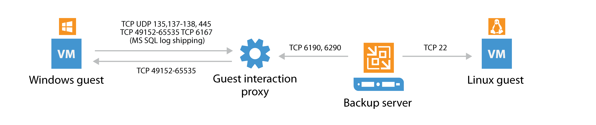

# Application-aware Image Processing

The following ports are required for application-aware image processing
over the network. If network ports are not available, the backup
server will failover to using VIX via VMware Tools.

