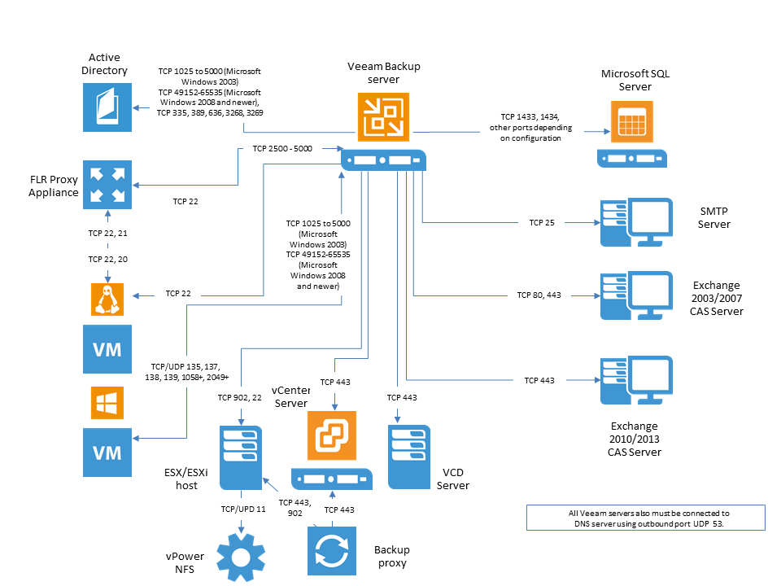

# Infrastructure Servers

**CHANGES**

0. Redesign the diagram
1. Add GIP - from GIP to VM same as from VB server to VM, make a note about editions (?)
2. Add console and mount server - from console to VB server TCP/9392, from console/MS to backup server TCP/9401, from backup server to mount server TCP/6170
3. Add Oracle/Win - same as to VM
4. Add Oracle/Lnx - from console to Oracle TCP/22, TCP/2500-5000
5. Add staging server (sql/win, ora/win, ora/lnx) - same as to respective servers plus TCP/3260-3270