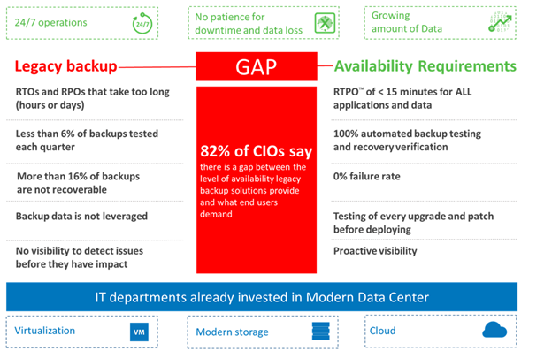

# POC Guide

Organizations are modernizing their data centers in order to provision IT
services faster, strengthen security and control, and lower operational costs.
While building modern data centers, organizations invest in server virtualization,
modern storage applications and cloud-based services. However, businesses are
facing new demands from end users including access to data and applications 24/7,
no patience for downtime or data loss, and exponential data growth at 30-50% per
year.

This opens a gap—an availability gap—between the requirements
of the Always-On BusinessTM and IT’s ability to effectively deliver
availability. In fact, 82% of CIOs say there is a gap between the level of
availability they provide and what end users demand.

Veeam bridges this gap by providing customers a new kind of solution --
Availability for the Modern Data Center, which delivers RTPO of < 15 minutes
for all applications and data.

Organizations now can leverage their investments in the modern data center to
meet new demands of the always-on business.

This section of the document will demonstrate how Veeam solution can be used throughout an entire datacenter availability project, beginning with the first assessment phase to the project implementation from the technical perspective.

**Note:**	While these guidelines focus on enterprise customers with more than 100 hosts or 1,000 virtual machines, Veeam Availability Suite is applicable to any infrastructure size.
