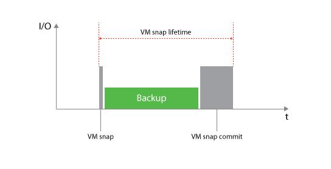
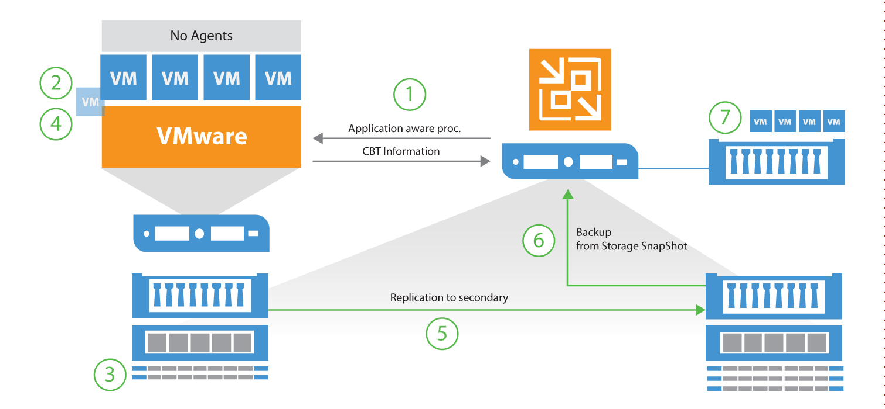
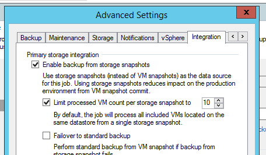
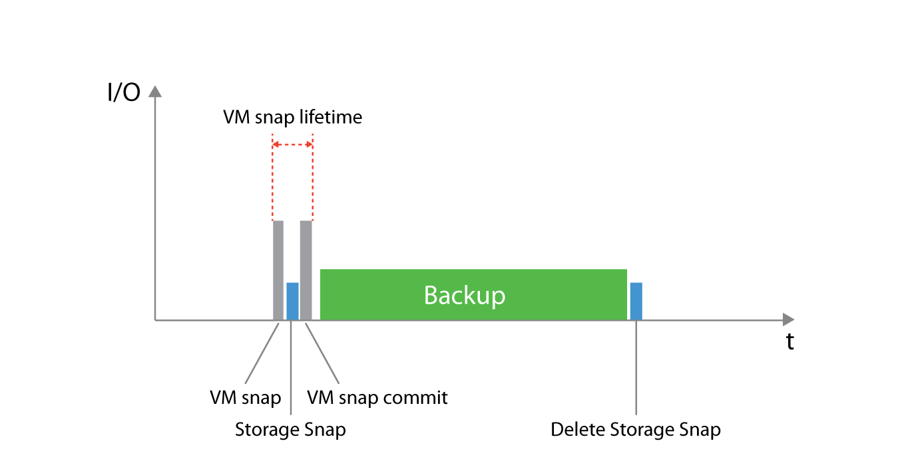
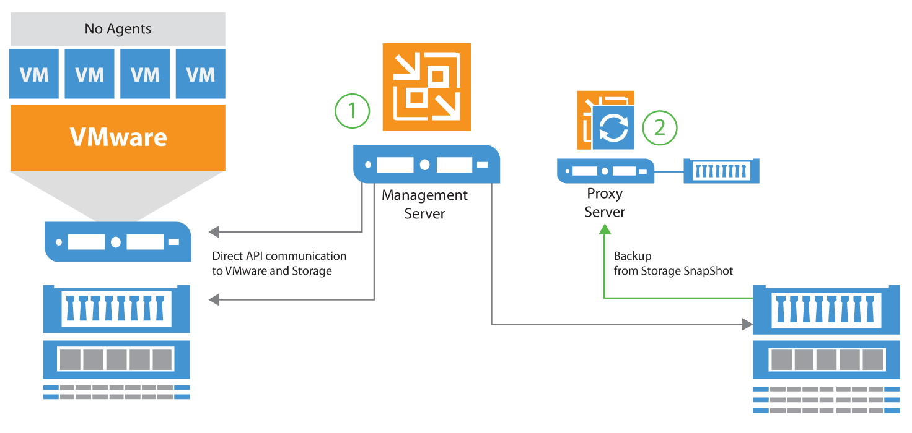

# Backup from Storage Snapshots
Veeam Backup & Replication offers integration with certain storage
arrays for VM snapshot offloading. The following storage vendors and
arrays are currently supported:

* HPE StoreVirtual (LeftHand)
* HPE StoreServ (3PAR)
* NetApp Data ONTAP (FAS, V-Series and IBM N series)
* EMC VNX, VNXe and Unity

Licensing and system requirements are described in the Veeam User Guide:
[Backup from Storage Snapshots](https://helpcenter.veeam.com/backup/vsphere/backup_from_storage_snapshots.html).

The storage integration covered in this section is VMware only and does not apply for Hyper-V.

Backup from Storage Snapshots (BfSS) is a feature included in the deep storage
array integrations and a way to optimize and enhance VM backups in a very
easy way. The main objective for implementing BfSS is to minimize the lifetime
of a VM snapshot, which reduces the time for VM snapshot commit and I/O
the vSphere environment.

For regular VADP based backups, the VM snapshot is created and remains
open (VM snap lifetime) until the VM backup is completed. Especially
with large or highly transactional VMs, that can lead to large snapshot
delta files being created during the backup followed by hours of snapshot
commit tasks within vSphere producing high I/O on the production storage.
Ultimately, these long snapshot commits may lead to unresponsive VMs.
For more information about the impact of VM snapshots
please see the "[Interaction with vSphere](./interaction_with_vsphere.html#impact-of-snapshot-operations)" section of this book.

## How it works

By using BfSS, the VM snapshot lifetime will be significantly reduced. In
this section, we will go through the steps performed.

 1. Application-aware processing ensures transactional consistency
    within the VM
 2. Veeam requests a VM snapshot via VMware APIs
 3. Immediately after creating the VM snapshot, a storage snapshot
    request is issued for saving the VM _including_ the application
    consistent VM snapshot within the storage snapshot.
 4. When the storage snapshot has been created, the VM snapshot is deleted
 5. _(NetApp only - optional)_ Trigger a replication update to
    secondary storage via SnapMirror or SnapVault
 6. Mount storage snapshot to the Veeam backup proxy server
 7. Read data from the storage snapshot and write to a Veeam backup repository

### VM processing limit

When adding large amounts of virtual machines to a job, by default steps
1 and 2 (above) are repeated until all virtual machines within the job have
successfully completed. Only then will BfSS proceed to step 3 and issue the
storage snapshot. If adding 100s of jobs to a backup or replication job, this
could cause a very high VM snapshot lifetime for the first VMs in the job list.

When configuring such large jobs, it is advised to configure the maximum number
of VMs within one storage snapshot. The setting is available in the
advanced job settings under the **Integration** tab.

Example: When creating a job with 100 VMs, and setting the limit to 10,
BfSS will instruct the job manager to process the first 10 VMs (step 1 and 2),
issue the storage snapshot and proceed with the backup (step 3-7). When step 7
has successfully completed for the first 10 VMs, the job will repeat the above
for the following 10 VMs in the job.

As seen below, when ensuring proper configuration of BfSS,
minimal VM snapshot lifetime is achieved, and reduces overall
I/O penalty on the production storage for highly transactional VMs.

## Configuration
Enabling BfSS requires minimal configuration, but understanding the tasks
and responsibilities of involved components are key when troubleshooting and
optimizing for high performance and low RTPO.

The backup server is responsible for all API requests towards
vSphere and storage arrays for determining present volumes, snapshots and
all necessary details such as initiator groups, LUN mappings and which
protocols are available.

The proxy server(s) are used for reading data from the storage snapshot and
sending it to the backup repository. To leverage Backup from Storage Snapshots,
the following configuration requirements must be met:

**Backup server** must have access to the management interfaces of
the storage array. All additional prerequisites such as LUN mappings, creation
of initiator groups for iSCSI, altering NFS exports and snapshot management
is subsequently handled via this connection.

**Backup proxy servers** must be
able to directly access the storage array via the same protocol used for
connecting the production datastore (FibreChannel, iSCSI or NFS). As opposed
to using [Direct Storage Access](./direct_storage_access.md),
it is not a requirement for the proxy server
to have access to the production datastore itself, as it reads data blocks
directly from the cloned storage snapshot.

As described in previous sections, the backup server and proxy server
can be deployed on one single server or scaled out on different servers. In
most environments, where BfSS is applicable, the components are usually
separated for scalability considerations.

## When to use
When using Backup from Storage Snapshots, overall jobs processing may take
longer, as additional steps are performed such as mapping vSphere Changed
Block Tracking (CBT) to offsets of the storage snapshot, and the snapshot
must be cloned and mounted on the backup proxy server. The mount overhead
can take several seconds on block protocols as HBAs or initiators must be
rescanned. It mostly affect FC deployments.

With this in mind, using BfSS on small VMs or VMs with a very low change rate
is not advised. As the VM snapshot lifetime on such VMs is very short, the
benefits of using BfSS are minimal.

In most environments, large VMs or highly transactional VMs producing large
amounts of changed data benefit most from using BfSS. Using the
[VM Change Rate Estimation](https://helpcenter.veeam.com/one/reporter/vm_change_rate_estimation.html)
report in Veeam Availability Suite, you may quickly identify such VMs.

VMs with either virtual or physical Raw Device Mapping (RDM)
are not supported with BfSS. Such VMs will failover to backing up via
standard methods if allowed in the job settings.
