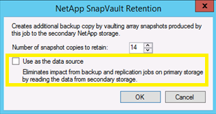
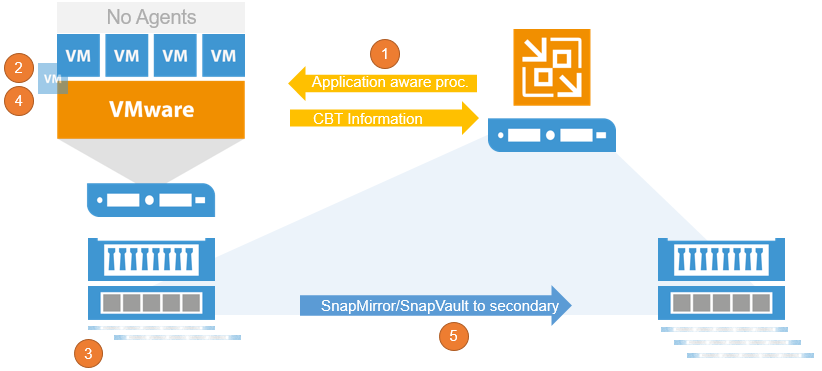
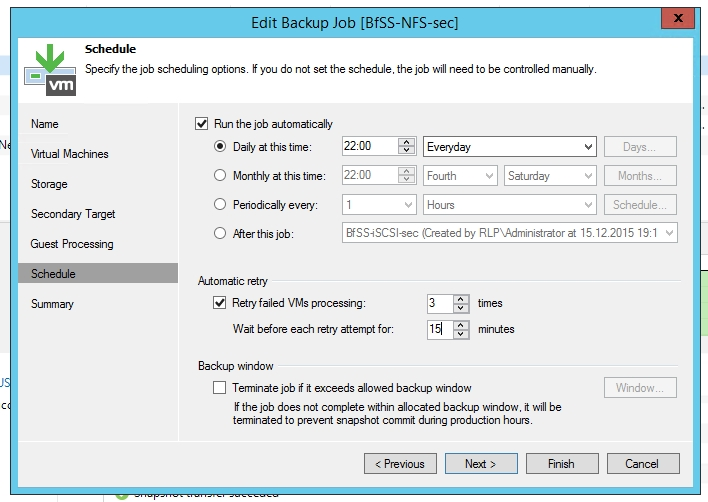

# NetApp Data ONTAP

Specifically for NetApp Data ONTAP, Veeam offers some specific additional
capabilities.

## Backup from secondary snapshots

Backup from Secondary Snapshots. In case you use NetApp SnapVault or
SnapMirror, Veeam can create a primary snapshot, update the secondary
(SV/SM) Snapshot and backup the CBT changes to the backup file. It is
configured with a job setting in the "Advanced" section if Veeam should allow
fallback to the primary snapshot for backup. You can find the setting
within the secondary destination window of your backup job and enable
“Use as the data source”.

## Snapshot Orchestration

For NetApp ONTAP storage systems Veeam offers a SnapShot Orchestration
only feature. SnapShot orchestration means to use storage SnapShots as
backup target. The feature can be used without any need to run a real
backup to an external repository. Veeam is taking care of all required
storage related tasks like data retention, SnapShot management and
SnapMirror/SnapVault updates to secondary sides.

The workflow for Storage Orchestration is:

1.  _(Optional)_ Application-aware processing ensures transactional consistency
    within the VM
2.  Veeam requests a VM snapshot via VADP
3.  Immediately after creating the VM snapshot, a storage snapshot
    request is issued for saving the VM *including* the application
    consistent VM snapshot within the storage snapshot.
4.  When the storage snapshot has been created, the VM snapshot is
    deleted
5.  Trigger a replication update to secondary storage via SnapMirror or
    SnapVault

To configure a “SnapShot only” job set the Repository to "NetApp
SnapShot only"

The retention policy defines the number of storage snapshots to keep.
To store 5 snapshots a day for 1 week, configure the retention to 35 restore
points with a daily schedule. If the job is configured with a high or lower
schedule frequency, adjust the number of restore points accordingly.

If you use a secondary NetApp ONTAP system with SnapMirror and/or
SnapVault you can set the box for a secondary destination and set the
retention.

When using Snapshot Orchestration please take care of the retry
scheduler setting.

If you have for example 100 VMs in one job and 10 of these VMs are
failing in the first run Veeam will rerun the job based on the retry
settings. If the setting is set to 3 (default) Veeam will try 3 more
time to process the failed VMs. For every successful retry Veeam will
create a new Snapshot. If all retries are needed to proceed the failed
VMs that ends in 3 Snapshots for one run. It is recommended to not set
the value higher than 3 or disable the automatic retry to avoid a high
number of Snapshots being created during every run.

One of the big benefits is that you are still able to use all Veeam
restore capabilities from storage snapshots. For more please refer to
the [Veeam Explorer for Storage Snapshots](./veeam_explorers.md#explorer-for-storage-snapshots) section.
