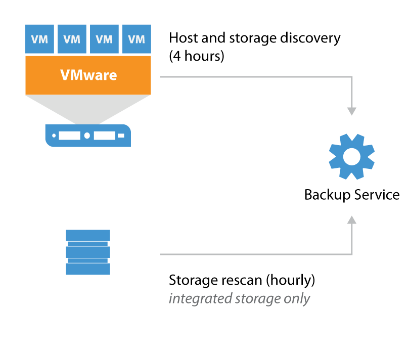
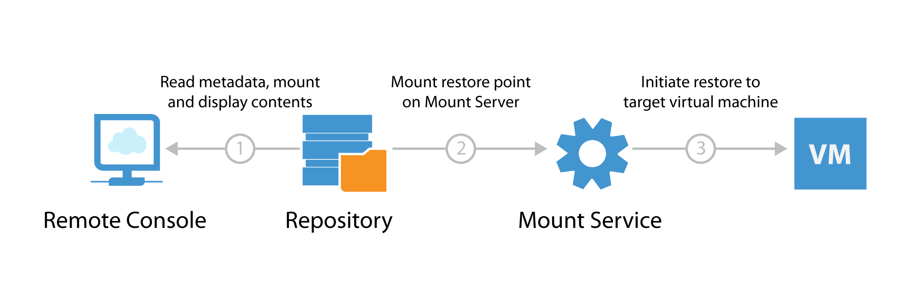
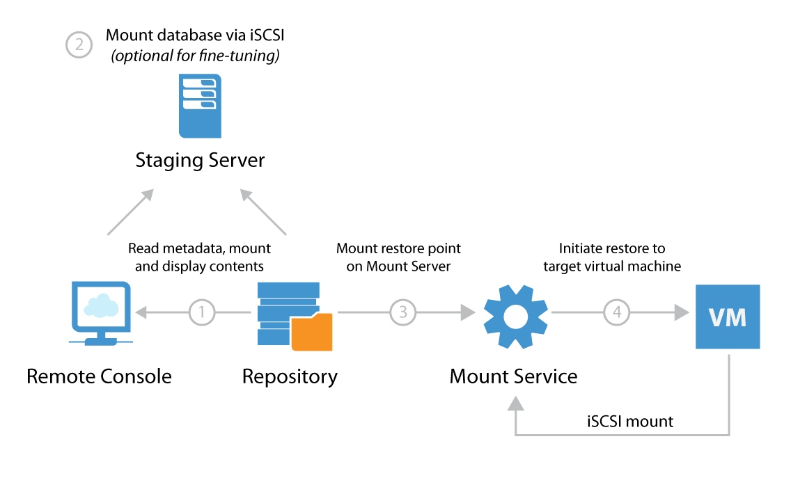

# Backup Server Placement

The Backup server runs a number of processes, e.g. the backup Service, backup Manager services and in some scenarios a Mount
Server as well. In this chapter we will evaluate how each of those components are affected by placement of the Backup & Replication server.

By evaluating the roles and understanding the data flow between the services it is possible to optimize overall backup performance and restore throughput significantly.

## Host and Storage Discovery

To collect information about the virtual infrastructure all managed vCenters and their connected hosts and datastores are periodically rescanned. This rescan process is visible in the **History** tab > **System** section in the Veeam Backup & Replication console. As seen here, the Host discovery process runs every four hours. All the collected information is stored within the configuration database.

The amount of collected information is typically very small however the
Host discovery process may take longer or even exceed the default schedule in highly distributed environments[^1]. If hosts or clusters are connected to vCenter over a high-latency link you may consider deploying a Backup server locally on the ROBO, then you  can create a vCenter service account with a limited scope to that particular location in order to reduce the window of the Host discovery process. If the ROBO uses a stand-alone host it is possible to add the host as a managed server directly instead of through vCenter.

**Note:** Avoid adding individual hosts to the backup infrastructure if
using shared storage in a vSphere cluster.

If storage with advanced integration (HPE, NetApp, EMC) are added to the **Storage Integration** tab there will additionally be a Storage discovery process periodically rescanning storage hourly. This process checks all snapshots for virtual machine restore points for usage within Veeam Explorer for Storage Snapshots. The Veeam Backup & Replication server itself will not perform the actual scanning of volumes but it will use the management API's of the storage controller to read information about present snapshots. Only proxy servers with required storage paths available will be used for the actual storage rescanning process[^2].

The following table shows the three different scanning workflows:

  | Adding new storage controller                       |  Creating new snapshot                              | Automatic scanning                                  |
  | ----------------------------------------------------|-----------------------------------------------------| ----------------------------------------------------|
  | 1. Collect specific storage information             |  1. Creating new Snapshot                           | 1. Storage Monitor runs in background               |
  | 2. List of volumes, snapshots, LUNs and NFS exports |  2. Lists initiators                                | 2. Detecting new volumes                            |
  | 3. Checking licenses, FC and iSCSI server           |  3. Testing iSCSI, NFS and FC from proxies          | 3. Scanning volumes for snapshots every 10 minutes  |
  | 4. Lists initiators                                 |  4. Searching storage exports in VMware             | 4. Lists initiators                                 |
  | 5. Searching storage exports in VMware              |  5. Mapping discovered VMs from datastores to snapshots  | 5. Testing iSCSI, NFS and FC from proxies           |
  | 6. Mapping discovered VMs from datastores to snapshots   |  6. Export and scan the snapshots with proxies      | 6. Searching storage exports in VMware              |
  | 7. Export and scan the snapshots with proxies       |  7. Update configuration database                   | 7. Mapping discovered VMs from datastores to snapshots   |
  | 8. Update configuration database                    |                                                     | 8. Export and scan the discovered objects with proxies |
  |                                                     |                                                     | 9. Update configuration database                            |

The scan of a storage controller performs, depending on the protocol,
several tasks on the storage operating system. Therefore it is
recommended to have some performance headroom on the controller. If your
controller is already running on >90% CPU utilization, keep in mind
that the scan might take significant time to complete.

The scanning interval of 10 minutes and 7 days can be changed with the following
registry keys.

-   Path: `HKEY_LOCAL_MACHINE\SOFTWARE\Veeam\Veeam Backup and Replication`
-   Key: `SanMonitorTimeout`
-   Type: REG_DWORD
-   Default value: 600
-   Defines in seconds how frequent we should monitor SAN infrastructure and
    run incremental rescan in case of new new instances

-   Path: `HKEY_LOCAL_MACHINE\SOFTWARE\Veeam\Veeam Backup and Replication`
-   Key: `SanRescan_Periodically_Days`
-   Type: REG_DWORD
-   Default value: 7
-   Defines in days how frequent we should initiate periodic full rescan after
    Veeam Backup service rescan

Per default Veeam will scan all volumes and LUNs on the storage
subsystem. During rescan, each present snapshot produces a snapshot
clone, mounts to a proxy server, scans the filesystem, lookup for
discovered VMs and unmounts. This is repeated for every present snapshot.

**Example**: A storage system with 50 volumes or LUNs with 10 snapshots for each.
Scanning the entire system means 500 (50x10) mounts and clones are
performed. Depending on the performance of
the storage system and the proxy server, this can take significant time.

To minimize the scan time it is recommended to select the volumes used
by VMware within the setup wizard to avoid the overhead of scanning
unused data volumes.

## File-level Recovery Data Flow
To perform file-level restores for a Windows-based or other OS VM Veeam mounts all VM disk files from the backup files (stored on the repository server) to a Mount Service.

When file-level recovery is performed from the Veeam backup console two mounts are initiated:

1. The remote console - for displaying restore point contents
2. The mount server - for performing actual restore traffic to the target VM

**Note:**  When using non Windows a FLR Helper mounts the backup file to recover the file and then mounts for recovery..

Between 50-400 MB of data is transferred between the console and backup repository. If the first file mount is performed over a slow connection it may take considerable time to load the file-level recovery wizard. If there is significant latency between the backup repository and console, it is recommended to deploy an instance of the console on or closer to the repository server.

### Veeam Enterprise Manager
Veeam Enterprise Manager is a self-service portal where administrators or service desk representatives can initiate restores for VMs, files, e-mail items and SQL databases.

It is possible to avoid the first mount entirely by using "guest file system indexing"[^3]. When guest file system indexing is enabled, the content of the guest VM is stored in the Veeam Catalog and presented through Veeam Enterprise Manager. Veeam Enterprise Manager will initiate the file-level restore with the mount server without requiring the first mount.

**Note:** If guest file system indexing is disabled restores may still be initiated through Enterprise Manager however they will still require the first mount to be performed with similar performance implications as previously described.

### Veeam Explorers
Veeam Explorers are installed as part of the backup server and backup console when installed remotely. When performing item-level recoveries the file-level recovery engine is leveraged. Please see the previous section for deployment considerations.

The Veeam Explorer for SQL Server, SharePoint and Oracle all use a staging server to allow selecting a specific point in time for point-in-time restore. This introduces an additional connection as illustrated below.

## Disaster Recovery Optimization
When using Veeam for replicating VMs to a disaster recovery (DR) site, it is
recommended to keep the Backup & Replication server in the DR site alongside the replicas. When the backup server is located in the DR site it enables true "1-Click Failover" by being able to start Failover Plans immediately and thus eliminate manual reconfiguration before the failover process can be initiated.

 Proper planning dictates that to get 1-Click Failover working it requires that the vSphere clusters in each location are connected to separate vCenter servers. In the event of an outage in the primary datacenter it is only possible for the Backup & Replication server in the DR site to initiate failover if the vCenter server itself is available.

 In cases when it is impossible to have multiple vCenter instances across
 sites (e.g. Metro Cluster or similar active-active configurations), the
 recommended solution is to use vCenter Server and following
 these steps in event of a disaster:

 1. Replicate vCenter from primary site to secondary site with low RPO
 2. Configure VMware DRS affinity rules[^4] for pinning replica vCenter VM to a specific host
 3. Connect to specified host and manually power on replicated vCenter VM
 4. Verify vCenter availability through Veeam Backup & Replication
 5. Initiate Failover Plans

## Examples
In this section we will outline two examples based on two enterprises with 50
remote/branch offices (ROBO). They have the following common characteristics:

- One vCenter Server in HQ managing all ROBO sites
- Local backup jobs for fast backup and restore performance
- Offsite copies from the ROBO consolidated at HQ for D/R protection

### Example 1: Centralized Job Configuration

IT requires _one_ central management console for the entire backup infrastructure,
administration and job scheduling. The backup administrator can follow these
guidelines:

1.  Install and configure Veeam Backup & Replication in HQ

2.  Add the vCenter Server via the Veeam Backup & Replication console

3.  Add the ROBO backup server as Managed Server in the **Backup Infrastructure** tab

4.  Configure the HQ backup server with the roles Backup Repository and
    optionally WAN accelerator

5.  Configure the ROBO backup server with the roles Backup Proxy, Backup Repository and optionally as WAN accelerator[^5]

6.  Configure one or more Backup Jobs for each ROBO pointing to its local backup repository

7.  At HQ configure one or more Backup Copy Jobs for each ROBO pointing to the backup repository

8.  Install Veeam Backup Console on the ROBO backup server for faster restore via the local Mount Server

**Note:** The remote console installation files are on the same installation media as Veeam Backup & Replication

#### Constraints
Please consider the following constraint:

-   If a WAN link between HQ and a ROBOs fails, no backup jobs will run, as the backup server will not be able to communicate with the remote ESXi hosts via the centralized vCenter Server

-   When performing file-level restore for non-indexed virtual machines at        the ROBO via Veeam Enterprise Manager the restore point will be mounted over the WAN link to HQ for displaying the contents of the restore point. Thus it is recommended to use indexing for such virtual machines

### Example 2: Distributed Job Configuration
IT requires local backup jobs and backup copy jobs (with optional WAN acceleration)
are created at the ROBO. For security considerations, each ROBO is provided with
delegated access to VMware vCenter. Restore capabilities from backup copy jobs
should be configured and managed at HQ as well as delegated restore and license
management for all sites via Veeam Enterprise Manager. The backup administrator
may follow these guidelines:

1.  Install Enterprise Manager at HQ

2.  Install and configure Veeam Backup & Replication on each ROBO

3.  On vCenter Server, create separate service accounts per ROBO with a limited
    scope for displaying only relevant hosts or clusters

4.  At the ROBO, add vCenter Server via the **Backup Infrastructure** tab using
    the scoped service account

5.  _Optional:_ At the ROBO, configure a local WAN accelerator and create or re-use
    an existing WAN accelerator at HQ (please note many-to-one configurations are
    supported)

6.  At the ROBO, add and configure the Repository Server at HQ (please note
    many-to-one configurations are supported)

7.  Configure one or more Backup Jobs at each ROBO pointing to its local
    backup repository

8.  Configure one or more Backup Copy Jobs at each ROBO pointing to the
    centralized backup repository at HQ (use WAN acceleration as needed)

9.  Install Veeam Backup & Replication Console at HQ. When using the remote
    console for connecting to remote instances, it is possible to leverage faster
    file-level or item-level restores at HQ via the console's built-in Mount Server

**Note**: As components are managed by multiple backup servers, always
ensure that the same patch/update/version level is used for the entire
Veeam backup infrastructure.

[^1]: In very large or extremely distributed environments, it is possible to extend the schedule frequency by altering registry key `VolumesDiscover_Periodically_Hours` (REG_DWORD, default: 4)
[^2]: Storage rescan procedure > [Re-Scanning Storage Systems](https://helpcenter.veeam.com/backup/vsphere/storage_rescan.html)
[^3]: More information about guest file system indexing in Veeam Helpcenter > [Guest file system indexing](https://helpcenter.veeam.com/backup/vsphere/indexing.html)
[^4]: VMware Distributed Resource Scheduler > [VM-Host Affinity Rules](https://pubs.vmware.com/vsphere-60/topic/com.vmware.vsphere.resmgmt.doc/GUID-2FB90EF5-7733-4095-8B66-F10D6C57B820.html)
[^5]: Remember to add sufficient resources if all three roles can run on the remote backup server.
