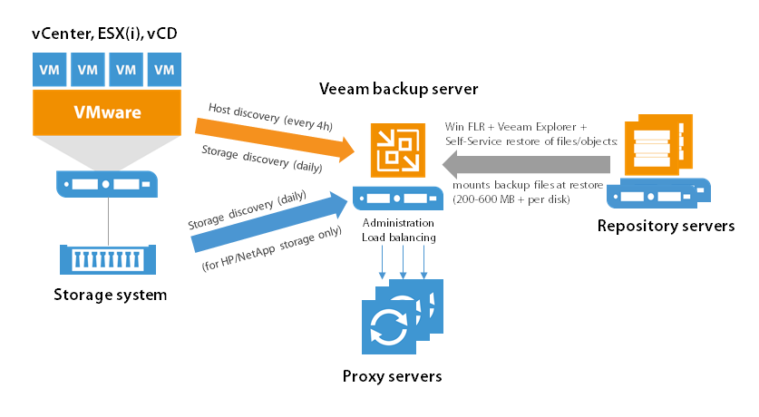
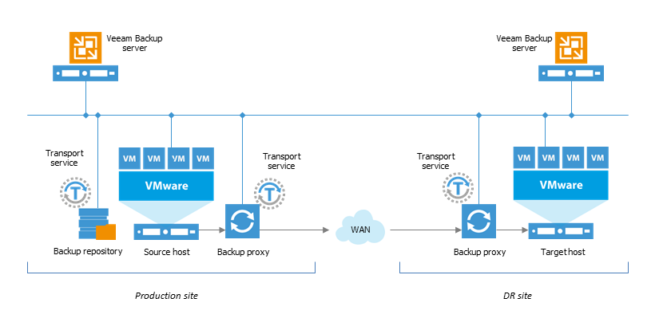

# Data Flow

Here is an overview of some of the data streams created by the Veeam Backup Service.

1.  Host and storage discovery
2.  Data flow at restore, including:
  -   Windows file-level restore process
  -   Application item restore (via Veeam Explorer for Microsoft Active
    Directory, Veeam Explorer for Microsoft Exchange, Veeam Explorer for
    Microsoft SharePoint, Veeam Explorer for Microsoft SQL)
  -   Self-Service Restore of files and application objects (via Veeam
    Backup Enterprise Manager)
3.  Disaster recovery optimization for replica failover and/or for
    possible WAN link downtime

## Host and Storage Discovery 

The Veeam backup server periodically scans all managed hosts and storage
systems in order to detect new datastores and newly added VMware cluster
members (ESXi hosts). Host scan runs every 4 hours, storage scan runs
daily. As a result of the scans, Veeam updates VMware metadata stored in
the Veeam Backup & Replication configuration database.

 **Note**: If there is a single Veeam backup server deployed on the same
site with vCenter Servers and VMware hosts, there are no special
considerations on data flow. However, if there are multiple Veeam backup
servers or if the deployment involves WAN links, you should plan
appropriately for network traffic so that it does not affect the
deployment.

When adding a vCenter Server to Veeam Backup & Replication management
console, consider that all its managed ESXi hosts will be scanned
automatically every 4 hours. So, in case of a RO/BO deployment with 100
branches, each with its own Veeam backup server, adding a central
(global) vCenter Server can produce a significant traffic over the WAN
links due to these periodic scans. To avoid that, the following can be
suggested:

-   Create a vCenter Server user account that can only access the ESXi
    hosts of a specific branch office. This account can be used by the
    local Veeam backup server to limit traffic to the local ESXi hosts
    when scanning.

-   If a site comprises standalone ESXi hosts, they can be added to
    Veeam Backup & Replication management console separately, as managed
    hosts (instead of adding the vCenter Server).

**Note:** Avoid adding individual hosts to the backup infrastructure if
using shared storage in VMware vSphere.

## Disaster Recovery Optimization

Best practices recommend to deploy a Veeam backup server on the target
site where replicated VMs will reside. Therefore, if you plan to perform
VM replication with Veeam, consider placing a Veeam backup server at the
replica target site. A backup server deployed in the DR site guarantees
correct one-click failover during disaster recovery event. If it is not
possible to deploy a Veeam backup server in the DR site, install Veeam
Backup & Replication on a VM and replicate this VM to DR site. Then in
the case of a disaster recovery event, you will be able to boot this
replica VM using VMware vSphere Web Client and perform the necessary
failover operations.

### Example 1: Enterprise Deployment for 50 Remote Offices, with Central Job Management

An organization comprises 50 branches, with ESXi hosts on each site, and
a vCenter Server in the central location. IT require a central
management point for the Veeam backup infrastructure, administration and
job scheduling. They require local backups to be created at branch
sites, and a backup copy job (with WAN acceleration) to consolidate
these at Global HQ. An administrator can implement this example scenario
in the following way:

1.  Install Veeam Backup & Replication in the branch office (ROBO) and
    the datacenter (HQ), either on a virtual or physical server. (Do not
    configure WAN accelerators).

2.  Add the branch office (ROBO) ESXi hosts to the corresponding
    (branch office) Veeam backup servers to provide fast local restore.

3.  Install Veeam Backup & Replication at Global datacenter HQ and add
    all branch office (ROBO) Veeam backup servers as managed servers
    with proxy, repository and WAN accelerator.

**Note**: Remember to add appropriate resources so that all 3 roles can
run on this server.

1.  Configure one or more repository servers and WAN accelerators at
    Global datacenter (HQ) as described in the documentation.

2.  Add the vCenter Server to the Veeam Backup & Replication console at
    Global datacenter (HQ).

3.  Configure backup and backup copy jobs on Veeam backup server at
    Global datacenter (HQ) for all branch offices (ROBO).

This deployment scenario facilitates centralized administration via
Veeam backup console at HQ.

#### Constraints

However, the following considerations should be taken into account:

-   Use local Veeam backup servers to rescan/import backups for
    file-level restore and item-level restore via Veeam Explorers.

-   Enterprise Manager can be used with all of its functionality, but
    Enterprise Manager Self-Service file restore functions and object
    restore cannot be used, as it would mount the whole backup file to
    the central Veeam backup server through the WAN link and also
    transport the restore data stream twice through the WAN link. This
    does not affect 1-Click VM Restore/failover and job administration
    by Enterprise Manager.

-   If a WAN link fails, no backup job will run, as the backup server
    will not be able to connect to the branch office Veeam and VMware
    components to start required tasks.

-   As components are managed by multiple backup servers, always ensure
    that the same patch/update/version level is used for the entire
    Veeam backup infrastructure.

### Example 2: Enterprise Deployment for 50 Remote Offices, with Independent Job Scheduling and Self-Services

An organization features 50 branches, with ESXi hosts on each site, and
a vCenter Server in the central location. They require VM backups and
Self-Service Restore to function without data flowing through a WAN link
for restore, as the WAN bandwidth is very low. They require local
backups to be created at branch sites, and a backup copy job (with WAN
acceleration to save bandwidth) to consolidate these at Global HQ.

An administrator can implement this example scenario, as follows:

1.  Install an Enterprise Manager on the Global HQ and add all Backup &
    Replication Servers later.

2.  Install Veeam Backup & Replication on each site, either on a virtual
    or physical server.

3.  Configure WAN accelerators as described to the documentation.

4.  Add the branch office ESXi hosts to the corresponding (local) Veeam
    backup servers to provide fast local restore.

5.  Install Veeam Backup & Replication at Global HQ for import and
    restore of backups that are copied to the Global HQ using the backup
    copy jobs.

6.  Configure backup and backup copy jobs on Veeam backup servers in the
    branch offices.

This deployment scenario facilitates VM backups at local sites, as well
as Enterprise Manager-based Self-Service Restore. Windows VM Restore
File Level Recovery and application item restore via Veeam Explorers can
be done without a need to rescan/import the backups directly at the
branch office Backup & Replication servers. You can use multiple Veeam
Backup & Replication management consoles for independent job scheduling.

**Note**: As components are managed by multiple backup servers, always
ensure that the same patch/update/version level is used for the entire
Veeam backup infrastructure.

## Data Flow at Restore

**[v9]** This section will be updated to include improvements from the Mount Server and stand-alone console.

### Windows File-Level Recovery 

To perform file-level restores for a Windows-based VM, Veeam mounts all
VM disk files from the backup files (stored on the repository server) to
the Veeam backup server. This can produce a significant data flow
between those components (50 - 400MB) – consider this factor if there is
a WAN link here.

When the backup is mounted, the files selected for recovery are
transported from the repository server through the Veeam backup server
to the VM itself.

To optimize file-level and item-level restores from backup repositories
in remote locations, you can deploy a backup server and import backups
manually as mentioned in the “Disaster Recovery Optimization” section
above.

### Veeam Explorers

Veeam Explorers are installed together with the Veeam backup server and
run the Windows file-level restore process in the background. So, if you
plan to use these tools, refer to the previous section for server
deployment considerations.

### Restore via Enterprise Manager 

Veeam Enterprise Manager is a self-service portals where administrators or service desk representatives can initiate restores for VMs, files, e-mail items and SQL databases.

The Self-Service restore process uses Veeam backup servers to mount the
backup file from the repository-based primary backups to itself or to
the Linux FLR appliance (for Linux file restore only). Thus, it is
recommended to place a Veeam backup server on the same site as the
repository where the backup files that will be used for restore are
stored.