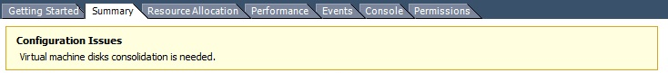
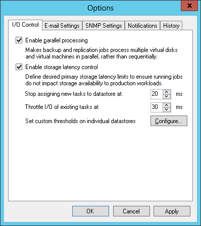
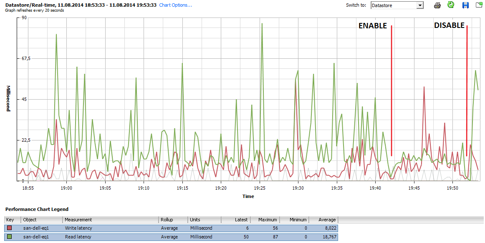

# Interaction with vSphere
Veeam Backup & Replication relies heavily on the vSphere
infrastructure it is protecting. Much of the implementation success depends
on the performance and stability of this environment. In this section, we will
discuss those interactions and note the items that should be considered
for a successful implementation.

While it is possible to connect a Veeam Backup & Replication server
directly to ESX(i) hosts, this section assumes a vSphere environment
with at least one vCenter Server, and that the backup server is
integrated at the vCenter Server level, as this is the best practice
configuration in almost all use cases.

## vCenter Server

One of the most critical components of any vSphere environment is the
vCenter Server. This server provides a single view of the entire virtual
environment, and a central point of management. Veeam Backup &
Replication communicates with the vCenter Server in many operations. For
this reason, fast and stable communication between Veeam Backup &
Replication and the vCenter Server is critical to achieving a stable
backup environment.

Consider some important factors:

-   Problems with connectivity to the vCenter Server is one of the top
    reasons for failed Veeam jobs. Having a well-performing vCenter
    Server with reliable connectivity will mitigate this issue and
    provide a strong backbone for a reliable backup infrastructure.

-   The vCenter Server must be reliable and always available when backup
    jobs are running. It must be able to answer queries and perform
    actions in a reasonable amount of time. If the vCenter Server
    performs poorly during normal operations, this should be corrected
    prior to implementing Veeam Backup & Replication.

-   For larger environments, with many concurrent jobs, especially jobs
    that run at short intervals, such as near-CDP, the load on the
    vCenter Server can be significant. The vCenter Server must be able
    to handle increased transactional workload to prevent random job
    failures due to command timeouts.

-   The backup server must have reliable network connectivity to the
    vCenter Server. It is generally suggested that the backup server is
    placed in close logical proximity to the vCenter Server, but this is
    not always the best deployment option. In cases where the backup
    server and vCenter Server must be deployed across a distance, the
    only real requirement is that this connection is consistent
    and reliable.

-   When maintenance is being performed on the vCenter Server, best
    practice would dictate that all Veeam Backup & Replication jobs
    must be idle, and the Veeam Backup Service should be stopped. This
    includes applying Windows updates, vCenter Server patches and
    upgrades, or any maintenance that would require the vCenter service
    to be restarted or the system rebooted.

## Impact of Snapshot Operations
To create VM backups, Veeam Backup & Replication leverages the VMware
vSphere snapshot functionality. When Veeam Backup & Replication begins
the backup of a VM, it communicates with vSphere to request a snapshot
of the VM, and after the backup of the VM is complete, Veeam requests
that vSphere remove the snapshot (with the exception of backup jobs
leveraging Backup from Storage Snapshots). The creation and removal of
snapshots in vSphere creates a significant impact on the environment
what must be taken into account. This section will describe various
factors that should be considered regarding this process, and offer
several techniques to minimize the impact of snapshot operations.

As a concept, VMware vSphere snapshots are a simple technology. A VM
generally contains at least one virtual disk, which is represented by a
VMDK file. When a snapshot is taken, VMware vSphere continues to read
blocks from the file as normal. However, for any new blocks that are
written to the disk, these writes are redirected to a new “thin” VMDK
file called the delta file.

Since the original VMDK file is only being used for reads, it provides a
consistent view of the blocks that made up the VM at the time the
snapshot was taken. This allows Veeam Backup & Replication to read this
base disk as a consistent image for backup and replication functions.
When the snapshot is removed, the blocks that were written to the delta
file are read and written back into the original VMDK, and finally the
delta file is discarded.

As Veeam Backup & Replication leverages the snapshot technology for
performing backups, you should ensure it is possible to snapshot the
virtual machine disks, since there are certain configurations that do
not support snapshots. To identify VMs that do not support snapshots,
see [VMware KB article 1025279](http://kb.vmware.com/kb/1025279) ; you
can also use [Veeam ONE assessment
reports](https://helpcenter.veeam.com/one/reports/vm_configuration_assessment.html)
to automatically detect them before starting Veeam Availability project.

As with many things in technology, although the concept is simple, the
actual implementation is a little more complex. The following section is
a quick look at the impact of various operations on the VM and
underlying infrastructure.

### Snapshot Creation
The actual operation of creating a snapshot generally has only a minor
impact: the snapshot file has to be created, and there is a very short
“stun” of the VM. This “stun” is generally short enough (typically, less
than 1 sec), so it is rarely an issue except for the most time-sensitive
applications.

**Note**: Veeam Backup & Replication leverages a standard VM snapshot
for the backup process. These VMware snapshots have a single file size
limitations. Keep in mind, that the maximum file size include all snapshot
files and the data disk in total. For example if you have an old VMFS
version 3 the maximum file size (including snapshots) is 2TB and so your
data disk should not be sized over 1.98TB to still be able to create snapshots.
For details, see [VMware KB article 1012384](http://kb.vmware.com/selfservice/microsites/search.do?language=en_US&cmd=displayKC&externalId=1012384).

The default number of concurrently open snapshots per datastore in Veeam
Backup & Replication is 4. This behavior can be changed by creating
the following registry key:

-   Path: `HKEY_LOCAL_MACHINE\SOFTWARE\Veeam\Veeam Backup and Replication`
-   Key: `MaxSnapshotsPerDatastore`
-   Type: REG_DWORD
-   Default value: 4

Please note that enabling [Storage Latency Control](#storage-latency-control) will override the registry
setting, as the snapshot threshold will instead adjust itself dynamically
according to current storage latency.

### Snapshot Open
Simply having a snapshot open for a running VM involves some performance
penalty on the VM, the ESX(i) host and the underlying storage. The host
has to track the I/O, split writes to the snapshot file and update the
snapshot file metadata. This overhead, in turn, impacts the guest
(primarily, with slower I/O).

This is generally most notable for VMs with significant write load, and
has less impact on read performance.

From the storage perspective, VMs running with an open snapshot require
additional space to store the snapshot data, and additional I/O load on
the datastore. This is generally more noted on systems with significant
write I/O load.

**Note**: Refer to VMware Knowledge Base article at
[www.kb.vmware.com/kb/1035550](file:///C:\Users\oslusarenko\Documents\Documents\B&R\In%20progress\8.0\VBR\Best%20Practices\Last%20version\www.kb.vmware.com\kb\1035550) for information on vMotion and Storage vMotion processes performed with
open snapshots.

### Snapshot Removal
Snapshot removal is the step with the highest impact from the
performance perspective. I/O load increases significantly, due to the
extra R/W operations required to commit the snapshot blocks back into
the original VMDK. This eventually leads to the VM “stun” required to
commit the final bits of the snapshot. The “stun” is typically a short
pause usually only a few seconds or less, when the VM is unresponsive
("lost ping"), while the very last bits of the snapshot file are
committed.

VMware vSphere uses the "rolling snapshot" for older versions and the
same method as storage vMotion uses starting from vSphere 6.0u1 to
minimize the impact and duration of the stun, as described below:

For vSphere 6u1 and newer:
The host leverages the Storage vMotion Mirror driver to copy all needed data
to the original data disks. When completed, a "Fast Suspend" and
"Fast Resume" is performed (comparable with vMotion) to bring the original data
files online.

For older vSphere Versions (Rolling Snapshot):
1.  The host takes a second, “helper”, snapshot to hold new writes.
2.  The host reads the blocks from the original snapshot and commits
    them to the original VMDK file.
3.  The host checks the size of the “helper” snapshot. If the size is
    over the threshold, step 1 is repeated.
4.  Once all helper snapshots are determined to be under the threshold
    size, vSphere “stuns” the VM and commits the last bits of
    the snapshot.

This “stun” period can be less than one second for small VMs with light
load, or several seconds for larger VMs with significant load. To
external clients, this small stun looks like the server is busy and thus
might delay a response for a few seconds. However, applications that are
very sensitive to delays may experience issues with this short period of
unresponsiveness.

For explanation of snapshot removal issues, see [VMware KB article
1002836](https://kb.vmware.com/kb/1002836).

## How to Mitigate?
To mitigate the impact of snapshots, consider the following
recommendations:

-   Upgrade to vSphere 6u1 or newer to use the new Storage vMotion
	  based Snapshot commit processing.

-   **Minimize the number of open snapshots per datastore**.
    Multiple open snapshots on the same datastore are sometimes
    unavoidable, but the cumulative effect can be bad. Keep this in mind
    when designing datastores, deploying VMs and creating backup and
    replication schedules. Leveraging backup by datastore can be useful
    in this scenario.

-   **Consider snapshot impact during job scheduling.**
    When possible, schedule backups and replication job during periods
    of low activity. Leveraging the [Backup Window](https://helpcenter.veeam.com/backup/vsphere/vm_copy_schedule.html)
    functionality can keep long-running jobs from running during production.
    See the corresponding setting on the **Schedule** tab of the job wizard

-   **Use the vStorage APIs for Array Integration (VAAI)
    where available.** VAAI can offer significant benefits:
    -   Hardware Lock Assist improves the granularity of locking
        required during snapshot growth operations, as well as other
        metadata operations, thus lowering the overall SAN overhead when
        snapshots are open.
    -   VAAI in vSphere 5.x offers native snapshot offload support and
        should provide significant benefits once vendors release
        full support.
    -   VAAI is sometimes also available as an ESXi plugin from the NFS
        storage vendor.

-   **Design datastores with enough IOPS to support snapshots.**
    Snapshots create additional I/O load and thus require enough I/O
    headroom to support the added load of snapshots. This is especially
    important for VMs with moderate to heavy transactional workloads.
    Creating snapshots in VMware vSphere will cause the snapshot files
    to be placed on the same VMFS volumes as the individual VM disks.
    This means that a large VM, with multiple VMDKs on multiple
    datastores, will spread the snapshot I/O load across
    those datastores. However, it actually limits the ability to design
    and size a dedicated datastore for snapshots, so this has to be
    factored in the overall design. 

    **Note:** This is the default behavior that can be changed, as explained
    in the VMware Knowledge Base: <http://kb.vmware.com/selfservice/microsites/search.do?language=en_US&cmd=displayKC&externalId=1002929>

-   **Allocate enough space for snapshots.**
    VMware vSphere 5.x puts the snapshot VMDK on the same datastore with
    the parent VMDK. If a VM has virtual disks on multiple datastores,
    each datastore must have enough space to hold the snapshots for
    their volume. Take into consideration the possibility of running
    multiple snapshots on a single datastore. According to the best
    practices, it is strongly recommended to have 10% free space within
    a datastore for a general use VM, and at least 20% free space within
    a datastore for a VM with high change rate (SQL server, Exchange
    server, and others).

    **Note:** This is the default behavior that can be changed, as explained
    in the VMware Knowledge Base: <http://kb.vmware.com/selfservice/microsites/search.do?language=en_US&cmd=displayKC&externalId=1002929>

-   **Watch for low disk space warnings.**
    Veeam Backup & Replication warns you when there is not enough space
    for snapshots. The default threshold value for production datastores
    is 10 GB. Keep in mind that you must increase this value
    significantly if using very large datastores (up to 62 TB).
    You can increase the warning threshold in the backup server options,
    of the Veeam Backup & Replication UI.
    You can also create a registry key to prevent Veeam Backup &
    Replication from taking additional snapshots if the threshold is
    breached:
    -   Path: `HKEY_LOCAL_MACHINE\SOFTWARE\Veeam\Veeam Backup and Replication`
    -   Key: `BlockSnapshotThreshold`
    -   Type: REG_DWORD
    -   Default value (in GB): 2

    **Tip:** Use the [Veeam ONE Configuration Assessment Report](https://helpcenter.veeam.com/one/reporter/vm_configuration_assessment.html) to detect datastores with less than 10% of free disk space available for snapshot processing.

-   **Enable parallel processing.**
    Parallel processing tries to backup multiple VM disks that belong to
    a single VM at the same time. This reduces snapshot lifetime to
    the minimum. This option is enabled by default. Please note if you
    upgraded from v6.5 or earlier versions, you have to enable this
    option explicitly in the backup server options.

-   **Tune heartbeat thresholds in failover clusters.**
    Some application clustering software can detect snapshot commit
    processes as failure of the cluster member and failover to other
    cluster members. Coordinate with the application owner and increase
    the cluster heartbeat thresholds. A good example is Exchange
    DAG heartbeat. For details, see [Veeam KB Article     1744](http://www.veeam.com/kb1744).

## Considerations for NFS Datastores
Backup from NFS datastores involves some additional consideration, when
the **virtual appliance (hot-add)** transport mode is used. Hot-add is
takes priority in the intelligent load balancer, when Backup from Storage
Snapshots or Direct NFS are unavailable.

Datastores
formatted with the VMFS file system have native capabilities to
determine which cluster node is the owner of a particular VM, while
VMs running on NFS datastores rely on the LCK file that resides within
the VM folder.

During hot-add operations, the host on which the hot-add proxy resides
will temporarily take ownership of the VM by changing the contents of
the LCK file. This may cause significant additional "stuns" to the VM.
Under certain circumstances, the VM may even end up being unresponsive.
The issue is recognized by VMware and documented in
<http://kb.vmware.com/kb/2010953>.

**Note**: This issue does not affect Veeam Direct NFS as part of Veeam Direct Storage Access
processing modes and Veeam Backup from Storage Snapshots on NetApp NFS datastores.
We highly recommend you to use one of these 2 backup modes to avoid problems.

If for what ever reason Direct NFS processing can not be used and HotAdd
is configured, ensure that proxies running in the Virtual
Appliance mode (Hot-Add) are on the same host as the protected VMs.

To give preference to a backup proxy located on the same host as the
VMs, you can create the following registry key:

-   Path: `HKEY_LOCAL_MACHINE\SOFTWARE\Veeam\Veeam Backup and Replication`
-   Key: `EnableSameHostHotAddMode`
-   Type: REG_DWORD
-   Default value: 0 _(disabled)_

    **Value  = 1** – when proxy A is available on the same host, Veeam Backup &
    Replication will leverage it. If proxy A is busy, Veeam Backup &
    Replication will wait for its availability; if it becomes
    unreachable for some reason, another Hot-Add proxy (proxy B) will be
    used.

    **Value = 2** - when proxy A is available on the same host, Veeam Backup &
    Replication will leverage it. If proxy A is busy, Veeam Backup &
    Replication will wait for its availability; if it becomes
    unreachable for some reason, Veeam Backup & Replication will switch
    to NBD mode.

This solution will typically result in deploying a significant number of
proxy servers, and may not be preferred in some environments. For such
environments, it is recommended switching to Network mode (NBD) if Direct
NFS backup mode can not be used.

## Snapshot Hunter
At Veeam Support, one of the most commonly raised support cases
was for orphaned snapshots. Orphaned snapshots were caused by VMware’s
own failed snapshot commit operations due to unreleased VMDK file locks
during VDDK operations. Veeam uses the VMware standard VM snapshot
processing for backup and replication processes, so although Veeam was
not the origin of the orphaned snapshots, as Veeam uses VMware
snapshots, Veeam is often seen as a root cause as this issue was only
discovered when a backup failed.

If not monitored appropriately, VMware orphaned snapshots can cause many
unexpected problems. The most common problems are overfilled VM
datastores, or snapshots growing so large they are impossible to commit.
This is a well-known VMware vSphere issue described in [VMware KB article 1007814](http://kb.vmware.com/kb/1007814).
The only way to
manually remediate this issue is cloning the VM and performing a new
full VM backup.

Veeam Snapshot Hunter automatically detects any VM with the configuration
issue “Virtual machine disks consolidation needed”. Prior to performing
backup of such VMs, Veeam Backup & Replication will trigger disk
consolidation (provided that the datastore performance threshold
specified in the [Storage Latency Control](http://helpcenter.veeam.com/backup/80/vsphere/index.html?options_parallel_processing.html)
settings is not exceeded).

Snapshot Hunter will attempt consolidation eight (8) times. If
consolidation fails after all retries, Veeam Backup & Replication will
send an e-mail with a warning.

You can view information on the Snapshot Hunter sessions on the
**History > System** view in Veeam Backup & Replication console.

**Note**: Currently, the default behavior of Snapshot Hunter cannot be
changed. As Snapshot Hunter will automatically retry consolidation up to
eight times, it may be inappropriate for some VMs that require planned
downtime to consolidate the snapshot manually. Such VMs should be
excluded from backup or replication jobs until the orphaned snapshots
are manually removed.

If you are evaluating Veeam Backup & Replication, use the
[Infrastructure Assessment Reports](http://helpcenter.veeam.com/one/80/reports/index.html?infrastructure_assessment_report.html)
included in Veeam Availability Suite to identify VMs with snapshots that
can be affected by automatic snapshot consolidation.

## Storage Latency Control
One question that often arises during the development of a solid
availability design is how many proxy servers should be deployed. There
must be a balance between the production infrastructure performance (as
you must avoid overloading production storage), and completing backup
jobs in time.

Modern CPUs have many physical cores and can run many tasks
simultaneously. The impact of having many proxy servers reading data
blocks from the production storage at a very high throughput may be
negative. With this in mind, many businesses avoided running backup or
replication jobs during business hours to ensure good response time for
their end users. Storage Latency Control was implemented to help avoid this
issue.

When Storage Latency Control is enabled, it monitors the storage read latency
on the production datastores using real-time metrics from the
hypervisor. By default, metrics from the hypervisor are collected every
20 seconds. These settings are inherited from vSphere.

The first Storage Latency Control threshold **Stop assigning new tasks to
datastore at** puts a limitation on assigning new tasks (one task equals
one VM disk). If the latency for a particular datastore is exceeded, no
more proxy tasks will be assigned to it, until the latency drops below
the threshold.

If limiting the number of tasks assigned to the datastore is not
sufficient, Storage Latency Control will throttle the throughput for existing
tasks according to the second threshold **Throttle I/O of existing tasks
at**.

The results of enabling Storage Latency Control are very easy to review using
the vSphere Client.

 

### When to Use?
Storage Latency Control provides a smart way to extend backup windows or even
eliminate backup windows, and run data protection operations during
production hours.

When Storage Latency Control is enabled, Veeam Backup & Replication measures
the storage latency before processing each VM disk (and also during
processing, if **Throttle I/O of existing tasks at** setting is
enabled). Furthermore, if the storage latency for a given datastore is
already above the threshold, committing VM snapshots can be delayed. In
some environments, enabling Storage Latency Control will reduce the overall
throughput, as latency increases during the backup window.

However, in most environments having this feature enabled will provide
better availability to production workloads during backup and
replication. Thus, if you observe performance issues during backup and
replication, it is recommended to enable Storage Latency Control.

Storage Latency Control is available in Enterprise and Enterprise Plus
editions. The Enterprise Plus customers are offered better granularity,
as they can adjust latency thresholds individually for each datastore.
This can be really helpful in infrastructures where some datastores
contain VMs with latency-sensitive applications, while latency
thresholds for datastores containing non-critical systems can be
increased to avoid throttling.

## vCenter Server Connection Count
If you attempt to start a large number of parallel Veeam backup jobs
(typically, more than 100, with some thousand VMs in them) leveraging
the VMware VADP backup API or if you use Network Transport mode (NBD)
you may face two kinds of limitations:

-   Limitation on vCenter SOAP connections
-   Limitation on NFC buffer size on the ESXi side

All backup vendors that use VMware VADP implement the VMware VDDK kit in
their solutions. This kit provides standard API calls for the backup
vendor, and helps to read and write data. During backup operations, all
vendors have to deal with two types of connections: the VDDK connections
to vCenter Server and ESXi, and vendor’s own connections. The number of
VDDK connections may vary for different VDDK versions.

If you try to back up thousands of VMs in a very short time frame, you
can run into the SOAP session count limitation. For example, in vSphere
5.1 the default maximum number of sessions is 500. If you hit this
limitation, you can increase the vCenter Server SOAP connection limit
from 500 to 1000. For details, see <http://kb.vmware.com/kb/2004663>.

In the current version, Veeam’s scheduling component does not keep track
of the connection count. For this reason, it is recommended to
periodically check the number of vCenter Server connections within the
main backup window to see if you can possibly run into a bottleneck in
future, and increase the limit values on demand only.

You can also optimize the ESXi network (NBD) performance by increasing
the NFC buffer size from 16384 to 32768 MB (or conservatively higher)
and reducing the cache flush interval from 30s to 20s.
For details how to do this, see [VMware KB article 2052302](http://kb.vmware.com/kb/2052302).
After increaing NFC buffer setting, you can increase the following Veeam
Registry setting to add addition Veeam NBD connections:

-   Path: `HKLM\SOFTWARE\VeeaM\Veeam Backup and Replication`
-   Key: `ViHostConcurrentNfcConnections`
-   Type: REG_DWORD
-   Default value: 7 _(disabled)_

Be careful with this setting. If the buffer vs. NFC Connection ratio is
too aggressive, jobs may fail.

## Security
When connecting Veeam Backup & Replication to the vCenter Server
infrastructure, you must supply credentials that the backup server will
use to communicate with the vCenter Server.

The features that Veeam provides, such as backup, restore, replication,
and SureBackup, interact with vSphere at the fundamental level. Thus,
certain permissions are required to take snapshots, create VMs,
datastores, and resource groups. Because of this level of interaction,
it is generally recommended that Veeam Backup & Replication uses an
account with full administrative permissions.

However, in some environments full administrative permissions is not
desirable or permitted. For those environments, Veeam has identified the
minimum permissions required for the various software functions. Review
the ["Required Permissions" document](https://www.veeam.com/veeam_backup_9_0_permissions_pg.pdf) and
configure the account used by Veeam Backup & Replication to meet these
requirements.

You can also leverage security to restrict the part of the environment
that the backup server can “see”. This can have multiple benefits beyond
security in that it lowers the time required to parse the vCenter Server
hierarchy and reduces the memory footprint required to cache this
information. However, care must be taken when attempting to use this
level of restriction, as some permissions must be provided at the very
top of the vCenter Server tree. Specifically if you access the vCenter over
a WAN link such scoping can reduce the (management background) WAN traffic.

For a detailed description of accounts, rights and permissions required
for Veeam Backup & Replication operations, see the ["Required Permissions" document](https://www.veeam.com/veeam_backup_9_0_permissions_pg.pdf).
