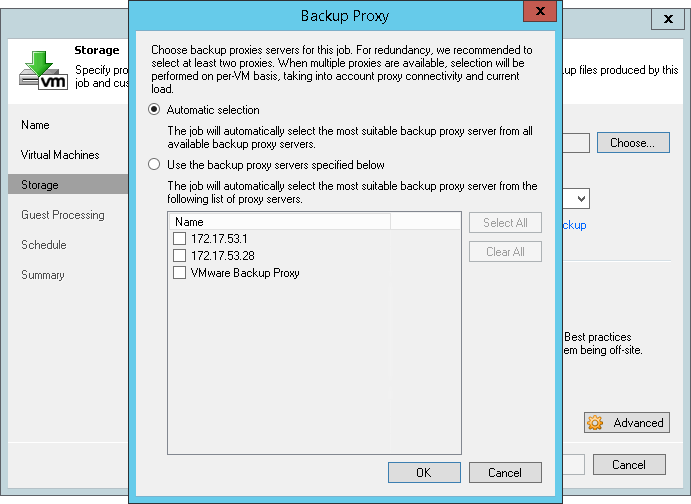
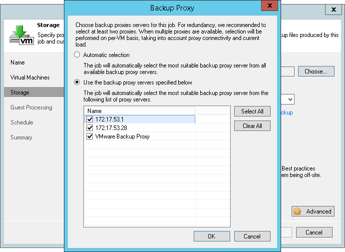

# Proxy Server and Transport Modes

### Veeam Backup Proxy Overview 

With backup proxies, you can easily scale Veeam backup infrastructure
based on the organization demands:

-   In a basic installation (simple deployment scenario for smaller
    environments or Proof of Concepts), the backup proxy is
    automatically installed on the Veeam backup server as part of the
    Veeam Backup & Replication installation process.

-   In other deployment scenarios, the backup proxy role is usually
    assigned to several Windows servers (64-bit). This approach allows
    for offloading the Veeam backup server, achieving better performance
    and a minimized backup window. Backup proxies can be deployed both
    in the primary site and in remote sites on any managed Microsoft
    Windows server in the infrastructures. Depending on the data
    transport mode you plan to use, a backup proxy can be installed on a
    physical server or on a VM, as explained later in this section.

A backup proxy handles data traffic between the VMware vSphere
infrastructure and Veeam Backup & Replication during backup,
replication, VM copy, VM migration jobs or VM restore.

Backup proxy operations include the following:

-   Retrieving VM data from production storage, compressing and sending
    it to the backup repository (for a backup job) or another backup
    proxy (for a replication job).

-   A backup proxy is also part of Veeam's deduplication engine; plus,
    it performs encryption if the corresponding option is selected in
    the data transportation settings.

Technically, a backup proxy runs a light-weight transport service that
takes a few seconds to deploy. When you add a Windows-based server to
Veeam backup management console and assign proxy role to it, Veeam
Backup & Replication installs the necessary components and starts the
required services on that server. When a job is started, the Veeam
backup server becomes the “point of control” for dispatching tasks to
proxy servers, using its built-in load balancing algorithm.

### Advanced Veeam Technologies for Data Processing

To specify the threshold for proxy load, an administrator uses the **Max
concurrent tasks** proxy setting (where a task stands for a single VM
disk), and Veeam Backup & Replication uses a unique load balancing
algorithm to automatically spread the load across multiple proxies. This
feature allows you to increase backup performance, minimize backup time
window and optimize data flow. By default, Veeam Backup & Replication
analyzes the backup proxy configuration, determines the datastores it
can access, and automatically selects the best transport mode depending
on the type of connection between the backup proxy and datastore:

First, Veeam Backup & Replication checks if data processing can be
assigned to a backup proxy with the Direct SAN Access, then it checks
whether a Hot-Add proxy can be used, and then looks for a Network (NBD)
proxy. For more details, see the “Transport Modes” section of this
guide.

After the algorithm identifies all existing backup proxies, it spreads
the load across them in an optimal way:

a.  It discovers the number of tasks being processed at the moment by
    each proxy, and looks for the server with the lowest load and the
    best connection.

b.  All tasks are standing in a “VM to process” queue, and when a
    proxy’s task slot becomes free, Veeam Backup & Replication will
    automatically fill it up with the next task.

c.  Note that priority goes to the disk that belongs to an already
    processed VM; also, short-term scheduled jobs take priority over
    long-term scheduled jobs (like daily or weekly jobs).

**Tip:** Default recommended value is **1** task per Core/vCPU. To
optimize the backup window, you can slightly overbook the **Max
concurrent tasks** count.

Starting with v7, Veeam Backup & Replication supports parallel
processing of VMs/VM disks:

-   It can process multiple VMs (each with a single disk)
    simultaneously, increasing data processing efficiency.

-   If a VM was created with multiple disks, Veeam will try to process
    these disks simultaneously to reduce VM snapshot lifetime.

**Note:** Parallel processing is a global setting that is turned on by default.

### Backup Proxy Services and Components

Veeam backup proxy uses the following services and components:

-   **Veeam Installer Service** - a service that is installed and
    started on the Windows server once it is added to the list of
    managed servers in the Veeam Backup & Replication console. This
    service analyses the system, installs and upgrades necessary
    components and services.

-   **Veeam Transport Service** – a service responsible for deploying
    and coordinating executable modules that act as "data movers" and
    perform main job activities on behalf of Veeam Backup & Replication
    (communicating with VMware Tools, copying VM files, performing data
    deduplication and compression, and so on).

-   **VeeamAgent.exe process** - a data mover, which can be started
    multiple times (on demand) for each data stream. These processes
    work in read-and-write pairs, being started for reading data on a
    source backup proxy, and for writing data - on a target backup proxy
    (replication), gateway proxy (for a CIFS repository), or on a
    repository itself. At restore, the dataflow is in the
    opposite direction.

### Data Transport Modes for Backup Proxies 

#### Network Mode (NBD) 

Network mode is by far the easiest backup mode to implement, as it
requires no additional configuration. Veeam always uses this mode at
least to back up and restore VMware configuration files and to read
Change Block Tracking information.

When in this mode, the backup proxy will connect to ESXi hosts on
VMkernel interfaces by DNS name resolution and use this connection to
transport data, utilizing Veeam’s file copy technology (also known as
FastSCP). Remember that the backup proxy requires several ports to be
open, as described in the User Guide:
<http://helpcenter.veeam.com/backup/80/vsphere/used_ports.html>.

**Note:** It is highly recommended to maintain a good network connection
between the VMware ESXi VMKernel port and Veeam Backup & Replication, as
it will be used by many other features like Instant VM Recovery, Virtual
Lab and SureBackup, Linux FLR appliance, etc.

For load balancing, Veeam uses a selection of proxy servers based on the
network subnet:

-   Backup proxies in the same subnets as the VMKernel interfaces (DNS
    Name of ESXi hosts) are selected if you have the **Automatic
    Selection** proxy setting configured in the backup jobs.

> 

-   If proxy servers do not run in same subnets as the VMKernel
    interfaces of the ESXi hosts, you will have to manually select the
    proxies that will process your backup jobs, otherwise it is possible
    that proxies from other sites will be used to transport data.\
    You can select all proxies from the same site to enable load
    balancing in that case.

> 

-   In case you work with several branches or datacenter environments,
    it is also recommended that you manually choose the proxies
    (per site) in the job settings - to streamline and speed up the
    load balancing.

#### Pros: {#pros .pseudo4}

-   Network mode can be used for both backup and restore.

-   Can work with both physical and virtual backup proxies.

-   Being the most mature of all transport modes, it supports all types
    of storages.

-   Is recommended for use in virtual deployments with NFS-based storage
    systems, as it helps to minimize VM stunning. See also the
    “Considerations for NFS Datastores“ section of this guide.

-   Performance on 10 Gb Ethernet is highly positive.

-   As data transfers initiate very quickly, the Network mode is
    preferable for processing incremental backups on relatively static
    servers (that is, VMs with small amount of changes).

-   Can be helpful when you have plenty of clusters with individual
    storage configurations (e.g., at hosting providers). In such
    deployments, using the Network mode for data transfer can help to
    reduce Veeam footprint and costs, as well as to increase the
    security (if compared to other modes and storage configuration).

#### Cons: {#cons .pseudo4}

-   Typically, Network mode uses only 40% of the physical available
    bandwidth of the external VMKernel Interface connection due to
    throttling mechanisms implemented on the management interfaces of
    VMware vSphere 4.x-5.x.

-   Is rather slow on 1 Gb Ethernet (about 10-20 MB/s) also due to
    throttling mechanisms, so restores via the Network mode will take
    quite a long time.

**Tip:** You can influence the usage of the specific VMKernel interface
by modifying the DNS name resolution for all Veeam backup servers (for
example, by adding entries in the *hosts* file or by using special DNS
configuration).

#### Recommendations {#recommendations .pseudo4}

-   As the Network mode is relatively inefficient in bandwidth usage,
    consider setting up at least one virtual backup proxy for hot-add
    restores – then it will be possible to achieve higher throughput and
    thus lower RTO.

-   You can also restore to a thin disk format and later use standard
    VMware methods to change the disk format to thick disk, if needed.

-   Another way to overcome this limitation is to use Instant VM
    Recovery with Storage vMotion (if licensed on the VMware
    vSphere side).

-   As there is no overhead (like SCSI disk Hot-Add, or search for the
    right volumes in Direct SAN) on backup proxies, the Network mode can
    be recommended for scenarios with high-frequency backups or
    replication jobs, as well for environments with very low overall
    data and change rate (VDI).

#### Direct SAN Access Mode 

The Direct SAN Access mode uses a direct data path (a Fiber Channel (FC)
or iSCSI connection) between the VMFS datastore and the backup proxy for
data transfer.

#### Pros: {#pros-1 .pseudo4}

-   Direct SAN Access mode provides the fastest, the most reliable and
    predictable backup performance (typically, using 8 Gb Fiber Channel
    or 10 GbE for iSCSI).

-   Produces zero impact on VMware vSphere hosts and
    production networks.

-   Starting with Veeam Backup & Replication v8, it is also possible to
    perform full VM restore using Direct SAN Access mode: if backup
    proxies that can use the Direct SAN Access mode are available in the
    backup infrastructure, and the VM disks are thick-provisioned, this
    mode will be used automatically.

-   Can be used at replica target for the initial replication (with
    thick-provisioned disk).

-   This is the fastest method to restore thick-provisioned disk files.

#### Cons: {#cons-1 .pseudo4}

-   This mode requires FC, iSCSI, Infiniband or sharedSAS-based storage.
    NFS-based storage is currently only supported with NetApp storage
    systems when Backup from Storage Snapshot feature is enabled
    and licensed.

-   Typically, Direct SAN Access requires a physical server (in-guest
    iSCSI mapping is an exception to this rule, but it rarely
    makes sense).

-   Direct SAN-based restore is possible only for thick-provisioned
    VM disks.

-   This mode is the most difficult backup mode to configure, as it
    involves reconfiguring storage and SANs (FibreChannel Zoning, LUN
    masking, or reconfiguration of iSCSI targets) to provide the
    physical proxy server(s) with direct access to the production
    VMFS datastores. When such configuration has been implemented, it is
    extremely important to ensure that HBAs and NIC drivers and firmware
    are up-to-date, and that multipathing driver software (e.g. MPIO) is
    properly configured.

For more information about configuring Direct SAN Access, refer to FAQ
at [Veeam Community Forums: Direct SAN Access
Mode](http://forums.veeam.com/vmware-vsphere-f24/vmware-frequently-asked-questions-t9329.html#p39948)

#### Example {#example-1 .pseudo4}

If operating datastores and vRDMs on a block storage that can share the
LUNs to different systems (SharedStorage) like FibreChannel, FCoE, iSCSI
and SharedSAS, you can add a backup proxy as a member to that shared
storage using LUN masking. This will allow for accessing the storage
system for backup and restore.

Remember to ensure that a connection between the storage and backup
proxy can be established – for that, verify FC HBAs, zoning, multipath
driver software, and iSCSI configuration including network changes, or
SAS HBA and its configuration.

#### Recommendations {#recommendations-1 .pseudo4}

-   Use the multipath driver software of the storage vendors choice
    (preferred integration into Microsoft MPIO) to avoid disk or cluster
    failovers at storage level. This will also prevent the whole storage
    system from being affected by possible failovers if wrong data paths
    are used.

-   If you attach a great number of volumes to the backup proxy,
    consider that logging and search for the correct volume at the job
    run can require extra processing time per VM disk (as well as for
    overall volume count). To avoid that, you can disable logging by
    setting the registry value to **VDDKLogLevel = 0 (DWORD)** in **the
    HKLM\\SOFTWARE\\Veeam\\Veeam Backup and** **Replication**
    registry key.

**Note**: As this reduces the amount of information in debug logs,
remember to enable it again when working with Veeam support (to
facilitate debugging of the Direct SAN Access-related challenges).

-   To achieve the best performance vs. costs, use fewer proxies with
    more CPU cores available. This will help to fully utilize the HBA or
    NIC capacity of each proxy server.

**Tip:** It is highly recommended to contact the storage vendor for
optimal settings.

#### Security Considerations {#security-considerations .pseudo4}

While the datastores and vRDMs are mapped to the backup proxy server,
during deployment of the proxy role to a Windows VM, Veeam Backup &
Replication uses the following security mechanisms to protect them:

-   Changes the Windows SAN Policy to "Offline (shared)". This prevents
    Windows from bringing the attached volumes online, and also prevents
    Windows write operations to the volumes.

-   Deploys VMware's VDDK Kit into the backup proxy server – in most
    cases, this VDDK Kit coordinates ‘read’ and possible ‘write’ process
    (Direct SAN restore) with VMware vSphere.

If necessary, you can take additional measures, as follows:

-   Disable Disk Management snap-in with **Group Policy**\
     **User Configuration &gt; Administrative Templates &gt; Window
    Components &gt; Microsoft Management Console &gt;
    Restricted/Permitted snap-ins &gt; Disk Management**.

-   Avoid providing excessive administrative access to the account used
    to run Veeam proxy servers.

-   Present LUNs as read-only to the backup proxy server. This
    capability is supported by most modern storages. For that, implement
    read-only LUN masking on the storage system, or use ReadOnly Zoning
    on the FibreChannel Switches (possible on most SAN directors) for
    the Veeam proxy servers.

**Note**: Consider that read-only LUNs will prevent Direct SAN restore.

If a VMFS data store was brought online, including Windows volume
re-signaturing, you can contact VMware Support. For more information on
Windows re-signaturing process and VMware datastores, please refer to
[VMware KB1002168: Unable to access the VMware virtual machine file
system datastore when the partition is missing or is not set to type
fb](http://kb.vmware.com/kb/1002168) .

#### Virtual Appliance Mode (Hot-Add) 

Veeam’s Virtual Appliance (or VMware’s Hot-add) mode has become quite
widespread, as it is the default setting with Veeam Backup & Replication
all-in-one deployment in a virtual machine (for details, see the
[Deployment
Scenarios](http://helpcenter.veeam.com/backup/80/vsphere/deployment_scenarios.html)
section of the User Guide). It is often used when Veeam is deployed in
branch office configurations (ROBO).

This mode supports a 100% virtual deployment, using direct storage
access through VMware ESXi storage I/O stack, thus having a very little
overhead. For example, in the case of a backup, the disk files from a
VMware snapshot are mapped by VMware Disk Hot-Add to a virtual backup
proxy server and later unmapped after backup/restore.

**Note:** For more information on how it works, refer to the section
“[Data Retrieval and Restore in Virtual Appliance
Mode](http://helpcenter.veeam.com/backup/80/vsphere/virtual_appliance_hiw.html)”
of Veeam User Guide.

Virtual Appliance mode can be recommended for proxies in highly dynamic
environments where it can be difficult to maintain access to newly
created datastores for Direct SAN Access. In such scenarios, using
Virtual Appliance mode for data transport will significantly reduce
administrative overhead due to leveraging VMware Hot-Add.

Virtual Appliance mode should be used when it is impossible to leverage
Direct SAN, for example, in the case of local datastores or NFS shares -
then using VMware Hot-Add will likely provide the optimal throughput.

This mode is also a good choice for VMware VSAN configurations, as
Veeam’s built-in intelligent load balancing will have VM disk placement
awareness.

**Note:** For details on using this mode for NFS datastores, see the
“Interaction with vSphere: Considerations for NFS Datastores ” section
of this guide.

-   If using the Virtual Appliance data transport mode with shared
    storage, it is necessary to deploy at least one proxy for each
    environment where you add a specific datastore. In most cases,
    datastores are added on a per-vSphere cluster base, so deploy at
    least one Hot-Add proxy there.

-   When backing up from local datastores, it is necessary to deploy one
    proxy per host (local disks in the ESXi are used for VM data),
    otherwise the proxy servers will fail back to Network mode
    (VMware’s NBD).

When planning for the Virtual Appliance mode for a backup proxy,
consider the time required for actual hot-add operations (such as adding
and removing VM disks from the source virtual machine) – they can add up
to 1-2 minutes per VM. Therefore, for a backup job containing 1000
virtual machines, this could result in more than two hours of adding and
removing disks with no actual data processing. To mitigate the issue,
enable parallel processing and process multiple disks from the same
virtual machine simultaneously (using this transport mode).

**Tip:** It is recommended to benchmark how such operations affect the
backup window - by monitoring a test job in the vSphere console.

#### Pros: {#pros-2 .pseudo4}

-   Using the Virtual Appliance mode for proxy servers enables a fully
    virtual deployment.

-   As the proxy will perform source-side data deduplication and
    compression, this mode will provide very good performance in
    environments running 1 GbE configurations.

#### Cons:  {#cons-2 .pseudo4}

-   If working in this mode, backup proxy will occupy the virtual
    infrastructure resources, impacting consolidation ratio. This could
    ultimately require additional physical ESXi hosts and licensing.

-   This mode requires additional planning and configuration in the
    enterprise environments because of the additional large disk Hot-Add
    processes in VMware vSphere.

#### Considerations and Limitations {#considerations-and-limitations .pseudo4}

Additional load is put on the vCenter Server and ESXi hosts as each disk
is mapped and unmapped (disk hot-add) at the backup proxies.

**Note**: For more information, see vCenter Server connection overview
in the "Veeam Backup & Replication Server" section of this guide.

It may occur that VMware API reports that unmap and snapshot commit were
done correctly, but a snapshot file still remains on disk. These
"orphaned snapshots" will grow over time and can fill up the datastore,
leading to downtimes (such a situation is most possible on NFS-based
storage). To overcome this issue, Veeam offers the following methods:

-   Veeam Snapshot Hunter – this feature introduced in v8 supports
    automatic clean-up of orphaned snapshots after each backup process.
    It can also repair the orphaned snapshots that were left over by
    other software (including VMware).

-   Bypassing VDDK processing to overcome some limitations and
    performance challenges, in particular:

<!-- -->

-   Veeam can back up multiple disks of VM in parallel on same proxy
    (default number is 4).

-   Typical "I/O bursts" do not happen at Hot-Add restore or replica
    target Hot-Add processing.

<!-- -->

-   To avoid some VMware issues related to NFS datastore and Hot-Add
    processing (described at
    <http://kb.vmware.com/selfservice/microsites/search.do?language=en_US&cmd=displayKC&externalId=2010953>
    ), enable a specific setting that will process VM backups only on
    backup proxies that run on the same host. For details, see
    <http://www.veeam.com/kb1681> .

**Note:** For additional tips, refer to the “Impact of Snapshot
Operations” section of this guide.

#### Recommendations {#recommendations-2 .pseudo4}

-   You will need at least one type of SCSI controller on each proxy in
    the infrastructure.

-   Add an extra SCSI controller to allow for more VM disks processing
    in parallel (check the corresponding Veeam proxy settings – default
    value is 4).

-   Specific client OS limitations for Hot-Add processing documented in
    Veeam Backup & Replication Release Notes at
    <http://www.veeam.com/veeam_backup_8_0_release_notes_rn.pdf> and in
    the KB article at <http://www.veeam.com/kb1054> . To test whether
    Hot-Add data transport mode is possible, refer to
    <http://www.veeam.com/kb1184>.

-   Disk Hot-Add is supported in all VMware vSphere editions, starting
    from a standalone ESXi host with a license and including vSphere
    Standard and vSphere Essentials (unlike the CPU and RAM Hot-Add
    Feature that is only available in higher VMware vSphere editions ).

-   When deploying hot-add backup proxies, try to avoid cloning existing
    VMs, as this may lead to identical UUIDs in the vSphere environments
    and cause hot-add operations to fail.

-   You may re-use any existing Windows server VM (to save
    on licensing). The Veeam data mover process runs with ‘below normal’
    priority by default.

**Note:** Changed block tracking (CBT) will be disabled for these
hot-add proxies. Consider that it may impact the backup window in case
the said virtual machines should be included in backup or replication
jobs.

### Veeam Storage Integration and Processing Modes for Backing Up from Storage Snapshots

Storage integration implemented with Veeam Backup & Replication supports
HP StoreVirtual, HP StoreServ and NetApp Data ONTAP storage types.
Backup proxy servers are utilized for storage discovery, reading and
writing data and for leveraging storage snapshots, which minimizes the
VMware Snapshot commit load.

**Note**: To read more about storage integration, refer to Veeam Backup
& Replication User Guide and corresponding sections of this guide.

Veeam Backup & Replication uses storage snapshots to minimize VMware VM
snapshot lifetime and to reduce load on VMware ESXi hosts and storage
systems.

The Storage integration feature utilizes proxy servers to read data
directly from these snapshots (without adding them to a proxy ESXi
host), to transport data and to scan the storage systems for possible
restore points in storage snapshots. Based on the supported storage
protocol, this feature requires direct network connections or SAN
connections (like iSCSI/Fiber Channel).

**Note**: For more information, refer to the corresponding sections of
this guide and Veeam Backup & Replication User guide.

### Choosing Transport Mode

#### Very small sites (single host with local disks as primary datastores / branch office)  {#very-small-sites-single-host-with-local-disks-as-primary-datastores-branch-office .pseudo4}

-   Virtual Appliance (Hot-Add) mode is the recommended option, as it
    gives you the best performance.

-   NBD over 10GbE VMKernel Interfaces link will provide a very stable
    and good performing solution

-   NBD over 1GbE VMKernel Interfaces can be used for failover.

-   Direct SAN Access mode or Veeams storage integration based backups
    cannot be implemented, as the disks are local and thus cannot be
    mounted to a physical proxy server.

#### Small sites (2-4 hosts with shared storage / branch office/ datacenter)  {#small-sites-2-4-hosts-with-shared-storage-branch-office-datacenter .pseudo4}

-   If storage integration is possible, the corresponding transport
    modes are preferred.

-   If the primary datastore runs on block protocols like Fiber Channel
    or iSCSI, then Direct SAN Access mode will provide the best
    performance (if all corresponding requirements are met).

For example, you can place a physical server with access to FC data
stores to the local site and perform backups to a local repository
(scenario with a single Veeam backup server). If you use
thin-provisioned disks for the VMs, configuring a dedicated backup proxy
for restore in the Virtual Appliance (Hot-Add) mode can help to increase
restore performance.

-   The Virtual Appliance (Hot-Add) mode is a recommended option if the
    above modes cannot be used.

**Tip:** If you are using NFS primary data stores, consider setting up a
backup proxy on same host (as described in the previous scenario).

-   NBD over 10 GbE VMKernel Interfaces link will provide a very stable
    and good performing solution.

-   NBD over 1 GbE VMKernel Interfaces can be used for failover and for
    situations where you do not have to transport much data, or if you
    cannot use the Direct SAN Access mode but look for the
    best reliability.

#### Medium sites (4-20 hosts with shared storage / branch office / datacenter)  {#medium-sites-4-20-hosts-with-shared-storage-branch-office-datacenter .pseudo4}

-   Use storage integration for all VMs with a high change rate. Veeam
    ONE “VM Change Rate Estimation” report can help to identify them.
    For VMs with low change rate, you can decrease the overhead of
    storage snapshot processing (faster as less data needs to be moved).

-   If the primary datastore is run on block protocols like Fiber
    Channel or iSCSi, then Direct SAN Access mode will provide the best
    performance (if all corresponding requirements are met).

For example, you can place one or multiple physical servers with access
to the Fibre Channel data store to the local site and perform backups to
a local or centralized repository (scenario with multiple proxies backup
to single repository server). If you use thin-provisioned disks for the
VMs, configuring several proxy servers for restore in the Virtual
Appliance (Hot-Add) mode can help to increase restore performance in
that scenario.

-   NBD over 10 GbE VMKernel Interfaces link will provide a very stable
    and good performing solution; it can be recommended for virtual only
    or NFS data stores.

-   The Virtual Appliance (Hot-Add) mode is a recommended option if the
    above modes cannot be used. A Proof of Concept is recommended after
    thorough planning to implement this mode.

-   NBD over 1GbE VMKernel Interfaces can be used for failover.

#### Large sites (21-100 hosts with shared storage / branch office / datacenter)  {#large-sites-21-100-hosts-with-shared-storage-branch-office-datacenter .pseudo4}

-   Use storage integration for all VMs with a high change rate. Veeam
    ONE Change Rate Estimation report can help to identify them (faster
    as less data needs to be moved).

-   If the primary datastore is run on block protocols like Fiber
    Channel or iSCSi, then Direct SAN Access mode will provide the best
    performance (if all corresponding requirements are met). For
    example, you can place one or multiple physical servers with access
    to the Fiber Channel datastore at the local site and perform backups
    to multiple repositories. If you use thin-provisioned disks for the
    VMs, configuring several proxy servers for restore in the Virtual
    Appliance (Hot-Add) mode – per cluster - can help to increase
    restore performance in that scenario.

-   NBD over 10 GbE VMKernel Interfaces link will provide a very stable
    and good performing solution; it can be recommended for virtual only
    or NFS data stores.

-   The Virtual Appliance (Hot-Add) mode implementation should be
    planned carefully, regarding vCenter connection count and general
    overhead on VMware side for disk mount and un-mount processes.

-   NBD over 1 GbE VMKernel Interfaces can be used for failover for some
    VMs; however a 10GbE network on VMKernel interface is
    highly recommended.

#### Enterprise or large datacener (above 100 hosts) {#enterprise-or-large-datacener-above-100-hosts .pseudo4}

-   Use the recommendations for Large Sites scenario above.

-   In large scale environments, the deployment of Veeam components,
    configuration and job creation is typically automated using the
    Veeam PowerShell integration.

-   To balance the management load, it is recommended to use multiple
    Veeam backup servers for at least every 5000 VMs, together with a
    central reporting and administration by Veeam Backup Enterprise
    Manager and Veeam ONE.

-   If you run a central Veeam backup server and multiple branches with
    it, a separate Veeam Backup & Replication management instance is
    recommended for at least every 200 branches. Consider using Veeam
    Backup Enterprise Manager for central administration.

### Sizing a Backup Proxy

#### Processing Resources 

As per system requirements, a proxy requires 2 GB RAM plus 200MB for
each concurrent task (VM disk to be processed).

As described above, you can define the max concurrent tasks value in the
backup proxy settings. On average, a task consumes 1 Core or 1 vCPU Core
(for compression and encryption). Depending on the job setup and other
settings, these numbers can vary. A PoC in the specific environment can
help to estimate resource usage, especially if you need to fit into an
existing budget.

-   If you double the proxy task count, that will, in general, decrease
    backup time window up to 50%.

-   It is recommended to plan for some additional resources – for
    further growth and possible new features: for example, the RAM usage
    for one proxy processing task should not be lower than 2 GB - to be
    prepared for upcoming features.

As a rule of thumb, a proxy will need 1 CPU+2 GB RAM for each 30 VMs
(with average change rate of 2-3 % at the block level) to fit into a
8-hour backup window.

#### Example: Calculating Overall Task Count  {#example-calculating-overall-task-count .pseudo4}

Sample infrastructure has the following configuration:

-   480 VMs

-   48 TB used data

-   Backup window - 8 hours

-   Daily change rate - 3%

For that, the following calculation can be used as a starting point:

30 VMs per CPU core (physical core or vCPU core) for a proxy. =&gt; 1
proxy task slot (1 core, 2 GB RAM). =&gt; 16 cores for 480 VMs =&gt; 1
server with 2x 8 core 32 GB RAM

If you need to achieve a 4 hour backup window, then double the resources
=&gt; 2 server with 2x 8 cores 32GB RAM.

The same counts if you have two times bigger amount of data (with 3%
change rate).

**Note:** Overall performance largely depends on the underlying storage
and network infrastructure.

Required processing resources may seem too high if compared with
traditional agent-based solutions. However, consider that instead of
using all VMs as processing power for all backup operations (including
data transport, source deduplication and compression), Veeam Backup &
Replication uses its central proxy and repository resources. Overall,
required CPU and RAM resources are normally below 5% (and in many cases
below 3%) of all virtualization resources utilized by backup and
replication jobs.

#### How Many VMs per Job?

Best practice is to add 20-50 VMs to a job (30 VMs at about 1000-2000
VMs; 50 VMs at 5000 VMs).

Also, remember that the number of running backup jobs should not exceed
100 jobs concurrently running (not overall). Veeam can handle more, but
a “sweet spot” for database load, load balancing and overall processing
is about 80-100 concurrently running jobs.

#### How Many Tasks per Proxy? 

Typically, in a virtual environment, proxy servers use 4, 6 or 8 vCPUs,
while in physical environments you can use a server with a single quad
core CPU for small sites, while more powerful systems (dual 16 core CPU)
are typically deployed at the main datacenter with the Direct SAN Access
mode processing.

**Note**: Parallel processing may also be limited by max concurrent
tasks at the repository level.

So, in a virtual-only environment you will have slightly more proxies
with less proxy task slot count, while in physical infrastructure with
good storage connection you will have a very high parallel proxy task
count per proxy.

The “sweet spot” in a physical environment is about 20 processing tasks
with 2x 16 Gbps FC cards for read.

Depending on the primary storage system and backup target storage
system, any of the following methods can be recommended to reach the
best backup performance:

-   Running fewer proxy tasks with a higher throughput per current proxy
    task

-   Running higher proxy task count with less throughput per task

As performance depends on multiple factors like storage load,
connection, firmware level, raid configuration, access methods and
others, it is recommended to do a Proof of Concept to define optimal
configuration and the best possible processing mode.

#### Considerations and Limitations

Remember that several factors can negatively affect backup resource
consumption and speed:

-   **Compression level**: It is not recommended to set it up to *High*
    (as it needs 2 CPU Cores per proxy task) or to *Extreme* (which
    needs much CPU power but provides only 2-10% additional
    space saving).

-   **Block Size**: the smaller the blocks size is, the more RAM is
    needed for deduplication. For example, you will see a RAM increase
    when using LAN mode if compared to Local target, and even greater
    (2-4 times) when using WAN. Best practice for most environments is
    to use default job settings (*Local* for backup jobs and *LAN* for
    replication jobs) where another is not mentioned in the
    documentation or this guide for specific cases.

-   **Antivirus Scanner** - see the corresponding section of
    this document.

-   **3rd party applications** – it is not recommended to use an
    application server as a backup proxy.
