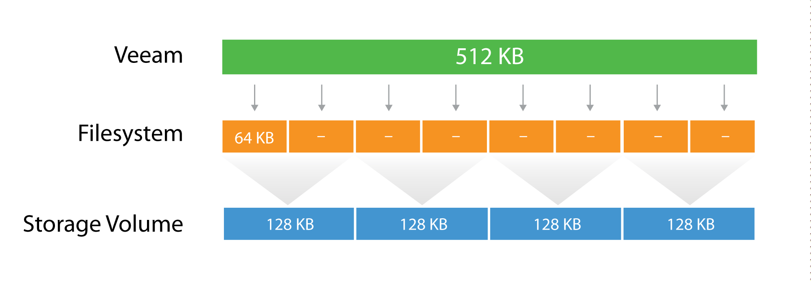

## Configuration Guidelines

### Parallel Processing
A repository can be configured to limit the amount of parallel tasks it can process at a time; with parallel processing enabled (by default) a *task* is one VMDK handled by the proxy during a backup job, or by a repository during a backup copy job. If there are many parallel tasks on the proxy side for only few tasks on the backup repository, this will lead the Veeam scheduler service to wait for available resources on the repository. To prevent such situation, you can figure out on which side the bottleneck will be (proxy or repository) and then set the overall amount of parallel tasks on the proxies equal to the total amount of parallel tasks on the repositories.

**Note:** Consider tasks for read operations on backup repositories (like backup copy jobs).

### Blocks sizes

During the backup process data blocks are processed in chunks and stored inside backup files in the backup repository. You can customize the block size during the [Job Configuration](../job_configuration/deduplication_and_compression.html#deduplication) using the **Storage Optimization** setting of the backup job.

By default block size is set to **Local target**, which is 1 MB before compression. Since compression ratio is very often around 2x, with this block size Veeam will write around 512 KB or less to the repository per each block.

This value can be used to better configure storage arrays; especially low-end storage systems can greatly benefit from an optimized stripe size.

There are three layers where the block size can be configured: Veeam block size for the backup files, the Filesystem, and the Storage volumes.

Let's use a quick example:

The Veeam block size of 512KB is going to be written in the underlying filesytem, which has a block size of 64k. It means that one block will consume 8 blocks at the filesytem lavel, but no block will be wasted, as the two are aligned. If possible, set the block size at the filesytem layer as close as possible to the expected Veeam block size.

Then, below the filesytem there is the storage array. Even on some low-end storage systems, the block size (also called stripe size) can be configured. If possible, again, set the stripe size as close as possible to the expected Veeam block size. It's important that each layer is aligned with the others, either by using the same value (if possible) or a value that is a division of the bigger one. This limits to a minimum the the so called **write amplification**: with a 128KB block size at the storage layer, a Veeam block requires 4 I/O operations to be written. This is a 2x improvement compared for example with a 64KB stripe size.

**Tip:** As can be seen from the field, optimal value for the stripe size is often between 256 KB and 512 KB; however. It is highly recommended to test this prior to deployment whenever possible.

For more information, refer to this blog post: <http://www.virtualtothecore.com/en/veeam-backups-slow-check-stripe-size/>

### File System Formats
In addition to the storage stripe size alignment, as explained in the previous paragraph, the file system may also benefit from using a larger cluster size (or Allocation Unit Size). For example, during formatting of NTFS volumes, Allocation Unit Size is set to 4KB by default. To mitigate fragmentation issues, configure to 64 KB whenever possible.

It is also recommended to use journaled file systems (this makes exFAT a less reliable option than NTFS).

### Using "Large File" Switch for NTFS
A file size limitation can be occasionally reached on NTFS, especially on Windows 2012 R2 with deduplication enabled. This happens due to a hard limit reached on the file records size because of the  high level of file fragmentation. To mitigate the issue, we recommend to format Windows NTFS repositories with the "**/L**" (large files) option.

### Keeping File Size Under Control
Try to avoid backup chains growing too much. Remember that very big objects can become unmanageable. Since Veeam allows a backup chain to be moved from one repository to another with nothing more than a copy/paste operation of the files themselves, it is recommended to keep backup chain size (the sum of a single full and linked incrementals) under 10 TB per job (\~16TB of source data). This will allow for a smooth, simple and effortless repository storage migration.

### Synthetic Backup and Caching

To get the best out of a synthetic backup and enhance the performance, it is recommended to use a write-back cache. Read and write request processing with write-back cache utilization is shown in the figure below.

