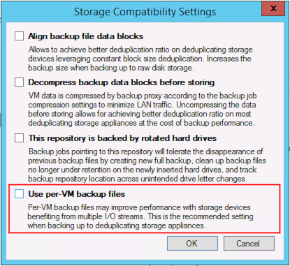

# Per VM backup files
It is possible to write one backup file chain per each VM on a repository, compared to the regular chain holding data for all the VMs of a given job. This option greatly eases job management, allowing to create jobs containing much more VMs than in previous versions, and also enhances performance thanks to more simultaneous write streams towards a repository, even when running a single job.

In addition to optimizing write performance with additional streams to multiple files, there are other positive side effects as well. When using the forward incremental forever backup mode, you may experience improved merge performance. When backup file compacting is enabled, per VM backup files require less free space. Instead of requiring sufficient space to temporarily accommodate an additional entire full backup file, only free space equivalent to the largest VM in the job is required. Parallel processing to tape will also have increased performance, as multiple files can be written to separate tape devices simultaneously.

Per VM backup files is an advanced option available for backup repositories, and it disabled by default for new backup repositories. If enabled on an existing repository, an active full backup is required after the option has been enabled.

## Maximum number of VMs per job
With per VM backup files the recommendation for number of VMs per job can be increased significantly. Even if technically jobs containing five thousands VMs have been successfully tested in a lab, feedback from the field shows the sweet spot at around 300 VMs per backup job, more for management reasons and unexpected side effects than pure performance matters.
When designing your jobs, keep in mind that several operations such as synthetic operations, health checks and Backup Copy Jobs will be pending until all VMs in the job have completed successfully. For those reasons, extremely large jobs may be impractical.

## Performance
To avoid counter productive effects, attention should be paid on not having too many write threads towards a storage used as a repository. For example, a low range NAS storage will probably not react very well to a high amount of parallel processes created by per VM backup files. To limit this effects, refer to Reposiory configuration options, especially the **Concurrent tasks** limit.
