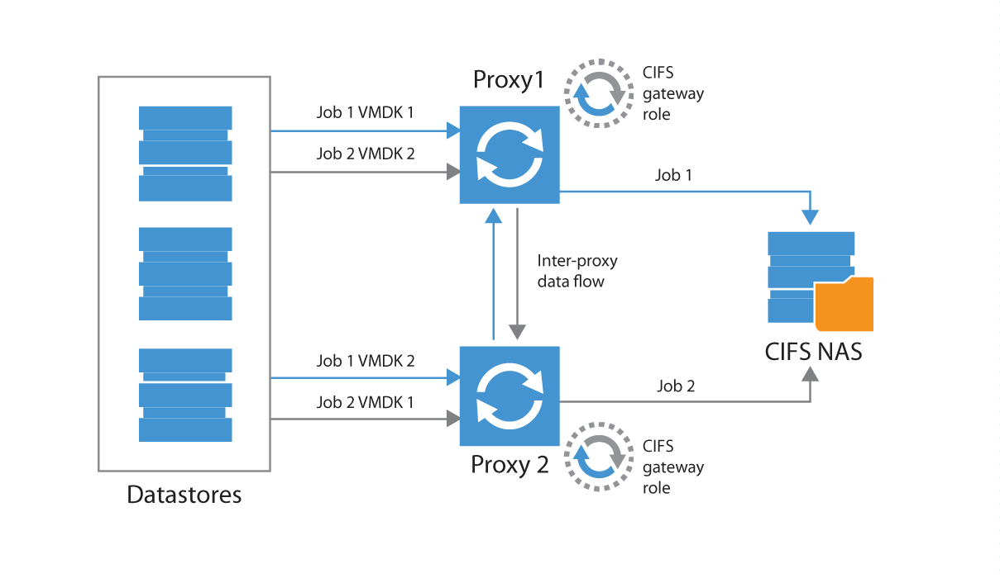
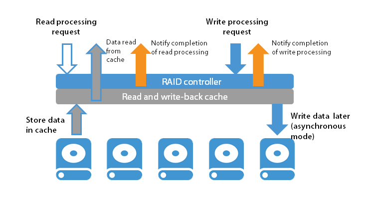
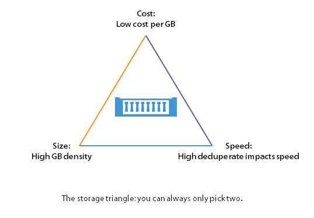

# Repository Server

Before you start planning for the repository, go through Veeam Backup &
Replication online documentation at
<http://www.veeam.com/documentation-guides-datasheets.html> to get basic
understanding of repositories.

In brief, backup repository is a storage location used by Veeam Backup &
Replication jobs to store backup files, copies of VMs and metadata for
replicated VMs. Technically, a backup repository is a server that hosts
Veeam Transport Service and provides a destination folder on the backup
storage. Each job can use only one repository as its destination
storage, but one repository can be used by multiple jobs in parallel.
You can balance the load across the backup infrastructure by setting up
several repositories in the environment and limiting the number of
parallel jobs for each one.

### Choosing Repository Type 

Being storage-agnostic, Veeam Backup & Replication supports a wide range
of repository types. When deciding on repository storage, consider the
following factors:

-   Capacity

-   Write performance

-   Read performance

-   Data density

-   Files security

-   Backup file utilization

As a basic guideline, a repository should be highly resilient, since it
is hosting the essential copy of data. It also needs to be scalable,
allowing the backup to grow as needed.

Organization’s policies may require different storages for backups with
different retention. If so, you can configure, for instance,two
repositories:

-   A high-performance repository hosting only several recent retention
    points for instant restore

-   A repository with more capacity, probably using a cheaper and slower
    storage, storing long-term retention points - you can set up a
    backup copy job with that repository as the destination.

**Important!** Remember that repository design is not only about storage
footprint, it is also about IOPS, depending on the intended use.

### Server-Based Repository: DAS, SAN, or NFS?

#### Direct-Attached Storage

This is a cheap, easy-to-use solution that can be very efficient in
terms of performance; however, it is less manageable due to
non-transportable volumes, capacity growth, and so on.

-   With a proper RAID configuration, the physical layers between the
    server and storage are minimal; since the DAS storage can be fully
    dedicated to backup, this type of repository is considered to offer
    a good balance between the “performance” and “cost” factors.

-   A strong benefit of a JBOD repository is that it supports the
    features offered by Veeam Backup & Replication in a very
    flexible way. In particular, is provides good read and write
    performance, sufficient for vPower-based features (such as Instant
    VM Recovery, SureBackup, and others). As it typically provides good
    random I/O performance, it will be the optimal solution when using
    I/O intensive backup modes such as reverse incremental or forever
    forward incremental (also used in backup copy job).

However, consider that though DAS is a valuable option in many cases,
its scalability may not meet organization’s requirements. When using
DAS, it is important to ensure proper proactive monitoring to avoid
hardware failures (such as multiple RAID drive failures or other
issues).

**Tip:** To achieve optimal performance, it is often required to install
a battery module to the server’s RAID to enable write-back mode for the
flash cache.

  Pros              Cons
  ----------------- -------------------------
  Cost efficiency   Manageability
  Performance       Single point of failure
  Simplicity        Monolithic

#### SAN Storage

This is a more modern, manageable solution that offers the same
advantages that DAS, and adds more refinements e.g. higher availability
and resiliency.

The volume size and quantity are easily scalable, offering scalable
capacity. Volumes can be easily moved from one server to another in case
of a Veeam Repository Server failure.

**Tip**: You can configure multiple backup repositories on the SAN
storage to increase repository throughput to the storage system.

  Pros                      Cons
  ------------------------- ------------
  Reliability               Complexity
  Performance               Cost
  Technical possibilities   

### Windows or Linux?

Technically, the main difference between Windows and Linux is the way
they handle NAS shares – this can be summarized as a choice between NFS
and SMB. Generally, a Linux-based repository can handle a higher
throughput than a Windows-based repository with same CPU/RAM/Disk
resources. However, if you deploy Veeam in a small-sized infrastructure,
you may want to keep the configuration "all-in-one" on a single Windows
server, so deploying a Linux server as a repository could add extra
complexity to the solution. Other possible concerns relate to cost and
administrative burden.

### Physical or Virtual?

You can use a virtual machine as a repository server, however, keep in
mind that the storage and associated transport media will be heavily
occupied.

If you are using a SAN storage, it can be accessed through software
iSCSI initiators, or directly (as a VMDK bound to the VM).

Best practice is to avoid using any storage technology that can be a
single point of failure leading into data loss together with
virtualization infrastructure. For example, you can add the backup
target storage by physical Raw Device Mapping (pRDM) into the VM, so if
VMFS has a failure, it will not affect the backup target storage.

### CIFS Repository 

While a CIFS (or SMB) repository is often considered to provide less
performance than direct attached storage, it still can provide very good
results as a repository due to leveraging Veeam’s load-balancing
technology for write operations, as explained in the next sections.

### CIFS Gateway Server 

When you set up an SMB share as a repository, the following options are
available:

-   Automatic selection of the server as the CIFS gateway proxy (that
    is, the server that will host the target-side transport and thus
    perform the role of “data writer”)

-   Specifying a unique server (from Windows servers added in Veeam
    Backup management console) as a CIFS gateway proxy

The second option is very helpful in case the SMB share is located
remotely — if so, it is recommended to use a CIFS gateway server as
close as possible to the SMB storage. Remember, however, to keep the
data flow under control.

To get the best performance out of CIFS storage, you can set up as many
connections as possible, and also leverage the automatic CIFS gateway
proxy load balancing by selecting **Automatic** from the drop-down list.

**Note:** Automatic selection will disable metadata caching (see Release
Notes for Veeam Backup & Replication v8 Update 2b at
<http://www.veeam.com/kb2024> ).

#### Load Balancing (with Automatic Proxy Selection) 

A Veeam backup job features out-of-the-box load balancing across proxies
in charge of reading data from the datastores. This means the following
for any data transport mode: each proxy server (eligible for the certain
job) will read data from multiple VMDKs off the job — but only one proxy
(called “gateway proxy”) per job will be used to write data to the CIFS
share. In the **Automatic** mode, the first selected proxy in the
running job will also start this gateway proxy instance.

In addition to traditional load balancing, this method — together with
an Active/Active or Active/Passive (with automatic failover) CIFS target
storage — will provide High Availability on the proxy and repository
side.

Here are some recommendations for managing Veeam backup proxies:

-   The inter-proxy networking should be fast enough to allow seamless
    load balancing.

-   For **Automatic** proxy gateway selection, proxies should have
    enough resources to host multiple of the gateway proxy instances
    (see resource requirements for traditional repositores).

-   As the first proxy of a job is used as a gateway proxy, it may
    happen that all gateway proxy instances are started on the same
    proxy and require, consequently, enough CPU and RAM resources. Thus,
    be sure to monitor RAM utilization of all proxies so that you can
    make configuration changes when needed.

**Note:** Consider that increasing the number of jobs also increases the
number of threads to the NAS storage.

Scaling out using this approach will allow you to process bigger amounts
of data and optimize the ingest rate of the NAS shares. Best practice
for large-scale environments is to use at least a mid-range or
enterprise NAS storage system that provides good I/O performance.
Low-end NAS devices often implement non-ideal changes to the SMB
protocol that will improve performance test results, but may corrupt
backup files. For low-end NAS devices, it is recommended to use a
block-based protocol, such as iSCSI.

**Tip:** Check with the storage vendor for the best practices for
optimizing the storage system for Veeam workloads.

**Important!** To prevent possible network issues, make sure that
network traffic is under control and that automatic load balancing is
used properly, as described above.

### Optimizing for Deduplication Storage

If you plan to use a deduplicating storage appliance as a repository,
consider the following options (available on **Repository** page of the
repository wizard):

-   For storage systems using fixed block size deduplication, you may
    want to enable the **Align backup file data blocks** option — then
    Veeam Backup &Replication will align VM data (saved to a
    backup file) to a 4 KB block boundary. This option provides better
    deduplication across backup files, but it can lead to greater amount
    of unused space on the storage device; if used with a traditional
    storage system without deduplication, it may result in higher level
    of fragmentation.

**Tip:** It is recommended to disable this option for deduplicating
storage that uses variable block size deduplication, such as HP
StoreOnce and EMC DataDomain.

-   When you enable compression for a backup job, VM data is compressed
    at the source side before it is transmitted to the target. You can
    use the **Decompress backup data blocks before storing** option on
    backup repositories — then, if data compression is enabled for a
    job, Veeam backup proxy will compress VM data, transmit it
    efficiently over the network, decompress data on the target side and
    write uncompressed VM data to the storage device. In this case, you
    should pay attention to the additional load generated on the
    repository or CIFS gateway server.

As for any other deployment and configuration option, this is all about
finding the right balance for the environment – here between better
performance and higher dedupe ratio. Veeam Backup & Replication offers a
flexible set of configuration options, so you can make the optimal
choice between the computing power of the proxies and repositories and
the available network bandwidth. For example, if the proxy and CIFS
gateway/repository are communicating through a low bandwidth link, then
it can be reasonable to first compress data, then send it and decompress
on target – for that, you will need more powerful computing resources on
both sides.

#### Deduplication File Systems 

Generally, a deduplication repository reduces footprint but makes the
recovery process longer, as it will need to “rehydrate” data so you can
access the VMs. This process is quite sophisticated if the backup job is
configured to perform transformations on the backup files (like forever
forward incremental, or reverse incremental, or synthetic full). Thus,
deduplication repository should only be used with an active full backup
job and with the backup window that is long enough to perform a periodic
full backup.

Another option is to use deduplication storage systems (from those
supported by Veeam) that enable syntetic full processing with these
devices. For example, this refers to DDBoost feature of EMC Data Domain
storage enhancements (see the corresponding section in the Veeam Backup
& Replication User Guide for this).

Veeam users also utilize repositories hosted on Windows Server 2012
deduplication file system. This solution can be implemented to reduce
footprint (consider Read rate as a counterpart). For more details,
settings, performance and limitations, see
<http://forums.veeam.com/veeam-backup-replication-f2/best-practice-for-ms-server-2012-dedup-repo-t14002-135.html>

### Sizing Computing Resources 

In mid-sized or enterprise customer environments, the recommended CPU
and RAM for a repository is 1 vCPU or core per concurrent job that
process data on a repository server. At least 2 vCPU or cores allow for
the OS to be more responsive.

It is recommended to configure 4 GB RAM per vCPU or core. The same
amount of resources are needed for CIFS/SMB gateway servers. Also,
consider that VM recovery processes (Instant Recovery, FLR and others)
require sufficient resources (as described
[here](http://helpcenter.veeam.com/backup/70/bp_vsphere/index.html?recovery_performance.html)).

#### Estimating Repository Capacity 

When estimating the amount of disk space required, you should know the
following:

-   Total size of VMs being backed up

-   Frequency of backups

-   Retention period for backups

-   Will jobs use forward chains or reverse incremental

Also, make assumptions on compression and deduplication ratios, change
rates, and other factors. The following figures are typical for most
sites (however, it is important to understand the environment if there
are exceptions):

-   Compression and deduplication savings 2:1 or more; typical is 3:1 or
    better, but you should always be conservative when estimating
    required space.

-   Typical change rate of 2-5% per day overall at a mid-size or
    enterprise environment; this can greatly vary among servers; some
    servers show much higher values.

-   Include additional space for one-off full backups.

-   Include additional space for backup chain transformation (forward
    forever incremental, reverse icremental) – at least the size of a
    full backup multiplied by 1.25x.

**Note**: When using deduplication storage, please consult the vendor
for sizing guidelines.

Using the numbers above, you can estimate required disk space for any
job. Besides, always leave plenty of extra headroom for future growth,
additional full backups, moving VMs, restoring VMs from tape.

**Tip:** With Veeam Availability Suite v8, you can use the “VM Change
Rate Estimation” report from the “Infrastructure Assessment” report pack
as an indicative pre-deployment assessment of the potential amount of
space that should be available on the backup repositories. This report
is built measuring the number of VM virtual disk write operations
supplied by VMware vSphere.

It is also recommended to periodically run the “Capacity Planning for
Backup Repositories” report from the “Veeam Backup & Replication
Reports” pack to analyze the amount of free space on backup repositories
and estimate the projected date when the repository will run out of
available storage capacity. The report provides recommendations on how
to adjust the allocated storage resources in order to meet the future
demand for backup storage. Furthermore, it calculates the amount of
additional space that needs to be provisioned to accommodate the
necessary restore points.

For more information on Veeam Availability Suite v8, please refer to its
Reviewer's Guide at
<http://www.veeam.com/documentation-guides-datasheets.html>

**Tip:** A repository sizing tool that can be used for estimation is
available at <http://vee.am/rps>.

#### Examples

The examples below explain the impact of backup method and retention
policy on the estimated repository size, assuming the environment is the
same in all three cases.

Environment: 10 VMs, 100GB each, 80GB avg/used

2:1 Estimated Compression/Deduplication, 5% daily change

**Example 1**

Backup: Reverse Incremental, Daily Backup, 30 Day Retention

-   Estimated Full Backup Size: 10 \* 80GB (Used space) \* 50%
    (2:1 Compression) = 400GB

-   Estimated Reverse Incremental Size: 10 \* 80GB \* 50% (2:1 Comp) \*
    5% (Change Rate) \* 29 (reverse incremental restore points) = 580GB

-   Spare : 500 GB

-   Estimated total Backup Size: 400GB + 580GB + 500 = 1480 GB

**Example 2**

Backup: Forward Incremental, Daily Backup, 30 Day Retention, Weekly Full

-   Estimated Full Backup Size: 10 \* 80GB (Used space) \* 50%
    (2:1 Compression) = 400GB

-   Estimated space for 6 Weekly Fulls (Max required for 30 Day
    Retention): 400GB \* 6 = 2400GB

-   Estimated Forward Incremental Size Max: 10 \* 80GB \* 50% \* 5% \*
    32 = 640GB

-   Estimated total Backup Size: 2400GB + 640GB = 3,040GB (\~3TB)

**Example 3**

Backup: Forward Incremental, Daily Backup, 30 Day Retention, Monthly
Full

-   Estimated Full Backup Size: 10 \* 80GB (Used space) \* 50%
    (2:1 Compression) = 400GB

-   Estimated space for 3 Monthly Fulls (Max req for 30 Day Retention):
    400GB \* 3 = 1200GB

-   Estimated Forward Incremental Size Max: 10 \* 80GB \* 50% \* 5% \*
    60 = 1200GB

-   Estimated total Backup Size: 1200GB + 1200GB = 2,400GB (\~2.4TB)

To summarize, when estimating the size of the repositories, use the
following best practices:

-   Be conservative when estimating compression and deduplication ratios
    if actual ratios and disk content are unknown.

-   Use higher estimates for change rate if a significant number of
    servers are transactional such as Microsoft SQL and
    Microsoft Exchange.

-   Include enough free space to take at least one and a quarter extra
    full backup for each transformation job.

### Configuration Guidelines 

#### Parallel Processing 

A repository can be configured to manage a certain amount of parallel
tasks at a time; here a *task* is one VMDK handled by the proxy, or one
backup copy job (sequential by nature) in progress. When enabling
parallel processing, please note if there are many parallel tasks on the
proxy side for only few tasks on the backup repository, this will lead
the Veeam scheduler service to wait for available resources on the
repository. To prevent such situation, you can figure out on which side
the bottleneck will be (proxy or repository) and then set the overall
amount of parallel tasks on the proxies equal to the total amount of
parallel tasks on the repositories.

**Note:** Consider tasks for read operations on backup repositories
(like backup copy jobs).

#### Blocks Alignment

As a part of the backup process, data blocks are processed in chunks and
stored in backup files in the backup repository. You can customize the
block size using the **Storage Optimization** setting of the backup job.
By default, block size will be set to **Local target**, which is 1 MB
before compression for backup and LAN (512 KB) for replication.

Whilst compression ratio is very often around 2x, with this block size
Veeam will write about 512 KB or less to the repository. Though this is
not a key figure in case of a mid-range or enterprise-class repository
storage, this estimation can help speeding up backups on a low-range
storage system. On this kind of storage, you may want to keep
transferred block size as close as possible to the stripe size in order
to mitigate the *write* “penalty” caused by RAID parity calculation.
Configuring the stripe size as close to the effective backup block size
will enhance overall I/O rate of the repository storage. For some
storage systems, performance can be increased using a 2x higher block
size. Check recommendations from the storage vendors for detailed
information.

**Tip:** As can be seen from the field, optimal value for the stripe
size is often between 256 KB and 512 KB; however. It is highly
recommended to test this prior to deployment whenever possible.

For more information, refer to this blog post:
<http://www.virtualtothecore.com/en/veeam-backups-slow-check-stripe-size/>

#### File System Formats 

In addition to the storage stripe size alignment, the file system may
also benefit from the best cluster size (or Allocation Unit Size). By
default, Allocation Unit Size is set to 4KB; to mitigate fragmentation
issues, set it to 64 KB.

It is also recommended to use journaled file systems (this makes exFAT a
less reliable option than NTFS).

#### Using “Large File” Switch for NTFS

A file size limitation can be occasionally reached on NTFS (especially
on Windows 2012 R2 with deduplication). This happens due to a hard limit
reached on the file records size – in particular, on deduplication NTFS
– because of high file fragmentation. To mitigate the issue, best
practices recommend to format Windows NTFS repositories with the
"**/L**" (large files) option.

#### Keeping File Size Under Control 

Try to avoid the backup chains growing too much. Remember that very big
objects can become unmanageable. Since Veeam allows a backup chain to be
moved from one repository to another with nothing more than a copy/paste
operation on the files themselves, it is recommended to keep backup
chain size (of a single full and relevant incrementals) under 10 TB per
job (\~16TB of source data). This will allow for a smooth, simple and
effortless repository storage migration.

#### Synthetic Backup and Caching 

To get the best out of a synthetic backup and enhance the performance,
it is recommended to use a write-back cache. Read and write request
processing with write-back cache utilization is shown in the figure
below.

#### Example: Using Windows 2012 R2 Server with Built-In Deduplication as a Veeam Repository

**Important!** If you plan to use a Windows 2012 or Windows 2012 R2
server as a backup repository, it is strongly recommended to deploy
Veeam backup server on the machine with the same Windows version. That
is, you should either have both the repository and Veeam backup server
running on Windows 2012 machines, or both running on Windows 2012 R2
machines.

Follow the recommendations provided in the configuration guidelines
above; here is the summary:

1.  Use **Windows 2012 R2** and apply all patches (some roll-ups contain
    improvements to deduplication).

2.  Format the disk using the command line "**/L**" option (for "large
    size file records") and **64KB** cluster size.

3.  Turn Veeam compression **OFF** and use the **LAN** block size (Veeam
    deduplication can stay ON) for better overall space savings.

4.  Modify garbage collection schedule to run daily rather than weekly.

5.  Use backup jobs configured to perform Active full with incrementals.

6.  If possible, spread active full backups over the entire week.

7.  Try to keep the .VBK files **below 1TB** in size (there is no
    official support from Microsoft for files bigger than this; see
    <https://msdn.microsoft.com/en-us/library/hh769303(v=vs.85).aspx>).
    Large files take a long time to deduplicate and will have to be
    fully reprocessed if the process is interrupted.

8.  Where possible, use multiple volumes. Windows deduplication can
    process multiple volumes using multi-core CPU – one CPU core per
    volume; see
    <http://blogs.technet.com/b/filecab/archive/2014/12/04/sizing-volumes-for-data-deduplication-in-windows-server.aspx>
    for details.)

9.  Configure deduplication process to run once a day, and for as long
    as possible.

More information can be found here:
<http://forums.veeam.com/veeam-backup-replication-f2/best-practice-for-ms-server-2012-dedup-repo-t14002-135.html>.

### Deduplication Appliances

#### Overview

Essentially, a deduplication storage is aimed at reducing footprint on
long-term retention storage at the cost of an overall performance
reduction due to data digest calculation.

**Note**: Basic facts about deduplicated repositories can be found in
the “Repository Server” section of this document.

Deduplicated storage systems are often optimized for writing and can
offer rather high ingests rates. However, any non-sequential read I/O
pattern will suffer a lot from compute resource required by data
"re-hydration”, so please consider that this kind of storage should be
used with care, thorough planning, and for their intended use only,
which means lots of writes for long-term retention.

#### Using a Deduplication Appliance

As a storage-agnostic product, Veeam Backup & Replication will let you
use a deduplication appliance as any repository storage, that is, for
the following purposes, each described in the separate section below:
primary backup repository, backup copy repository, and VTL container.

#### Deduplication Appliance as a Primary Backup Repository  {#deduplication-appliance-as-a-primary-backup-repository .pseudo4}

Unless you are using DDBoost on DataDomain storage, you should configure
the jobs for active full backups plus incremental backups - since jobs
with transformation will require block "de-hydration" and then
"re-hydration" on the storage. These operations might require
significant time.

**Note:** “Re-hydration” means retrieving/transferring the original
blocks in a non-deduplicated form, an operation that consumes hardware
resources of the appliance. During backup files transformation, the same
blocks are read and then written back to the appliance where they are
de-hydrated (deduplicated) again. This two-step process can generate
significant load on the appliance, slowing down operations.

Also, consider that Instant VM Recovery might not be as fast as expected
– unless the deduplication appliance offers a fast non-deduplicating
landing zone for the latest restore points (such as ExaGrid). In this
case, Instant VM Recovery will work as fast as expected from a
traditional storage – but only for the latest restore points (residing
in the landing zone). If you have the latest increment in the landing
zone, and full in dedupe zone, restore process will be almost as slow as
if you had no landing zone at all. These considerations also apply to
SureBackup jobs.

**Note:** For performance comparisons, review Veeam Community Forum
topic at [Version 7 and Deduplication
devices](http://forums.veeam.com/veeam-backup-replication-f2/version-7-and-deduplication-devices-t18015-30.html#p98916).

Thus, if you plan to use this storage as a primary repository, configure
backup jobs for active full and incremental backups and consider that
instant restores may take some time. This approach will allow you to
achieve high ingest rates and significantly reduce footprint. On the
other side, you will need to transport 100% of data on a weekly/monthly
base into backup. This can lead to long snapshot commit, so this mode
needs to be planned wisely. As an alternative, a deduplication storage
system supported by Veeam can be used, with processing functionality
similar to DDBoost (that performs synthetic operations on the storage
device).

With proper configuration, it is possible to achieve more than 1 GB/s on
10 GbE links and CIFS access for a single high-end appliance.

#### Using Deduplication Appliance as a Backup Copy Repository {#using-deduplication-appliance-as-a-backup-copy-repository .pseudo4}

By design, a backup copy job applies transformations to the backup
chain. This will lead to this "de-hydration"/"re-hydration" overhead at
the end of the backup copy job cycle (due to synthetic full or
transformation). Keep this in mind when looking for a balance between
job overall duration and backup copy scheduling.

For example, if you plan to use DataDomain with DDBoost, consider that
synthetic operations will be performed on the storage device, so they
will require minimal additional time and produce no impact on production
infrastructure. On the other hand, if backup copy jobs have GFS enabled,
using DataDomain will help you to save storage space.

**Note:** Refer to [this blog
article](https://poulpreben.com/active-full-backup-for-backup-copy-job/)
about the issue.

#### Using Deduplication Appliance as a Virtual Tape Library Container {#using-deduplication-appliance-as-a-virtual-tape-library-container .pseudo4}

If a deduplication appliance can be used as a Virtual Tape Library
(VTL), this might be very helpful as long as the backup job is
configured with the compression level set to **None** or
**Dedupe-friendly**.

Also, before you start using it, make sure that the appliance meets
Veeam tape requirements described [in the User
Guide](http://helpcenter.veeam.com/backup/80/vsphere/index.html?system_requirements.html).

**Important**! If backup jobs are configured with compression rate other
than **None** or **Dedupe-friendly**, it is not recommended to use the
deduplication appliance as a VTL because you will then write compressed
data (deduplication will be less efficient).

These backup to tape jobs will not produce any transformations on the
appliance, letting you benefit from the footprint reduction for
long-term retention of backup data. However, overall backup management
will require more attention in this case.

As these jobs are tape jobs, they do not support direct SureBackup,
Instant VM Recovery, direct VM restore or direct guest object recovery –
these operations are not performed directly from tape, but involve a
repository as interim staging storage. See the User Guide at
<http://helpcenter.veeam.com/backup/80/vsphere/index.html?tape_restoring_vm_from_tape.html>
for details.

#### Recommendations and Best Practices

##### Parallel Write Operations

You can benefit from using multiple parallel write operations to a
deduplication appliance, as follows:

-   If sufficient throughput is not achieved, try increasing the number
    of jobs to generate more write streams (as one job will generate one
    write stream).

-   Leverage multiple CIFS gateway servers to generate more
    TCP-IP connections.

**Note:** There is generally a maximum supported number of data streams
depending on the specific appliance and the stream type. Contact
appliance vendor to obtain the most efficient number of write streams
for each specific model.\
For example, a DD670 with 16 GB of RAM can handle 90 write (backup)
streams, 30 read (restore) streams or 60 replication streams if acting
as source. Newer models have much higher numbers; refer to manufacturer
manuals and other documentation.\
See also:
<http://forums.veeam.com/veeam-backup-replication-f2/write-streams-t21574.html>.

This feature is especially useful in case you have LACP (or any
equivalent networking load balancing algorithm) and utilize the
appliance in CIFS mode. The more gateways are involved, the more jobs
can be processed and more overall throughput can be reached (in some
cases, until you reach physical limitations of the network bandwidth).

##### Veeam File-Level Recovery and Veeam Explorer Tools

By design, Veeam Explorer tools (should they concern file or application
restore) will perform Read operations intensively on the repository
side. This may lead to long waiting time while the management interface
is launched. Thus, consider that with a deduplication appliance it can
be possible to restore a full VM faster than a single file, generating a
continuous, sequential read flow from the storage.

When performing file-level restore, it is recommended to use Veeam file
indexing for the VM guest OS, as the file selection can be performed via
Veeam Backup Enterprise Manager, browsing the catalog of indexed files.
While this may not enhance restore performance, it will provide a better
user experience, as waiting time is significantly reduced.

##### Job Configuration

Several parameters can be used to optimize a deduplicated repository, so
when planning for backup job configuration, consider the following
settings:

-   **Compression level** – can be set to **Optimal**.

**Tip:** You can have **Optimal** compression to save traffic between
source and target data movers, and use **Decompress on target** option
in the **Advanced** properties of repository to save data in
decompressed format. (For example, if the network bandwidth between the
backup proxy and repository is low, you can leave compression enabled
and allow the repository server to decompress data before storing.)

-   **Veeam Inline Deduplication** – Veeam deduplication needs to read
    metadata from the backup files (in a random manner), so you can
    increase the performance by disabling this setting on the job. On
    the other hand, if this option is disabled and CBT fails, Veeam will
    have to stream all of the data. Thus, if existing performance is
    satisfactory, it is recommended to leave this option selected.

-   **Block size** – Veeam block size is configured per job, also on the
    **Storage** tab of the job's **Advanced** settings for
    repository storage. You may want, for example, to select the **Local
    target (16 TB + backup files)** option and use 8 Mbyte blocks. This
    will limit the amount of generated metadata and optimize sequential
    writes on the storage.

**Important!** Remember that large blocks result in faster backups but
slower restores (especially with Instant Recovery). Similarly, small
blocks result in slower backup but faster restore.

-   **Encryption** – deduplication rates will be heavily affected by
    backup file encryption, so it is not recommended to activate
    encryption for backup files residing on such storage appliances.

**Note**: See also the “Encryption” section in the “Job Configuration”
chapter of this document for more information.

For example, if *ESXi cluster1* is backed up using *key1*, and *ESXi
cluster2* is backed up using *key2*, both using the same deduplication
storage, then blocks that could be common between both backups chains
will be different - because of encryption-generated differences. (In
fact, even if you have 2 exactly same blocks in one file, in that case
they will be encrypted into two totally different blocks.)

##### Backup File Size

General recommendation is to keep multiple smaller backup chains on
deduplication appliances to reduce the amount of metadata that needs to
be read, before a restore process can be initiated. As a starting point,
try keeping the backup chain size (of a single full and relevant
incrementals) under 10 TB per job (\~16 TB of source data). This figure
can be adjusted.

#### Recommendations for EMC Data Domain Appliances

##### Using DDBoost

When deciding on whether to use DDBoost, consider that its usage will
allow for the following capabilities :

-   High deduplication between the Veeam gateway server and Data Domain
    appliance since deduplication will be processed at the source side.
    This will reduce the amount of data sent over the network to the
    appliance, and thus reduce datacenter footprint.

**Important!** DDBoost over WAN is not supported as current version of
DDBoost libraries assumes low latency and reliable links.

-   Better LAN parallelization, since DDBoost manages its own network
    load balancing algorithms which are considered more efficient than
    standard network links aggregation.

<!-- -->

-   Seamless Veeam files transformations like synthetic full or forever
    forward incremental.

-   DDBoost can be used through Fiber Channel SAN, providing a totally
    LAN-free backup solution. 

For more details, refer to the DDBoost configuration guide by Rick
Vanover at
<https://www.veeam.com/wp-configuring-emc-data-domain-boost-with-veeam-availability-suite-v8.html>.

##### Chain Length Limitation

Consider that Data Domain can support only up to 59 incremental restore
points for a single full backup. For details, refer to the Veeam Backup
& Replication [User
Guide.](http://helpcenter.veeam.com/backup/80/vsphere/index.html?limitations_for_deduplicating_.html)

#### Recommendations for ExaGrid Appliance

Starting with Veeam Backup & Replication v8, the ExaGrid appliance can
integrate with the Veeam Data Mover, so a repository server can be
directly integrated with the appliance. In this case, you will not need
an additional Windows or Linux server to act as a repository gateway
server.

After you select an ExaGrid appliance as repository type, all jobs that
use this repository will be preconfigured to use it aaccording to
ExaGrid and Veeam recommendations (see
<http://go.veeam.com/rs/veeam/images/Best_Practices_and_Deployment_Veeam_and_ExaGrid.pdf>
).

For example, ExaGrid recommends to use 1 job per repository. Thus, if
you want to have parallel processing, create several repositories and
set up 1 job per repository.

As a rule of thumb, the "landing zone"(which is the zone that will hold
most recent set of data waiting to be deduplicated) should be at least
125% of a full backup so that each backup can fully be written there and
processed. This will ensure that SureBackup, Instant VM Recovery and
application items restore will be usable for the latest restore point
without the read rehydration overhead.

#### Recommendations for HP StoreOnce

Selecting StoreOnce appliance as a repository will automatically change
the jobs and repository settings to the recommended values. For more
information, refer to storage vendor guidelines.
