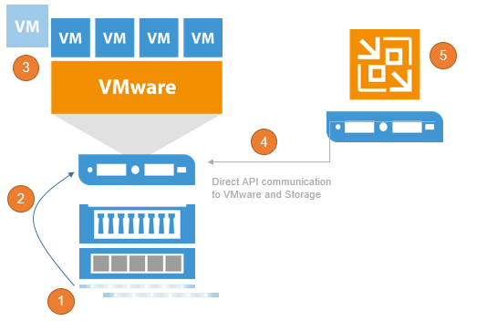

# Veeam Explorers

Veeam Explorers are tools included in all editions for item-level recovery from
several application. As of v9, following Explorers are available:

* Veeam Explorer for Active Directory
* Veeam Explorer for SQL Server
* Veeam Explorer for Exchange
* Veeam Explorer for SharePoint
* Veeam Explorer for Oracle
* Veeam Explorer for Storage Snapshots

Each Explorer has a corresponding user guide available in Helpcenter:
[Veeam Backup Explorers User Guide](https://helpcenter.veeam.com/backup/explorers/introduction.html). This
section will focus primarily on the planning required for SQL Server and Oracle
restores. For these Explorers, special attention should be paid to planning network connectivity between mount server and staging servers in restricted environments. Ports used for communication between them are listed in the corresponding section of the User Guide (https://helpcenter.veeam.com/backup/vsphere/used_ports.html#explorers).

**Note:** Some recommendations for the staging system (if required for Veeam Explorer tool) can be also found in the [Veeam Backup Server](./backup_server_introduction.md) and [Veeam Backup & Replication Database](./backup_server_database.md) sections of this document.

## Explorer for Active Directory

For Microsoft Active Directory, also check the tombstone lifetime settings, as described in Veeam Explorers User Guide at Veeam Help Center (https://helpcenter.veeam.com/backup/explorers/vead_recommendations.html).

## Explorer for SQL Server

If you have special features/enhancements/configuration settings on the production Microsoft SQL and/or Microsoft SharePoint server to be protected with Veeam, these custom settings should be implemented on the staging SQL Server, too.

One special case of custom settings that must be configured on staging server is encryption. When performing restore/export of encrypted database please refer to [KB2006](https://www.veeam.com/kb2006) for details on configuring the staging server.

## Explorer for Oracle

Oracle restore uses a combination of executing commands via SSH or RPC depending
on the platform, and using the RMAN client. VM disks are mounted to target server using iSCSI (Windows) or FUSE and loop device (Linux). Only database files will be restored, not instance files. Instance files may be recovered through file-level recovery
if needed.

When backing up Oracle on Linux, the backup server is used for initiating
connections, whereas a Guest Interaction Proxy will be selected for Oracle on
Windows.

Ensure the account used to connect to target/staging server has enough permissions on operating system and database as described in the corresponding section of [User Guide]( https://helpcenter.veeam.com/backup/explorers/veo_connection_to_target_server.html) or [Application-aware Image Processing](../job_configuration/application_aware_image_processing.md) section of this guide.

**Note:** When restoring to Linux ensure that account used to connect to restore target server has valid shell.

### Restore workflow

When performing restore Veeam follows the following steps:
1. Oracle instance/database discovery is performed and information is collected, that includes path validation and sisk space availability checks.
2. VM disks are mounted.
3. Target database is shut down and dropped, configuration is cleaned (configuration and temporary instance files).
4. Database is started from the temporary location, if that fails another restore attempt is performed with safe set of parameters.
5. After successful test start from temporary location database is restored to proper location using automatically generated RMAN script.
6. Restore control files are restored after that. Database is updated to specific transaction prior to that in case point in time was selected for restore.
7. Fast Recovery Area parameters are restored and database is upgraded accordingly if restoring 32-bit instance to 64-bit.
8. To finalize restore mounted backup is removed from RMAN repository, restored database is restarted and new DB ID is generated. Remaining bits of the configuration are restored as well - parameter file is restored to proper path along with password file, DBNAME is changed if needed, logs are reset and online logs are recreated.

## Explorer for Storage Snapshots
Veeam Explorer for Storage Snapshots (VESS) is included, but it is
related to storage integrations with primary storage. This is explained in
the [Backup from Storage Snapshots](./backup_from_storage_snapshots.md) section
of this guide.

VESS is a very easy way to perform item-level recovery directly from storage
snapshots. Veeam is able to use discover and mount any storage snapshot for
restores. By combining the Veeam application consistent with crash consistent
snapshots, the RPO for certain applications can be significantly reduced.

When opening VESS, the following workflow kicks off:

1.  Creating a Clone of the Snapshot to make it writeable

2.  In case of Block access (iSCSI, FC, FCoE) mount the new LUN to a
    proxy ESXi and register a temporary datastore, in case of NFS access
    the existing NFS datastore and look for the cloned VM

3.  Register the temporary VM within the VMware inventory

4.  Access the VM using the VMware API

5.  Show the content as a Veeam Explorer to restore

After restoring and exiting VESS, the temporary datastore,
VM and LUN clones will be rolled back and cleaned up.
