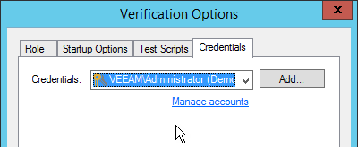

# vPower NFS and Virtual Lab

## Virtual Lab Appliance Overview

The Virtual Lab appliance operates as a gateway to offer network connectivity between the Veeam backup server and the isolated virtual machines in the Virtual Lab. It can also be used to provide access to other clients coming from the production network using static mapping. If VMs running in the isolated network need Internet access, the Virtual Lab appliance can act as a proxy server.

When a SureBackup job is executed the static routes to reach the masquerated networks are temporarily added to the routing table on the Veeam backup server. To review the routing table, you can open a command prompt on the Veeam backup server and execute:

`route print -4`

You may run this command before and after starting the SureBackup job to compare the differences.

The routes are added just after the Virtual Lab appliance has booted and has been correctly initialized by the Veeam backup server. As static
routes are added, this will ensure the Virtual Lab appliance is the gateway for all packets destined to the masquerade networks.

To avoid network reconfiguration of physical components, place the backup server and the Virtual Lab appliance in the same network subnet.

Check Veeam Backup & Replication documentation for configuration details:

-   <https://www.veeam.com/veeam_backup_9_0_evaluators_guide_vpower_vsphere_en_pg.pdf>

-   <https://helpcenter.veeam.com/backup/vsphere/verification_perform.html>

## How SureBackup Job Works
SureBackup leverages the capabilities of the Virtual Lab appliance to create an isolated environment where different tests can be executed against VMs. These VMs are powered on directly from the backup files using the vPower technology.

### Booting the Virtual Lab Appliance
1.  Virtual Lab appliance configuration file is built and mapped to the Virtual Lab appliance as an ISO.

2.  Virtual Lab appliance network interfaces are reconfigured for appropriate isolated networks.

3.  The Virtual Lab appliance is powered on.

4.  The SureBackup job waits for IP configuration to be published and stabilized through VMware Tools.

5.  A static route for the configured masquerated networks is added dynamically to the routing table of the Veeam backup server. Those static routes define the IP address of the Virtual Lab appliance as the gateway towards the masquerated networks.

### Booting Virtual Machines

1.  If the Application Group is based on backups,  Veeam publishes and registers VMs using Veeam vPower NFS from the repository containing the backup file. This step is skipped if the VMs are replicas.

2.  Veeam reconfigures the VMs and connects them to the isolated port groups of the Virtual Lab. If a network connection is configured to be connected to a port group that is not available in the Virtual Lab, those network are disconnected automatically.

3.  Veeam creates a snapshot for the VMs in order to redirect write operations to a production datastore selected during the Virtual Lab configuration.

4.  If the domain controller role is selected, registry settings are injected in the VM to ensure the NETLOGON service will not shutdown due to missing peer communication.

5.  VMs are powered on.

6.  During boot VMware Tools announce IP configuration of VMs. The SureBackup job waits for this information to stabilize.

**Note:** If VMware Tools are not installed on the virtual machine the job will wait for the duration of **Maximum allowed boot time** configured for the VMs. This will slow down SureBackup jobs significantly. Therefore, it is always recommended to install VMware
Tools on a verified VM.

###  Testing Virtual Machines

1.  **VMware Tools heartbeat** is used for verifying that the VM OS is successfully started.

2.  **PING** tests are initiated according to the masqueraded network configuration. The ping is sent from the Veeam backup server using the static routes added during the job execution. Since the masquerade network is not part of the Veeam backup server's own subnet, the packet is sent to the gateway matching the Virtual Lab network (usually the virtual lab appliance).

3.  **Application-specific testing** uses scripts and is enabled based on the roles assigned to a VM in the application group configuration. The built-in roles will check corresponding TCP ports for a given service. The built-in role for SQL Server provides additional testing (see next section), and custom scripts may be used for third party applications. Requests are sent from the Veeam backup server, and the routing
to the virtual machine is handled by the Virtual Lab
proxy appliance.

4. **CRC verification** is optionally available and is disabled by default. If enabled, it will ensure all content of the backup file is consistent with the hash values at the time they were written. This consistency check is using the CRC algorithm for hashing.

  **Note:** This feature reads the entire backup file, and requires significant time to complete.

If [Linked Jobs](https://helpcenter.veeam.com/backup/vsphere/surebackup_job_joblink_vm.html) are configured for the SureBackup job, linked VMs will start booting once all virtual machines explicitly defined within the Application Group have been successfully booted and verified. Remember that by default  3 VMs are tested at the same time in a Linked Job. There may be more than 3 VMs linked, but the following ones will stay in the testing queue. The limit can be adjusted in the SureBackup job configuration wizard, and may be increased if the backup repository can handle the load accordingly.

### Checking SQL Server Database Availability
A dedicated Visual Basic script is included to allow for testing whether all databases on a given instance are available. This script is available in the Veeam installation folder as the `Veeam.Backup.SqlChecker.vbs` file.

By default, the script tries to retrieve and check _all_ instances; you can optionally configure one or more specific instances to be tested. The script enumerates all databases and checks if these databases are available, using the `USE <db>`
statement.

When running scripts that require authentication, when executed the script will impersonate the service account under which the Veeam Backup Service is running (default is SYSTEM). To specify different credentials configure them in the 'Credentials' tab
in the Application Group settings.

**Important!** To ensure successful authentication it is required for the specified user to have *public* access to all databases.

The `SqlChecker.vbs` script also accepts two additional parameters to use SQL authentication instead of Windows based authentication. In order to
use SQL authentication you need to add a custom test script instead of the built-in SQL Server role, and specify the following path and arguments:

* Name: SQL checker
* Path: _Browse for the `Veeam.Backup.SqlChecker.vbs` file_
* Arguments: `%log_path% %vm_ip% sa sa_account_password`

### Creating Custom Roles

Though there are a number of built-in tests intended for application-level testing, you may need to develop additional scripts for testing proprietary applications. This is the procedure to do so:

1.  Open the Veeam installation folder and look in the `SbRoles` folder. All roles are defined in the XML files available in this folder.

2.  To create custom roles, duplicate one of the above mentioned files and modify the `<Id>` tag using a UUID generator (such as     https://www.uuidgenerator.net). Use this configuration file to specify the GUI settings.

When creating custom roles for Linux-based applications you may need to execute the generated code locally within the VM. To do so, use `\Putty\plink.exe` shipped with the product and located in the Veeam Backup & Replication installation directory.

When executing bash scripts locally on a Linux virtual machine using `plink.exe`, the exit codes are passed to the SureBackup job, enabling correct error reporting. If using `plink.exe` in combination with a
SSH private key, you should connect manually (one time) to the VM via SSH using `putty.exe` from the Veeam backup server in order to accept the target VM SSH fingerprint; otherwise, the SureBackup job will wait for this input and ultimately timeout.

**Note:** You can use `puttygen.exe` to create a private key.

Another option for testing service availability with
`Veeam.Backup.ConnectionTester.exe` is described in
<http://www.veeam.com/kb1312>.

### Troubleshooting Mode

If you need to troubleshoot Virtual Lab, it is recommended to start sessions in the Troubleshooting Mode. To do so:

1.  Open up **Statistics** for a SureBackup job.

2.  Right-click the VM you want to troubleshoot.

3.  Select **Start**.

The SureBackup lab will now start in troubleshooting mode, which means that errors will not cause the Virtual Lab to shut down immediately.

If the selected VM is in an application group, this VM and previous ones are started. If the VM is part of a linked job, the entire Application Group and the selected VM is started.

This mode is especially helpful during an implementation phase while measuring application boot times via vPower NFS, or implementing custom verification scripts. When you have finished troubleshooting, you can stop the SureBackup session manually.

**Tip:** On the Virtual Lab appliance, ICMP traffic is blocked on all network interfaces connected to isolated networks, unless you check the "Allow proxy appliance to act as internet proxy for virtual machines in this lab". Unless checked, this may cause some versions of Windows Server to switch a network interface to a different network profile (i.e. from Domain to Public). This may lead to some tests failing.

## Virtual Lab in Complex Environments

When using standard vSwitches in a VMware vSphere infrastructure, the Virtual Lab proxy appliance and the isolated networks must run on the same ESXi host. The reason is that standard vSwitches and their port
groups are bound to one single host. Since the Virtual Lab port groups are isolated by nature, these networks are not known at the core network in
terms of VLAN tagging or routing.

When Distributed vSwitch (dvSwitch) is available, port groups can span multiple
ESXi hosts. Distributed vSwitches are typically required when using Virtual Lab
for replicas (SureReplica) as replicas will often span multiple hosts. vSphere
Distributed Resource Scheduler (DRS) may also distribute VMs across multiple
hosts within a cluster once they are started.

**Important!** Please check the following help article and the links at the
bottom of the webpage before you configure Virtual Labs for Distributed vSwitch:
[Advanced Multi-Host Virtual Labs](https://helpcenter.veeam.com/backup/vsphere/surereplica_advanced_mutihost.html).

Even in environments where Distributed vSwitch is available, make sure that the Veeam backup server and the Virtual Lab proxy appliance are placed in the same port group to prevent network packets (sent to
the masquerading IP subnets) from being routed.

Most DR datacenters are configured with different IP networks from production to allow for “active-active” configurations. In such cases, layer 3 (L3) is used for networking configuration and routing is in place to establish communications between the production site and the DR site.

In these scenarios, it is recommended to deploy a Veeam backup server at the DR site. This will
help getting the Virtual Lab working and ensure correct "1-Click Failover" and failback if the production site becomes unavailable.

For more information, please see the [Backup Server Placement](backup_server_placement.md)
section of this guide.

