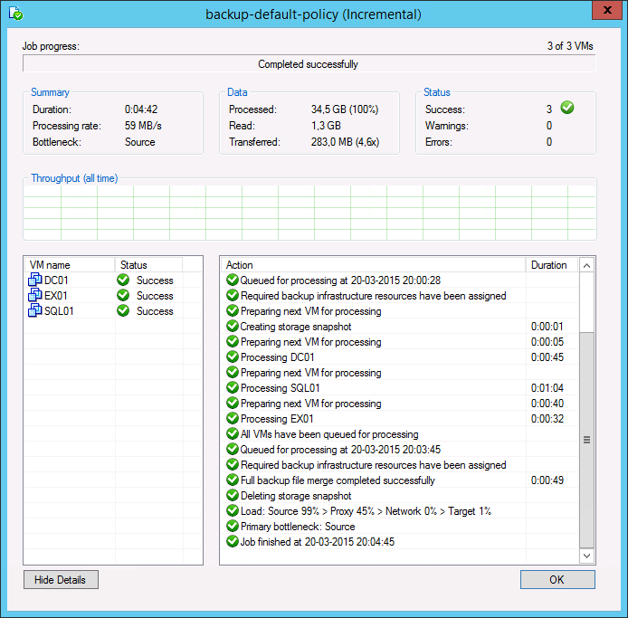
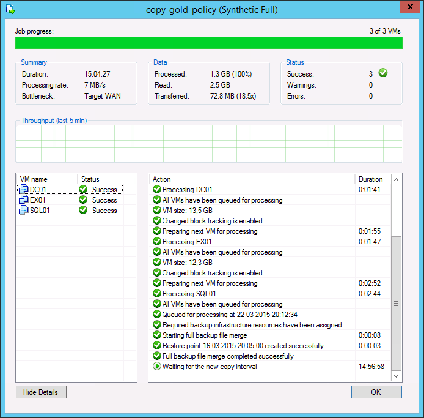
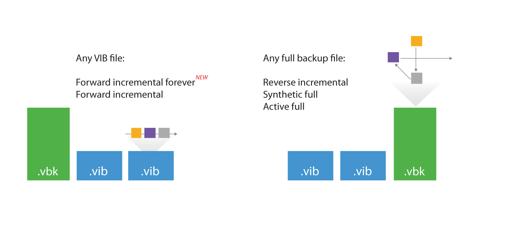
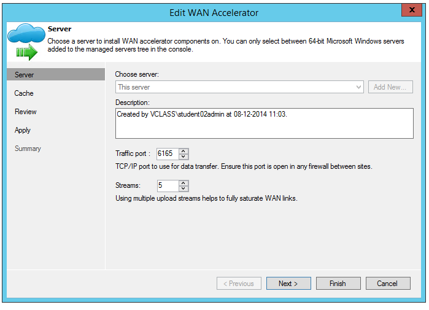
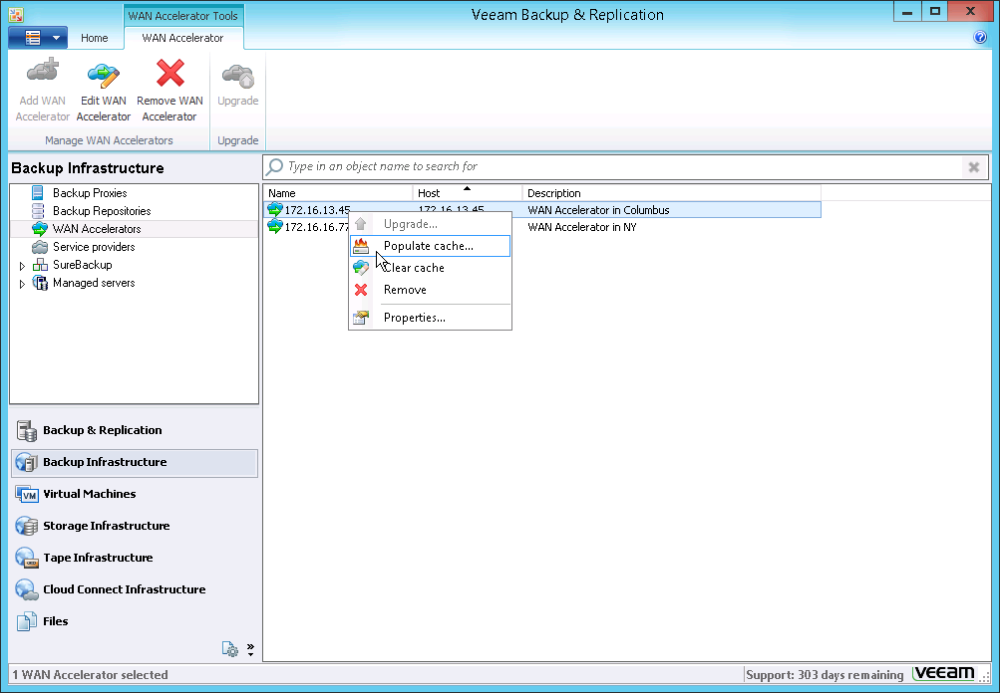

# WAN Acceleration

WAN acceleration was introduced as a key component of backup copy jobs
in Veeam Backup & Replication v7. By combining multiple technologies
such as network compression, multi-threading, dynamic TCP window size,
variable block size deduplication and global caching, WAN acceleration
provides sufficient capability whilst the required network bandwidth is
dramatically reduced when performing backup copy and replication jobs.
To determine whether WAN acceleration is necessary in the environment,
it is important to understand what particular savings can be achieved.

### Determining Required Bandwidth

When using WAN acceleration on links with very poor bandwidth, you may
have to manually seed the initial copy to the target. For more
information, refer to the [WAN
Acceleration](http://helpcenter.veeam.com/backup/80/vsphere/index.html?wan_acceleration.html)
section of the Veeam Backup & Replication User Guide.

The WAN accelerator calculates its own digests based on the hashes of
the blocks inside the storage which means that it reads data from the
backup files while re-hydrating them on the fly.The WAN accelerator
component will then re-process data blocks with much more efficient data
deduplication and compression algorithms. This is the reason why the WAN
accelerator consumes significant amounts of CPU and RAM resources.

To determine how much data has to be transferred over the WAN link with
and without WAN acceleration enabled in backup copy job, you can compare
the daily changes of the primary backup job statistics (as the same data
is transported in a standard backup copy job without WAN acceleration)
with the WAN accelerator-enabled backup copy job log and statistics.

#### Analyzing Backup Job

During both full and incremental job sessions, three metrics are
displayed in the session data: **Processed**, **Read** and
**Transferred**. To better understand the difference between direct data
transfer and WAN accelerated mode, examine the **Read** and
**Transferred** values: 

 

-   **Read —** amount of data read from the production storage prior to
    applying any compression and deduplication. This is the amount of
    data that will be optimized by the WAN accelerator.

<!-- -->

-   **Transferred** — amount of data written to the backup repository
    after applying compression and deduplication. This is the amount of
    data that will be processed by the backup copy job running in Direct
    Transfer mode (without WAN acceleration), assuming all VMs from the
    backup job are included in the backup copy job.

#### Analyzing Backup Copy Job

When analyzing a backup copy job, you can see the same metrics in the
job session data: **Processed**, **Read** and **Transferred**. Comparing
the backup copy job with WAN acceleration enabled and the backup job, it
is possible to correlate the information in both outputs.

 

-   The amount of **Processed** blocks in the backup copy job session is
    equal to the amount of **Read** blocks in the backup job session.
    This is the most important metric, as it is the amount of data that
    has to be processed by the WAN accelerator.

-   The number of **Read** blocks for the backup copy job is typically
    higher than the amount of **Processed** - this is due to the backup
    copy job using a differing fingerprinting algorithm that work on a
    differing block size to the fingerprinting algorithm and block size
    used by backup jobs that created the original backup file. For that
    reason, this metric can be ignored.

-   The amount of **Transferred** data is the amount of data actually
    transferred over the WAN link. 

#### Comparing Direct Mode with WAN Accelerated Mode

Consider that the savings rate (18.5x) displayed in the GUI will be
based on **Processed** data ("re-hydrated" data blocks). In the example
above, 283 MB would have been transferred over the WAN link in Direct
Transfer mode, while only 72.8 MB were transferred after enabling WAN
acceleration. The actual savings rate equals 3.9x in this relatively
static demo infrastructure, whilst it would typically be significantly
higher in real-life scenarios.

**Note**: Approximate savings ratio can be assumed as of 10x.

To calculate possible savings and needed bandwidth you may use the
following calculator <http://vee.am/bandwidth>.

### Backup Mode Effect

When planning for WAN acceleration, review the backup mode used on the
primary backup job. Some backup methods produce a random I/O workload on
the source repository (as opposed to sequential I/O patterns in other
backup modes). The methods of reading from source is illustrated by the
figure below:

 

For example, forward incremental and forever forward incremental method
will make backup copy jobs work much faster, as read operations will be
sequential rather than random.

Though a workload penalty may not be significant, it can be a good idea
to monitor the storage latency on the backup repository, especially if
the reported bottleneck is *Source*. If the storage latency on the
backup repository is high, it is recommended that you change the backup
mode in order to increase the throughput of one pair of WAN
accelerators.

### Configuration

#### Source WAN Accelerator

At the first step of the WAN accelerator configuration wizard, you can
change the default setting of five TCP threads. This setting applies to
the source WAN accelerator, and is automatically accepted by the target
WAN accelerator.

Veeam can support up to 100 simultaneous threads as throughput
optimization and compensation for high latency or packet loss.

If the link has low latency and high bandwidth, the default setting (5
streams) may be enough to fully saturate it.

**Important**! If the link is still not saturated, you can increase the
number of streams accordingly.

**Tip:** To test different scenarios in the lab before deploying WAN
acceleration, you can use a free WAN emulator (such as WANem). For more
information, see this [link](http://wanem.sourceforge.net/).

When configuring the cache location for the source WAN accelerator,
consider that the actual cache size is irrelevant on the source, as it
is used only for digest files.

-   If a WAN accelerator will be used for bi-directional acceleration
    (act as both source and target), follow the guidelines provided in
    the “Target WAN Accelerator” section below.

-   To understand the storage requirements for storing digests, refer to
    the “Sizing” section below.

#### Target WAN Accelerator

The following recommendations apply to configuring a target WAN
accelerator:

-   The cache size setting configured on the target WAN accelerator will
    be applied to the pair of WAN accelerators. This should be taken
    into account when sizing for many-to-one scenarios, as configuring
    100 GB cache size will result in 100 GB multiplied by the number of
    pairs configured for each target WAN accelerator.

**Note**: A pair of WAN accelerators means any source WAN accelerator
paired with the target WAN accelerator.

-   It is recommended to configure the cache size at 20 GB for each
    operating system processed by the WAN accelerator. 

**Note**: All Linux operating systems are considered as one in terms of
WAN accelerator sizing.

-   Once the target WAN accelerator is deployed, the optimal option is
    to leverage the cache population feature implemented in Veeam Backup
    & Replication v8 (see [this
    section](http://helpcenter.veeam.com/backup/80/vsphere/index.html?wan_population.html)
    of the User Guide for details). When using this feature, the WAN
    accelerator service will scan through selected repositories for
    protected operating system types.

-   It is also possible to seed the initial copy of data to the target
    repository to further reduce the amount of data that needs to be
    transferred during the first run.

### Sizing

#### Source WAN Accelerator

When configuring the WAN accelerator on the source side, consider that
all VM disk data blocks are already in the source backup repository and
they can simply be re-read from the source repository when needed.
However, there are other files residing in the source WAN accelerator
folder, and the file structure will be described in the next sections.

The I/O requirements for the source WAN accelerator are high: it is
strongly recommended to deploy it on the fastest possible disk, as most
of I/O will take place there.

The source accelerator will also consume a lot of CPU resources whilst
applying heavy compression (also for decompressing before
recompressing).

The optimal configuration is with 4 vCPU and 8 GB RAM.

**VeeamWAN\\GlobalCache\\src**

There is only a *data.veeamdrf* file located in the
*\\VeeamWAN\\GlobalCache\\src* folder. This file will be synchronized
with the target WAN accelerator during the very first job run (or if the
cache was manually cleared) to understand what data blocks are already
cached in the target WAN accelerator. The size of this file is typically
up to 2% of the configured target cache size; thus, it may take some
time for the initial data transfer to begin.

**VeeamWAN\\Digests**

On the source WAN accelerator, there are the VM disk digests that take
up disk space. For each processed VM disk, a disk digest file is created
and placed in *\\VeeamWAN\\Digests\\&lt;Job ID&gt;\_&lt;VM
ID&gt;\_&lt;Disk ID&gt;*.

**Note**: Traffic throttling rules should be created in both directions.
See [Network Traffic Throttling and Multithreaded Data Transfer: Veeam
Backup Guide for
VMware](http://helpcenter.veeam.com/backup/80/vsphere/traffic_throttling.html)
for more information.

#### Calculating Source Side Disk size for WAN Accelerator {#calculating-source-side-disk-size-for-wan-accelerator .pseudo4}

Consider that each digest file is up to 2% of its source VM disk size.
This means, for example, that a 1.5 TB VM disk file can produce a
digests file up to 30 GB in size.

**Note:** As the cache size on the source WAN accelerator will always be
ignored, the digests file will be produced regardless of cache setting
been configured. They may consume considerable disk space.

Additionally, plan for 10 GB of working space for payloads and other
temporary files.

The disk I/O pattern on the source WAN accelerator is high and should be
taken into account when planning for storage; it is recommended to
deploy source WAN accelerators on the fastest storage available on that
side.

#### Target WAN Accelerator

Although a target WAN accelerator will consume less CPU resources than
the source, the I/O requirements for the target side are high. For each
processed data block, the WAN accelerator will update the cache file (if
required), or it may retrieve the data block from the target repository
(if possible). Tests show that for one-to-one deployments, there are no
significant performance differences using SAS10k drives as storage for
the target WAN accelerator cache rather than flash storage. With
multiple caches being updated in many-to-one deployments, it is
recommended to use SSD or flash storage in such scenarios.

**VeeamWAN\\GlobalCache\\trg**

For each pair, there will be a subfolder in the *trg* directory, with a
UUID describing which source WAN accelerator the cache is attached to.
In each of those subfolders, the *data.blob* file containing the cache
will be located. That file size corresponds to the setting configured in
the management console.

**Note**: The *data.blob* file will exist for all connected source WAN
accelerators.

**VeeamWAN\\GlobalCache\\temp**

When connecting a new source WAN accelerator, the *temp* folder will
temporarily contain the *data.veeamdrf* file that is later transferred
to the source containing the cache manifest.

#### Calculating Target Side Disk Size for WAN Accelerator {#calculating-target-side-disk-size-for-wan-accelerator .pseudo4}

Ensure that enough space has been allocated for global cache on the
target WAN accelerator.

1.  At least 10 GB per each different OS that is backed up.\
    That is, if you plan to backup VMs running under Windows 8, Windows
    2008 R2, Windows 2012 and RHEL 6 (four different operating systems),
    you will need at least **10 GB \* 4 = 40 GB**

2.  Plan for additional **20 GB** of working space for cache population,
    payload and other temporary files.

3.  If the cache is pre-populated, an additional cache is created. This
    pre-populated cache will be used as template for all other
    connected sources.

-   Source A = 40 GB

-   Source B = 40 GB

### How Many WAN Accelerators to Deploy?

As the source WAN accelerator can only process one task at a time (one
VM disk in a backup copy job or replication job), you may need to deploy
multiple WAN accelerator pairs to meet the performance demands.

As the target WAN accelerator can handle multiple incoming streams (as
described in the [Many-to-One WAN
Acceleration](http://helpcenter.veeam.com/backup/80/vsphere/wan_acceleration_many.html)
section of the User Guide), it is recommended to maintain a 4:1 ratio
between the number of source WAN accelerators per target WAN
accelerator.

This guideline is very much dependent on the WAN link speed. Many source
sites with low bandwidth will create little pressure on the target WAN
accelerator. So, for instance, in multiple ROBO configurations a 10:1
ratio can be considered.

If there are sites with very high bandwidth (such as
datacenter-to-datacenter replication), they will produce a much more
significant load on both the target WAN accelerator and the target
repository due to the second data block lookup (for more information,
refer to the [User
Guide](http://helpcenter.veeam.com/backup/80/vsphere/wan_acceleration_sources.html)).

**Note:** The secondary data block lookup is used, when a data block is
not available in the WAN accelerator cache. When there is a WAN cache
“miss”, the secondary lookup for the same data block is performed on the
target repository. If it is found here, it is read back to the WAN
accelerator instead of re-transmitting over WAN.

Performance of the WAN accelerator was improved significantly in Veeam
Backup & Replication v8. Assuming the source and target repositories can
deliver the throughput required for the optimal processing rate, use the
guidelines that follow.

**Note**: The numbers below are processing rates. The WAN link usage is
dependent on the achieved data reduction ratio.

-   Average throughput per target WAN accelerator: 500 Mbit/s
    (62.5 MB/s)

-   Depending on the achieved data reduction rate (typically 10x), the
    transfer rate over the WAN link will vary.

    -   If the processing rate is 62.5 MB/s, and the data reduction rate
        is 10x, then it is possible to sustain 6.25 MB/s (50 Mbit/s)
        over the WAN link.

    -   If the WAN link has high bandwidth (above 100Mbps consider using
        backup copy jobs without WAN Acceleration. However, if you use
        WAN accelerators in that scenario, it may require deployment of
        multiple WAN accelerator pairs to fully saturate the WAN link.
